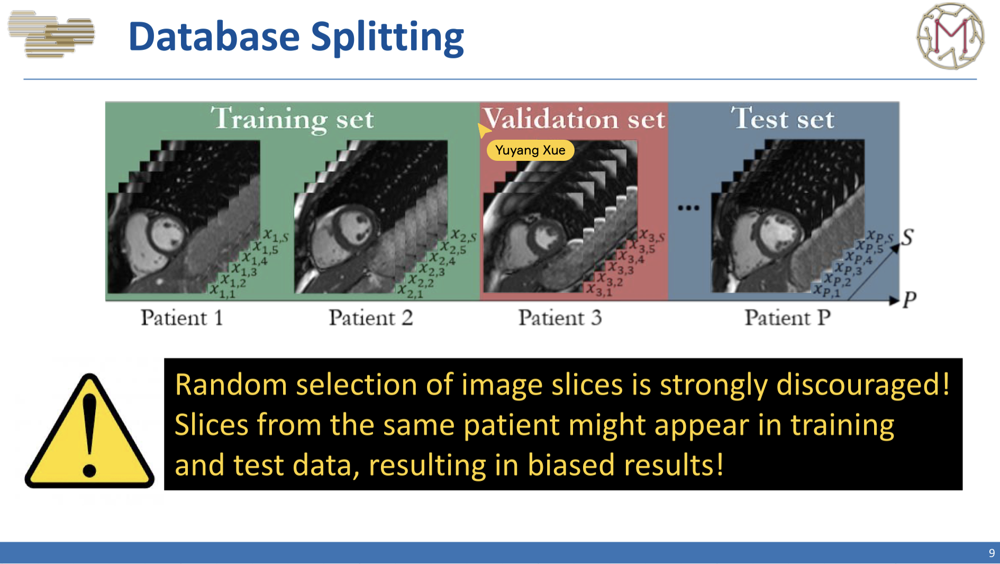
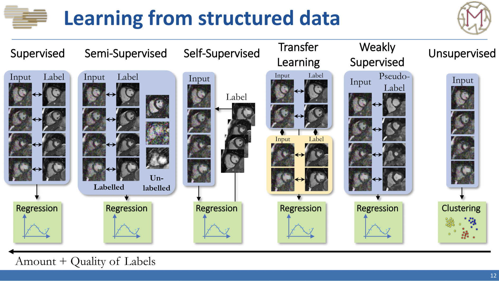
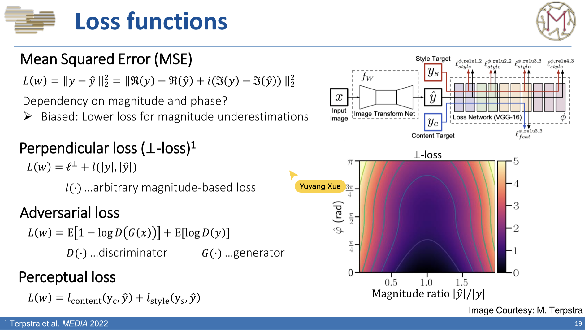
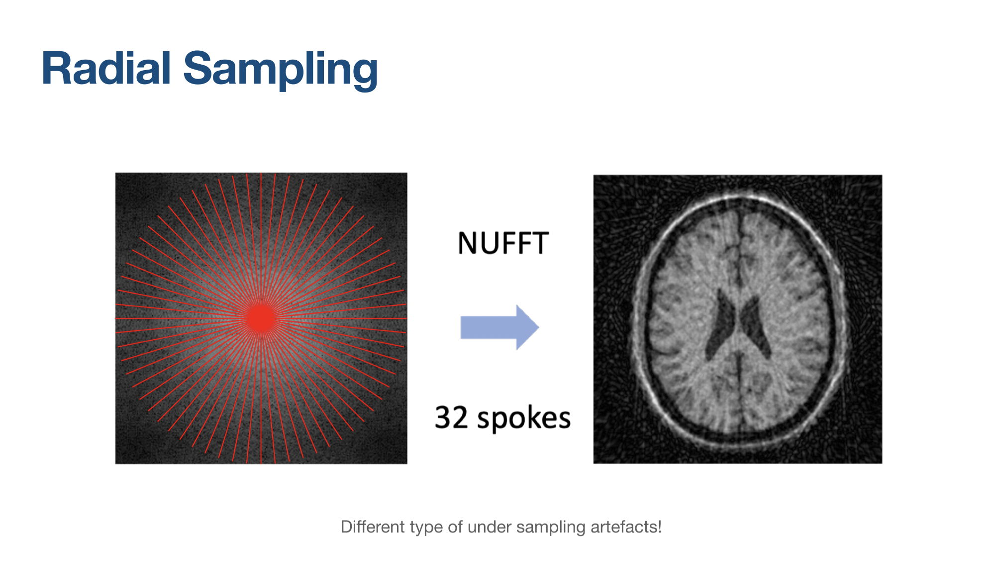
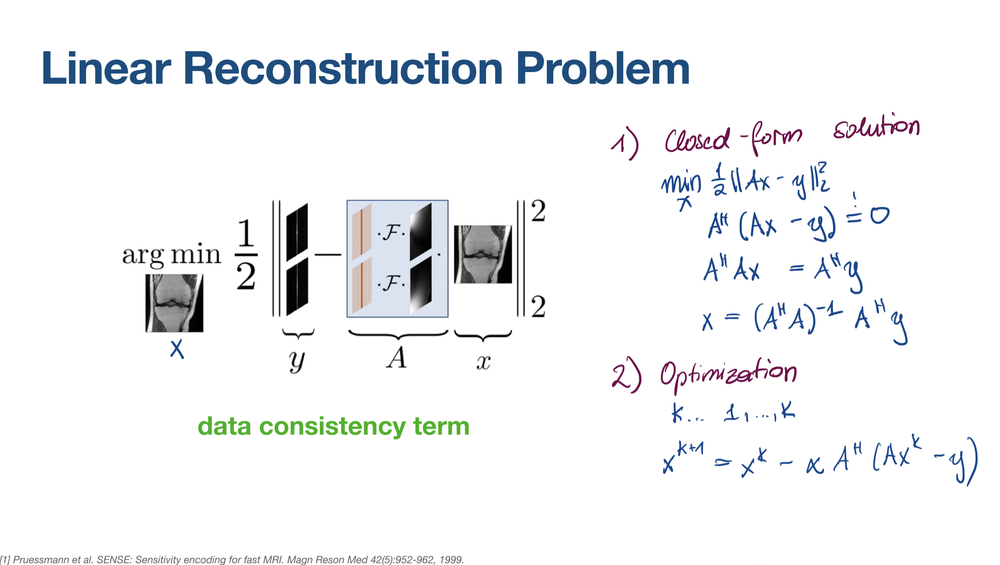
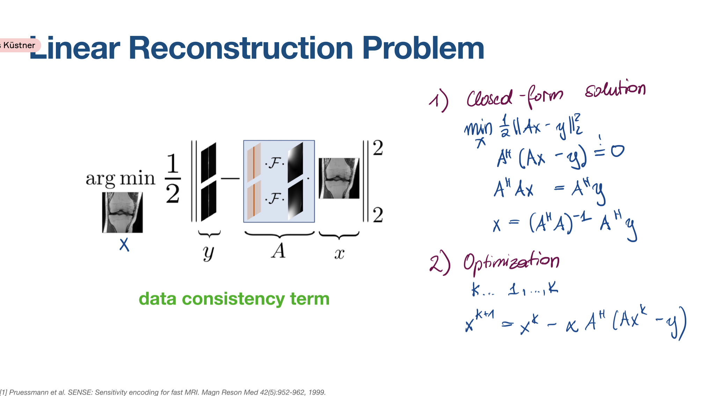
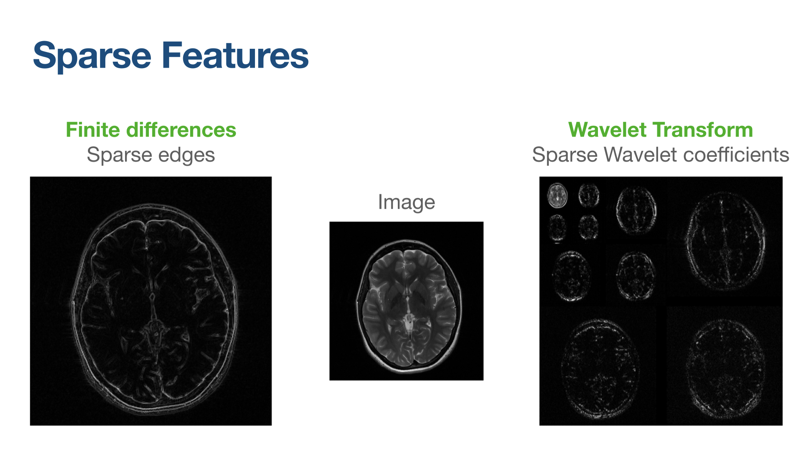
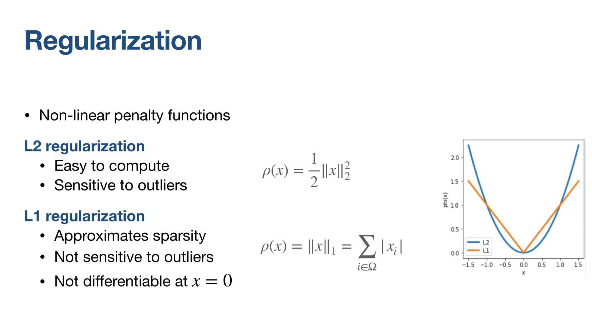
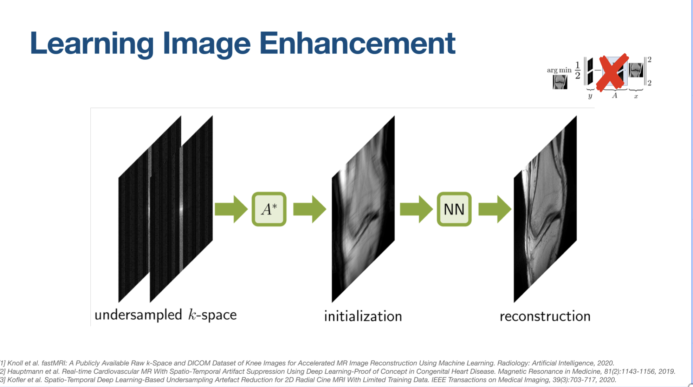
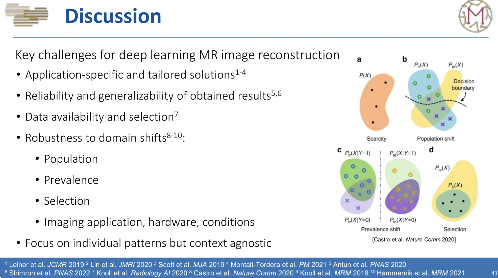

# Machine Learning in MRI

## Basics in Machine Learning

### Dataset Splitting

### Learning from structured data

### Loss functions

## Going Complex

### Parallel Imaging

Accelerate MR imaging from the hardware side.

- Combine k-space data from multiple receiver coils
- Each coil is sensitive only in a certain spatial region
- Exploit redundant information in the data

### Multicoild MRI Forward Operator $A$

- Input: Image $x$
	- Apply sensitivity maps $\mathcal{S}$ to the image
	- Fourier Transform $\mathcal{F}$of each individual coil image
	- Undersampling mask $\Omega$
	- $y = \Omega \mathcal{F} \mathcal{S} (x) + \epsilon$

### Multicoil MRI Adjoint Operator $A^H$

Reverse operations from forward operator

- Input: Multi-coil (undersampled) k-space $y$
	- Undersampling mask $\Omega$
	- Inverse Fourier Transform $\mathcal{F}^{-1}$
	- Complex-conjugate multiplication and summation along coils $\sum_{coils}$
	- $x = \sum_{coils}(\mathcal{S}\mathcal{F}^{-1}\Omega(y))$

### Types of Undersampling

- Regular Cartesian -- low frequency only (nRef = 20)
	- only 20 central lines
- Regular Cartesian (R = 4)
	- Every 4 step
- Regular Cartesian (R = 4, nRef=20, R_{eff}=$3.4$)
	- Central 20 lines with 4 step sampling
- Variable Random Sampling (R = 4)
	- Random sampling with $1/4$ sampling
- Radial Sampling
	- 
	- NUFFT, 32 spokes

### Inverse Problems in Imaging

Minimizing the data misfit

- Closed-form solution
	- $\min_x \frac12 \|Ax-y\|^2_2$
	- $A^H(Ax-y)=0$
	- $A^HAx=A^Hy$
	- $x=(A^HA)^{-1}A^Hy$
- Optimisation
	- $x^{k+1}=x^k-xA^H(Ax^k-y)$
	   
### Regularised Reconstruction Problem

- Data consistency term + regularisation term

### Sparse Features

### Regularization

Non-linear penalty function

- L2 regularization
	- Easy to compute
	- Sensitive to outliers
	- $\rho(x)=\frac12 \|x\|^2_2=\sum_{i\in \Omega}(x^i)^H(x^i)$
- L1 regularization
	- Approximates sparsity
	- Not sensitive to outliers
	- Not differentiable at $x=0$
	- $\rho(x)=\|x\|_1=\sum_{i\in\Omega}|x_i|$

#### Example 1: Regularized Image Reconstruction

$$\min_x \frac{\lambda}{2} \|Ax-y \|^2_2 + \frac12 \|\triangledown x\|^2_2$$

2D: $\triangledown=\begin{bmatrix}
\triangledown _{x} \ \\
\triangledown _{y}
\end{bmatrix}$, 3D: $\begin{bmatrix}
\triangledown _{x} \ \\
\triangledown _{y} \  \\
\triangledown _{z}
\end{bmatrix}$

Gradient Descent:

$x^{k+1} = x^k - \alpha [\lambda A^H(Ax^k-y) + \triangledown^T \triangledown x^k]$

### Compressed Sensing

Signal processing

- Technique to acquire data and reconstruct image efficiently
- Acquire data efficiently by sub-sampling, i.e., exploit sparsity of a signal
- This violates the Nyquist-Shannon sampling theorem
- Exploit sparsity of a signal in a transform domain: e.g. sparse edge
- Non-linear reconstruction algorithm

#### Example 2: Regularized Image Reconstruction

$\min_x \frac{\lambda}{2}\|Ax-y\|^2_2 +\sum^{N_k}_{j=1} \rho_j(K_jx)$

- $\rho$: potential functions
- $K$: convolution filter operators
- $N_k$: pairs of filter / potential functions

$R(x)=\sum^{N_k}_{j=1}\rho_j(K_j x)$
$\triangledown_x R(x)=\sum^{N_k}_{j=1} k_j^H \rho_j'(K_jx)=\sum^{N_k}_{j=1}K_j^H\phi_j(K_jx)$
$\triangledown_x R(x) \approx \sum^{N_k}_{j=1}K_{2,j} \phi_j(K_{1,j}x)$: Conv + Activation + Conv

### Complex Convolution

- Convolution matrix $K$: $\mathbb{C}^N \rightarrow \mathbb{C}^N$
- Vectorised image $x \in \mathbb{C}^N$
- $\bar x * \bar k \Leftrightarrow Kx$: 4 multiplications, 2 additions
  $\begin{bmatrix}
Re( Kx)\\
Im( Kx)
\end{bmatrix} =\begin{bmatrix}
Re( K) & -Im( K)\\
Im( K) & Re( K)
\end{bmatrix}\begin{bmatrix}
Re( x)\\
Im( x)
\end{bmatrix}$

### Complex Activations

- Complex ReLU: $ReLU(Re(z))+j\cdot ReLU(Im(z))$
- Separable Sigmoid: $h(Re(z))+j\cdot h(Im(z)), h(z)=\frac{1}{1+e^{-z}}$
- Cardioid: $\frac12 (1+\cos(\angle z +b))z$
- Siglog: $\frac{z}{1+|z|}$

### Complex Pooling

- Perform max pooling on the magnitude, and keep the phase

## Machine Learning MR Reconstruction in action

### Learning Image Enhancement

- Cost function
	- $\theta^*=\arg \min_\theta \|f_\theta(A^Hy)-x_{ref} \|^2_2$

#### First Approach using Learning in MRI

- Offline Learning
	- Learning an image denoiser offline on pairs of reference images and zero-filled images
- Online Reconstruction
	- Apply the learned image denoiser to a new reconstruction problem
	- $x^k = \arg\min_x \|f_\theta (A^Hy)-x\|^2_2+\lambda \|Ax-y\|^2_2$

#### Plug'n'Play Prior

Solving inverse problems with advanced regularisers

- Consider a Proximal Gradient (PG) methods
  
$$x^{k+1}=\mathrm{prox}_{\tau, R}(x^k - \tau A^H(Ax^k-y)))$$

$$\mathrm{prox}_{\tau, R}(\hat x)=\min_x \frac{1}{2\tau}\|x-\hat x\|^2_2+R(x)$$

Idea: Replace $\mathrm{prox}_{\tau, R}$ by a mapping function (NN) $f_\theta$:

$$
x^{k+1}=f_\theta(x^k-\tau A^H(Ax^k-y))
$$

$f_\theta$ can be modelled by neural networks, BM3D, Non-Local Means, ...

#### Learned Unrolled Optimisation

Motivation: Regularisation by early stopping:

$$
x^*=\arg\min_x \frac{\lambda}{2} \|Ax-y\|^2_2+R(x)
$$

Select an optimisation scheme and stop early after $T$ steps.

$$
x^{k+1}=\mathrm{Prox}_D(x^{k+\frac12})=\arg \min_x \frac12 \|x-x^{k+\frac12}\|^2_2+\frac{\lambda}{2}\|Ax-y\|^2_2
$$

### Data Consistency Layers

- Gradient Descent Layer: $\hat{x}=x-\lambda A^H(Ax-y)$
- Null-space projection layer: $\hat{x}=A^\dagger (I-A^\dagger A)x$
- Proximal Mapping layer: $\hat{x}=\mathrm{prox}_D(x)=\arg \min_{\bar x}\frac12\|\bar x-x\|^2_2+\frac{\lambda}{2}\|A\bar x-y\|^2_2$
	- Singlecoil: DCCNN
	- Multicoil: Solution via Conjugate Gradient Optimisation

### Self-Supervised Learning in Image Reconstruction

#### Deep Image Prior

Implicit Regularisation

$$
\min_\theta \frac12 \|Af_\theta(z)-y\|^2_2, \hat x=f_\theta(z)
$$

where $z$ is a low-dimensional latent vector.

## Applications of Machine Learning for MR Image Reconstruction

### Image Ehancement

1. [2D Neuro imaging: MRI Denoising Using Deep Learning](https://hal.archives-ouvertes.fr/hal-01918437/file/Patchmi_DeepDenoising_HAL.pdf)
2. [2D Neuro ASL: DeepASL: Kinetic Model Incorporated Loss for Denoising Arterial Spin Labeled MRI via Deep Residual Learning](https://arxiv.org/pdf/1804.02755.pdf)
3. [2D Cardiac CINE: Real‐time cardiovascular MR with spatio‐temporal artifact suppression using deep learning–proof of concept in congenital heart disease](https://onlinelibrary.wiley.com/doi/pdfdirect/10.1002/mrm.27480)
4. [2D Neuroimaging: ]()

### Transformers

1. [ViT: ReconFormer: Accelerated MRI Reconstruction Using Recurrent Transformer](https://arxiv.org/pdf/2201.09376.pdf)
2. [Swin Transformer]
3. [Vision Transformer](https://openreview.net/forum?id=cNX6LASbv6)

### Transform Learning

1. [AUTOMAP](https://www.nature.com/articles/nature25988)

### K-space Learning

1. [RAKI](https://onlinelibrary.wiley.com/doi/pdf/10.1002/mrm.27420?casa_token=s-lK0ZQ23ecAAAAA:vHG_2NX6PqIaYDrqXTPN4IbAew0-9m7qXCg05Lt5aTiRzNGxDerDqU6c730Rf0klJoZp8yu2zxzL)
2. [E2E Variational Network: End-to-End Variational Networks for Accelerated MRI Reconstruction](https://arxiv.org/pdf/2004.06688.pdf)

### Plug'n'Play Priors

1. [liu ieee jstsp 2022]
2. [wang isbi 2016]
3. [Learning Proximal Operators: Using Denoising Networks for Regularizing Inverse Imaging Problems](https://openaccess.thecvf.com/content_ICCV_2017/papers/Meinhardt_Learning_Proximal_Operators_ICCV_2017_paper.pdf)
4. [Deep Plug-and-Play Prior for Parallel MRI Reconstruction](https://arxiv.org/pdf/1909.00089.pdf)
5. [Plug-and-Play Methods for Magnetic Resonance Imaging](https://engineering.purdue.edu/~bouman/publications/orig-pdf/SPM-2020.pdf)

### Generative Models

1. [DAGAN: Deep De-Aliasing Generative Adversarial Networks for Fast Compressed Sensing MRI Reconstruction](https://pubmed.ncbi.nlm.nih.gov/29870361/)
2. [Compressed Sensing MRI Reconstruction Using a Generative Adversarial Network With a Cyclic Loss](https://ieeexplore.ieee.org/abstract/document/8327637)
3. [SARA-GAN: Self-Attention and Relative Average Discriminator Based Generative Adversarial Networks for Fast Compressed Sensing MRI Reconstruction](https://www.frontiersin.org/articles/10.3389/fninf.2020.611666/full)
4. [MR image reconstruction using deep density priors](https://openreview.net/forum?id=ryxKXECaK4)

### Physics-based Unrolled Optimization

1. [Learning a variational network for reconstruction of accelerated MRI data](https://onlinelibrary.wiley.com/doi/full/10.1002/mrm.26977)
2. [MoDL: Model-Based Deep Learning Architecture for Inverse Problems](https://ieeexplore.ieee.org/document/8434321)
3. [A Deep Cascade of Convolutional Neural Networks for Dynamic MR Image Reconstruction](https://pubmed.ncbi.nlm.nih.gov/29035212/)
4. [Convolutional Recurrent Neural Networks for Dynamic MR Image Reconstruction](https://pubmed.ncbi.nlm.nih.gov/30080145/)
5. [Learned primal-dual reconstruction](https://ieeexplore.ieee.org/abstract/document/8271999)
6. [VS-Net: Variable Splitting Network for Accelerated Parallel MRI Reconstruction](https://arxiv.org/abs/1907.10033)
7. [CINENet: deep learning-based 3D cardiac CINE MRI reconstruction with multi-coil complex-valued 4D spatio-temporal convolutions](https://www.nature.com/articles/s41598-020-70551-8)
8. [A multi-scale variational neural network for accelerating motion-compensated whole-heart 3D coronary MR angiography](https://pubmed.ncbi.nlm.nih.gov/32353528/)
9. [Accelerating cardiac cine MRI using a deep learning-based ESPIRiT reconstruction](https://onlinelibrary.wiley.com/doi/full/10.1002/mrm.28420)

### Multi-tasking

1. [Recon + Segmentation: Breaking Speed Limits with Simultaneous Ultra-Fast MRI Reconstruction and Tissue Segmentation](https://proceedings.mlr.press/v121/caliva20a/caliva20a.pdf)
2. [Recon + Registration: Motion-Guided Physics-Based Learning for Cardiac MRI Reconstruction](https://ieeexplore.ieee.org/abstract/document/9723134)
3. [Recon + Coil Sensitivity Estimation: Joint Deep Model-Based MR Image and Coil Sensitivity Reconstruction Network (Joint-ICNet) for Fast MRI](https://ieeexplore.ieee.org/abstract/document/9723134)

[ESMRMB_LMR_2022: Workbook](https://github.com/midas-tum/esmrmb_lmr_2022)