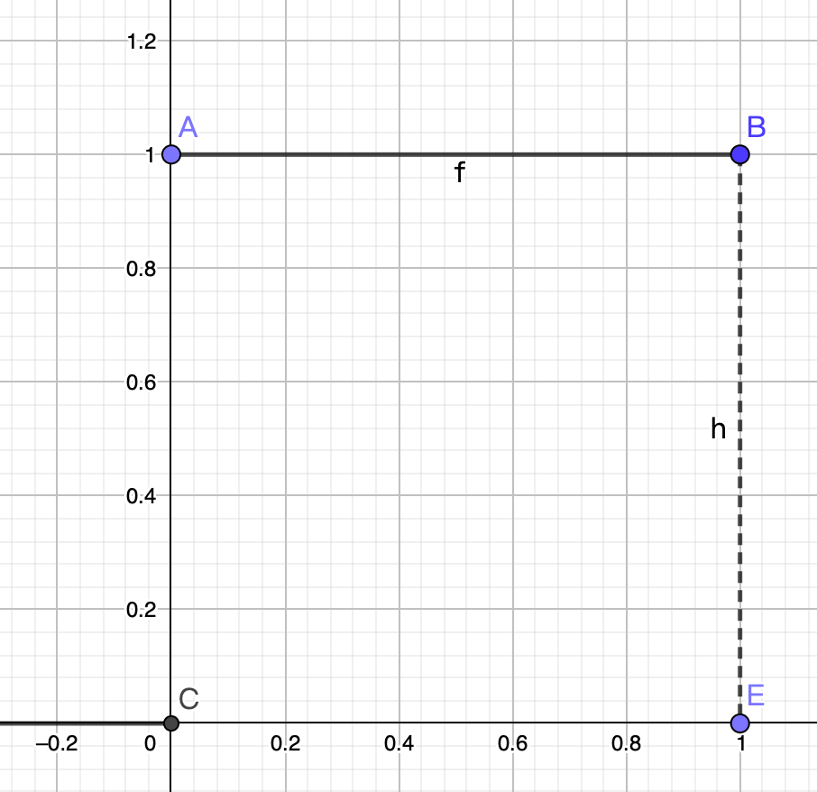

# Bayesian Statistics: From Concepts to Data Analysis

## Probability

### Backgrounds

#### Rules of Probability

If $A$ and $B$ are two events, the probability that $A$ or $B$ happens is the probability of the union of the events:

$$
P(A\cup B)=P(A) + P(B) - P(A\cap B)
$$

If a set of events $A_i$ for $i = 1, \dots, m$ are mutually exclusive (only one can happen), then:

$$
P(\bigcup^m_{i=1}A_i) = \sum^m_{i=1}P(A_i)
$$

#### Odds

Suppose we denote rolling a "$4$" on a fair six-sided die as the event $A$. Then $P(A)=\frac16$. The odds for events $A$, denoted $O(A)$ is defined as $O(A) = P(A)/P(A^c)=P(A)/(1-P(A))$:

$$
O(A)=\frac{1/6}{5/6}=\frac15
$$

This can also be expressed as $1:5$ (or $5:1$ "odds against").

If event $B$ has $a:b$ odds, then $P(B)/(1-P(B))=a/b \Rightarrow P(B)=a/(a+b)$.

#### Expectation

The expected value of a random variable $X$ is a weighted average of values $X$ can take, with weights given by the probabilities of those values. If $X$ can take on only a finite number of values, we can calculate the expected value as:

$$
E(X) = \sum^n_{i=1} x_i \cdot P(X=x_i)
$$

### Classical and Frequentist Probability

- Classical: equally likely
- Frequentists: relative frequency

### Bayesian Perspective

- Bayesian: Personal Perspective

## Bayesian Theorem

### Conditional Probability

$P(A|B)=\frac{P(A\cap B)}{P(B)}$

|        | Female | Not Female | Total |
|:------:|:------:|:---------:|:-----:|
|   CS   |    4   |     a     |   12  |
| Not CS |    b   |     c     |   d   |
|  Total |    9   |     e     |   30  |

- 30 students, 9 females, 12 computer science of which 4 females.
	- Male computer science student: 8
	- Not CS students: 18
	- Not CS females: 5
	- Not CS male students: 13
	- Total male students: 21

|        | Female | Not Female | Total |
|:------:|:------:|:----------:|:-----:|
|   CS   |   4    |     8      |  12   |
| Not CS |   5    |     13     |  18   |
| Total  |   9    |     21     |  30   | 

$$
P(F)=\frac{9}{30}=\frac{3}{10},\ P(CS) = \frac{12}{30}=\frac{2}{5},\ P(F\cap CS) = \frac{4}{30} = \frac{2}{15}
$$

Then, as for conditional problem:

$$
P(F|CS) = \frac{P(F\cap CS)}{P(CS)} = \frac{4/30}{12/30} = \frac13,\ P(F|CS^c) = \frac{P(F\cap CS^c)}{P(CS^c)} = \frac{5/30}{18/30}= \frac{5}{18}
$$

#### Independence

$$
P(A|B) = P(A) \Rightarrow P(A\cap B) = P(A)P(B)
$$

### Bayes' Theorem

$$
P(A|B) = \frac{P(B|A)P(A)}{P(B|A)P(A)+P(B|A^c)P(A^c)} = \frac{P(A \cap B)}{P(B)}
$$

$$
P(A_1|B) = \frac{P(B|A_1) P(A_1)}{\sum^m_{i=1}P(B|A_i)P(A_i)},\ \sum^m_{i=1}P(A_i)=1
$$

- Example: 
	- $P(+|HIV) = 0.977$
	- $P(-|NoHIV) = 0.926$
	- $P(HIV) = 0.0026$
	- What is $P(HIV|+)$ ?

$$
P(HIV|+) = \frac{P(+|HIV)P(HIV)}{P(+|HIV)P(HIV) + P(+|NoHIV)P(NoHIV)} = \frac{0.977 \times 0.0026}{0.977 \times 0.0026 + (1-0.926) \times (1-0.0026)}=0.033
$$

## Review of Distributions

### Bernoulli

$$
X \sim B(p),\ P(X=1)=p,\ P(X=0)=1-p
$$

$$
f(X=x|p) = f(x|p) = p^x (1-p)^{1-x}I_{\{x\in \{0, 1\}\}^{(x)}}
$$

Expected value:

$$
E[X] = \sum_x xP(X=x)=(1)p + (0)(1-p)=p
$$
Variance: 
$$
\mathrm{Var}(x) = p(1-p)
$$

### Binomial

The distribution of two possible outcomes.

$$
X \sim B_{in}(n, p)
$$

$$
P(X=x|p)=P(x|p)=(\frac{n!}{x!(n-x)!})p^x(1-p)^{n-x}, \mathrm{for}\ x\in \{0, 1, \dots, n\} 
$$

Expected Value:

$$
E[X] = np
$$

Variance:

$$
\mathrm{Var}(X) = np(1-p)
$$

### Uniform Distribution

The PDF is sort of proportional to the probability that the random variable will take a particular value. 

The key idea is that if you integrate the PDF over an interval, it gives you the probability that the random variable would be in that interval.

$$
X \sim U[0, 1]
$$

$$
f(x) = \begin{cases}
1 & \mathrm{if,} \ x\ \in [ 0,\ 1]\\
0 & \mathrm{otherwise}
\end{cases} = I_{\{0 \leq x \leq 1\}^{(x)}}
$$

The probability between $0<x<\frac12$:

$$
P(0<x<\frac12)=\int^{\frac12}_0 f(x)dx = \int^{\frac12}_0 dx = 0.5
$$

$$
P(0\leq x\leq\frac12)=\int^{\frac12}_0 f(x)dx = \int^{\frac12}_0 dx = 0.5
$$

Because there are an infinite number of possible outcomes, so for the possibility of a certain value is 0.

$$
P(X=\frac12)=0
$$

Expectation value:

$$
E[x]=\int^\infty_{-\infty}xf(x)dx
$$

if $X \bot Y$:

$$
E[X + Y] = E[X] + E[Y], E[XY]=E[X]E[Y]
$$

$X \sim [\theta_1, \theta_2]$

$$
f(x|\theta_1, \theta_2)= \frac{1}{\theta_2-\theta_1}I_{\theta_1 \leq x \leq \theta_2}
$$

### Exponential Distribution

We can write $X$ follows an exponential distribution with a rate parameter $\lambda$.

$$
X \sim \mathrm{Exp}(\lambda),\ f(x|\lambda)=\lambda e^{-\lambda x}
$$

$$
E[X]=\frac{1}{\lambda}, \mathrm{Var}(x)=\frac{1}{\lambda^2}
$$

### Normal Distribution

$$
X \sim N(\mu, \sigma^2)
$$

$$
f(x|\mu, \sigma^2) = \frac{1}{\sqrt{2\pi \sigma^2}}\exp\{-\frac{1}{2\sigma^2}(x-\mu)^2\}
$$

$$
E[X]=\mu, Var(x)=\sigma^2
$$

If $X$ and $Y$ are independent random variables:

$$
X\sim N(\mu_x, \sigma_x^2),\ Y\sim N(\mu_y, \sigma_y^2),\ Z=X+Y,\ Z\sim N(\mu_x + \mu_y, \sigma_x^2+\sigma_y^2)
$$

If not, we still have 

$$
E(X+Y)=E(X) + E(Y)
$$

but now

$$
\mathrm{Var}(X+Y)=\mathrm{Var}(X) + \mathrm{Var}(Y) + 2\mathrm{Cov}(X, Y)
$$

where

$$
\mathrm{Cov}(X, Y)=E[(X-E[Y])(Y-E[X])]
$$