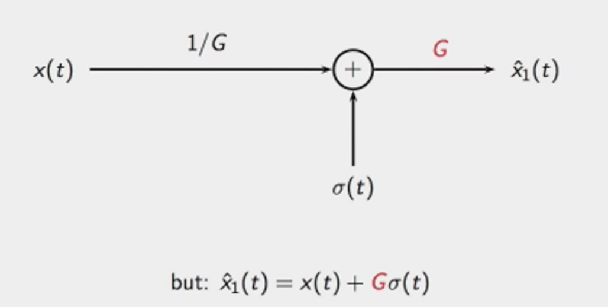
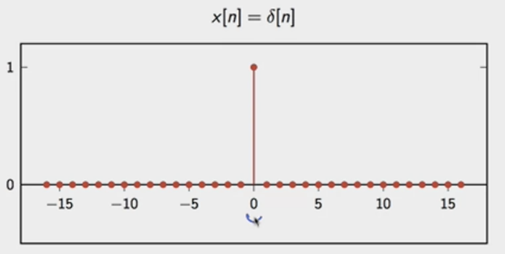
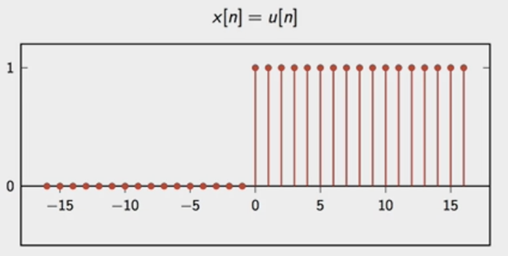
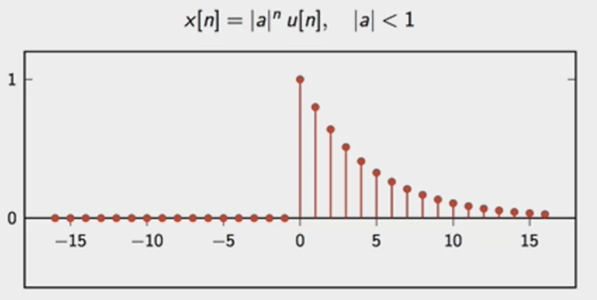
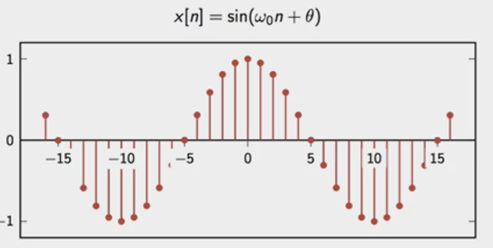

# DSP Course

## DSP1: Digital signals and Fourier transform

**Analysis**: understanding the information carried by the signal.

**Synthesis**: creating a signal to contain the given information.

- The digital paradigm
	- Key ingredients
		- discrete time 
			- The sampling Theorem: Under appropriate "slowness" condition for $x(t)$ we have:
				  $$
				  x(t)=\sum^\infty_{n=-\infty}\times x[n]\mathrm{sinc}(\frac{t-nT_s}{T_s})
				  $$ 
		- discrete amplitude
			- storage
			- processing
			- transmission
			

### Discrete-time signals

- Discrete-time signal: a sequence of complex number
	- one dimension (for now)
	- notation: $x[n]$, $[\cdot]$ means it's discrete
	- two-sided sequences: $x: \mathbb{Z\rightarrow C}$
	- $n$ is a-dimensional "time"
	- analysis: periodic measurement
	- synthesis: stream of generated samples

#### The delta signal

- $x[n]=\delta[n]$
	- It exemplifies a physical phenomenon that has a very short duration in time.

#### The unit step

- $x[n]=u[n]$
	- a signal that is $0$ for all negative values of the index.

#### The exponential decay

- $x[n]=|a|^nu[n], |a|<1$
	- How fast does your coffee get cold
		- $\frac{dT}{dt}=-c(T-T_{env})$
		- $T(t)=T_{env}+(T_0-T_env)e^{-ct}$
	- The rate of discharge of a capacitor in an RC circuit
		- $v(t)=V_0e^{-\frac{t}{RC}}$

#### The sinusoid

- $x[n]=\sin (\omega_0 n+\theta)$
	- the sine of an angular frequency of $\omega_0$

#### Four signal classes

- finite-length
	- sequence notation: $x[n], n = 0, 1, \dots, N-1$
	- vector notation: $x = [x_0 x_1 \dots x_{N-1}]^\top$
	- practical entities, good for numerical packages
- infinite-length
	- sequence notations: $x[n], n\in \mathbb{Z}$
	- abstraction, good for theorems
- periodic
	- N-periodic sequence: $\tilde{x}[n]=\tilde{x}[n+kN],\ n,k,N \in \mathbb{Z}$
	- same information as finite-length of length $N$
	- "natural" bridge between finite and infinite lengths
- finite-support
	- Finite-support sequences: with a finite number of nonzero samples.
	- $\bar{x}[ n] =\begin{cases}
x[ n] & \mathrm{if} \ 0\leq n< N\\
0 & \mathrm{otherwise}
\end{cases} \ n\in \mathbb{Z}$
	- same information as finite-length of length $N$
	- another bridge between finite and infinite lengths

#### Elementary operators

- scaling: $y[n]=\alpha x[n]$
- sum: $y[n]=x[n]+z[n]$
- product: $y[n]=x[n]\cdot z[n]$
- shift by $k$ (delay): $y[n]=x[n-k]$, shift a finite-length sequence to a finite-support sequence

#### Energy and power

- Energy: all elements in the sequences of the square magnitude of the elements.
	$$
	E_x=\sum_{n=-\infty}^{\infty}|x[n]|^2
	$$
	- periodic signals: $E_{tilde{x}}=\infty$
- Power: the rate of production of energy for a sequence, and it is defined as the limit for capital $N$ that goes to infinity of the local energy computed over a window of size $2N + 1$ divided by the size of the window.
	$$
	P_x=\lim_{N\rightarrow \infty} \frac{1}{2N+1}\sum^N_{n=-N}|x[n]|^2
	$$
	- periodic signals: $P_{\tilde{x}}=\frac{1}{N}\sum^{N-1}_{n=0}|\tilde{x}[n]|^2$

#### Digital vs Physical frequency

- Discrete time:
	- $n$: no physical dimension (just a counter)
	- periodicity: how many samples before pattern repeats
- Physical world:
	- periodicity: how many seconds before pattern repeats
	- frequency measured in $\mathrm{Hz}$ ($s^{-1}$)

- Set $T_s$, time in seconds between samples
- periodicity of $M$ samples --> periodicity of $MT_s$ seconds
- real world frequency: $f=\frac{1}{MT_s}\mathrm{Hz}$

### The Karplus-Strong algorithm

