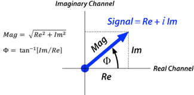

## $k$-space

### What is $k$-space

$k$-space is an array of numbers representing **spatial frequencies in the MR image**.

$k$-space is a grid of raw data of the form $(k_x, k_y)$ obtained directly from the MR signal.

Each point in $k$-space is just a data point derived directly from the MR signal. The brightness of each point represents the relative contribution of that unique spatial frequency to the final image.

The two presentations may be converted to one another using Fourier Transform.

The $k_x$ and $k_y$ axes of $k$-space correspond to the horizontal (x-) and vertical (y-) axes of the image.

The individual points $(k_x, k_y)$ in k-space **do not correspond one-to-one** with individual pixels $(x, y)$ in the image.

Each k-space point contains spatial frequency and phase information about *every* pixel in the final image. Each pixel in the image maps to every point in $k$-space. 

$k$-space is a deconstructed representation of spatial frequencies inherent in the original object.

### "Geography" of $k$-space

Different parts of k-space **do** correspond topologically to *spatial frequencies* in MR image.

Data near the centre of k-space corresponds to low spatial frequencies (i.e., general shapes and contours), whereas data from the periphery relates to high-spatial frequencies (i.e., edges, details).

### The meaning of $k$

The letter $k$ refer to the spatial frequency of waves in various media.

A wave is characterised by its wavelength $\lambda$, the distance between two corresponding points or successive peaks. The wavenumber $k$ is simply the reciproccal of the wavelength, given by:

$$
k = 1/\lambda
$$

The wavenumber $k$ is therefore the number of waves or cycles per unit distance.

### Spatial Frequencies

Images can be decomposed into planar waves varying in amplitude, frequency, phase, and direction.

Spatial frequency is the number of wave cycles (or line pairs) per unit distance.

A 2-dimensional image can be decomposed into a set of planar waves varying in phase, frequency, amplitude, and direction.

The $k$-space representation of an MR image is merely an organised collection of these spatial frequencies reflecting that image's spatial harmonic content.

### Location of Spatial Frequencies

The centre of $k$-space contains low spatial frequency information, determining overall image contrast, brightness, and general shapes.

The periphery of $k$-space contains high spatial frequency information, such as edges, details, sharp transitions.

Points along the $k_x$-axis represent frequency components along the $x$-direction of the image. Points along the $k_y$-axis reflect frequency components along the $y$-direction of the image.

### Filling $k$-space

Because gradients have been applied for phase and frequency encoding, the MR signal is already in a Fourier-like format suitable for filling the $k$-space matrix.

Each digitised data point of the MR signal can be represented as a complex number, with real and imaginary components. Each data point can be defined as having a magnitude and phase, computed by simple trigonometric relations.

The dominant method for filling $k$-space over the last 30 years has been the line-by-line *Cartesian method*.

In the Cartesian method each digitised echo completely fills a line of $k$-space. The echo signal is recorded in quadrature, so each k-space point contains *real* and *imaginary* components. The $k$-space values on the left side of each row are obtained early in the evolution of the echo, while those on the right side are obtained later. The centre of the echo occur near the middle of each row of $k$-space.

Rows near the centre of the k-space grid are defined to correspond to low-order phase-encode steps, whereas those rows near the top and bottom correspond to higher-order phase-encodings. Since echo amplitudes are larger at the low-order phase-encode steps, the values of $k$-space will be greater near the centre of the grid.