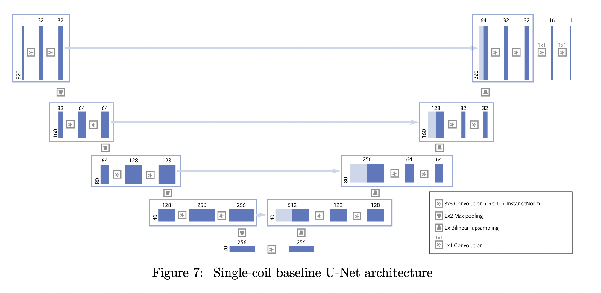
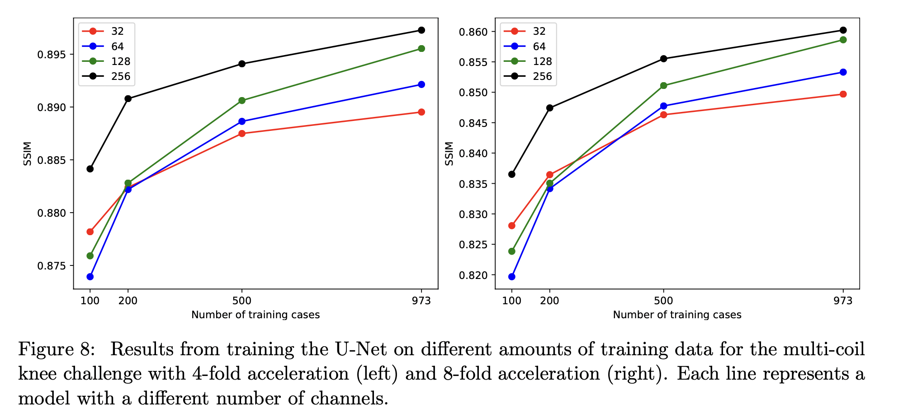
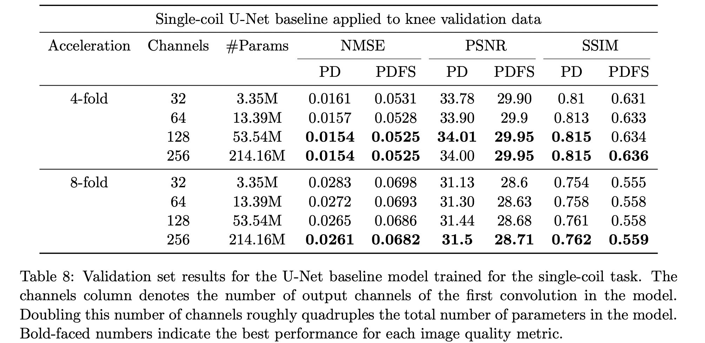
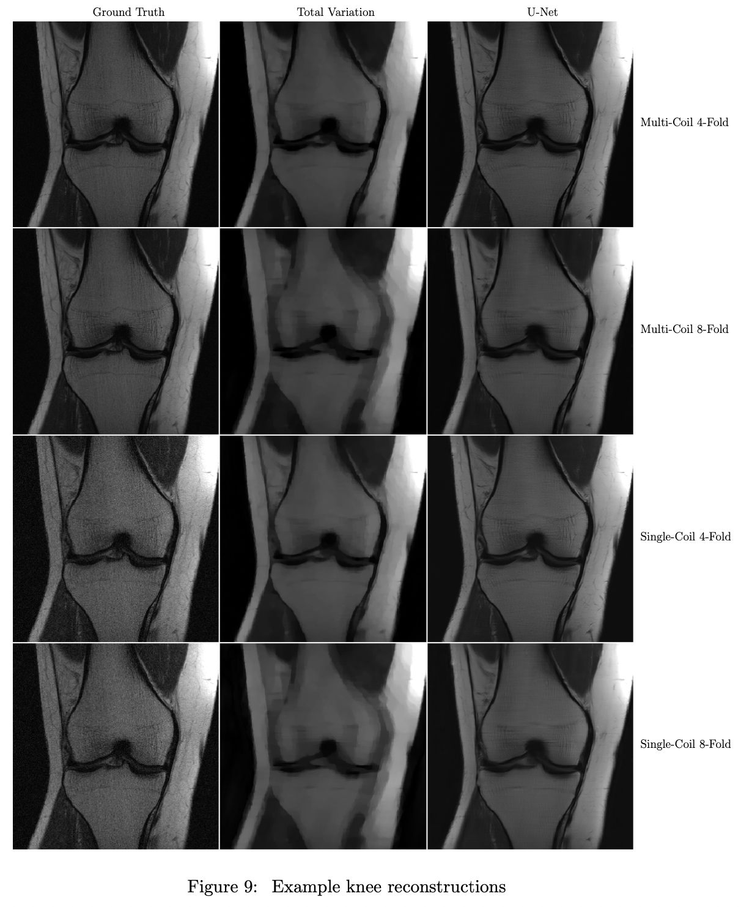

# fastMRI: An Open Dataset and benchmarks for Accelerated MRI

## Introduction

In this work we describe the first large-scale release of raw MRI data that includes $8344$ volumes, consisting of $167, 375$ slices, associated with *in vivo* examinations from a range of MRI systems. In addition, we are releasing processed MR images in DICOM format from $20,000$ knee and brain examinations from a representative clinical patient population, consisting of more than $1.57$ million slices.

## Introduction to MR Image Acquisition and Reconstruction

The spatially-resolved image $m$ can be estimated from the full k-space $y$ by performing an inverse multidimensional Fourier transform:

$$
\hat{m}=\mathcal{F}^{-1}(y)
$$

where $\hat{m}$ is a noise-corrupted estimate of the true image $m$. The number of samples captured in k-space is a limiting factor for the speed of MR imaging. Fewer samples can be captured by sampling up to a lower maximum frequency, however this produces images of lower spatial resolution. An alternative undersampling approach involves omitting some number of k-space samples within a given maximum frequency range, which then results in aliasing artifacts.

### Parallel MR Imaging

In parallel MR imaging, multiple receiver coils are used, each of which produces a separate k-space measurement matrix. Each of these matrices is different, since the view each coil provides of the imaged volume is modulated by the differential sensitivity that coil exhibits to MR signal arising from different regions; Each coil measures Fourier components of the imaged volume multiplied by a complex-valued position-dependent coil sensitivity map $S_i$. The measured k-space signal $y_i$ for coil $i$ in an array of $n_c$ coils is given by:

$$
y_i=\mathcal{F}(S_im) + noise
$$

where the multiplication is entry-wise.

This image shows the absolute value of the inverse *discrete Fourier transform* (DFT) of fully-sampled complex-valued k-space signals for each coil in a 15-element coil array.

If the sensitivity maps are known, and the k-space sampling is full, then the set of linear relations between $m$ and each $y_i$ defines a linear system that is overdetermined by a factor of $n_c$. It may be inverted using a pseudoinverse operation to produce a reconstruction of $m$, as long as the linear system is full rank. The quality of this reconstruction will depend on the measurement noise, since the signal-to-noise ratio is poor in parts of the volume where the coil sensitivity is low.

In accelerated parallel imaging, each coil's k-space signal is undersampled. As long as the total number of measurements across all coils exceeds the number of image voxels to be reconstructed, an unregularised least squares solution can still be used, leading to a theoretical $n_c$-fold speedup over fully-sampled single-coil imaging. Each extra coil effectively produces an additional "sensitivity-encoded" measurement of the volume, which augments the frequency and phase encoded measurements obtained from the sequential application of magnetic field gradients in the MR pulse sequence.

In practice, the use of sub-sampling results in significant amplification of noise, and regularisation is usually needed. As a result, in the clinic, parallel imaging acceleration factors are typically on the order of two to three.

### Machine Learning Reconstruction of Undersampled MRI Data

In the machine learning approach, a reconstruction function:

$$
\hat{m} = B(y)
$$

is learned from input and output pair tuples $(y,m)$ drawn from a population. The goal is to find a function $B$ that minimises the risk over the population distribution:

$$
B^* = \underset{B}{\arg \min}R(B)\ \ \mathrm{where}\ R(B)=\mathbb{E}_{(y, m)}[L(B(y), m)]
$$

In practice this optimisation problem must be approximated with the empirical risk using a sample $\{(m^{(i)}, y^{(i)})\}^{n_{data}}_{i=1}$ from the population, with respect to a loss function $L$:

$$
R_{empirical}(B)=\frac{1}{n_{data}}\sum^{n_{data}}_{i=1}L(B(y^{(i)}), m^{(i)})
$$

## Prior Public Datasets

See [A list of Public MRI Dataset](Dataset_List.md)

## The fastMRI Dataset and Associated Tasks

Four types of data:

1. **Raw multi-coil k-space data**: unprocessed complex-valued multi-coil MR measurements
2. **Emulated single-coil k-space data**: combined k-space data derived from multi-coil k-space data in such as way as to approximate single-coil acquisitions, for evaluation of single-coil reconstruction algorithms.
3. **Ground-truth images**: real-valued images reconstructed from fully-sampled multi-coil acquisitions using the simple root-sum-of-squares method detailed below.
4. **DICOM images**: spatially-resolved images for which the raw data was discarded during the acquisition process. These images are provided to represent a larger variety of machine s and settings than are present in the raw data.

Two distinct types of tasks:

1. **Single-coil reconstruction task**: reconstruct images approximating the ground-truth from undersampled single-coil data
2. **Multi-coil reconstruction task**: reconstruct images approximating the ground-truth from undersampled multi-coil data.

For each task we provide an official split of the k-space data and ground-truth images into *training* and *validation* subsets that contain fully-sampled acquisitions, as well as *test* and *challenge* subsets which contain k-space data that have been subjected to undersampling masks. During training of a machine-learning model, the training k-space data should be programmatically masked following the same procedure.

The rationale for having a single-coil reconstruction task is two fold:
1. to lower the barrier of entry for researchers who may not be familiar with MRI data, since the use of a single coil removes a layer of complexity
2. to include a task that is relevant for the single-coil MRI machines still in use throughout the world

The DICOM images may be useful as additional data for training. Their distribution is different from that of the ground-truth images, since they were acquired with a larger diversity of scanners, manners of acquisition, reconstruction methods, and post-processing algorithms, so the application of transfer-learning techniques may be necessary. Most DICOM images are the result of accelerated parallel imaging acquisitions and corresponding reconstructions, with image quality that differs from that of putative fully-sampled acquisitions and reconstructions. The ground-truth images may represent a higher standard of image quality than the clinical gold standard, for which full sampling is not routine or even practical.

### Anonymisation

Raw data was anonymised via conversion to the vendor-neutral ISMRMRD [^1]  format, with manual checking of metadata in raw data files, as well as spot checking of all metadata and image content.

DICOM data was anonymised using the RSNA clinical trial. processor. Each DICOM image is performed manual inspection for the presence of unexpected protected health information (PHI).

### Knee k-space Data

Multi-coil raw data was stored for $1,595$ scans acquired for the purpose of diagnostic knee mRI. For each scan, a single fully sampled MRI volume was acquired on one of three clinical 3T system or one clinical 1.5T system. Data acquisition used a 15 channel knee coil array and conventional Cartesian 2D TSE protocal employed clinically.

The dataset includes data from two pulse sequences, yielding coronal proton-density weighting with and without fat suppression.

The following sequence parameters are used:
- Echo train length $4$
- matrix size $320 \times 320$
- in-plane resolution $0.5$mm$\times 0.5$ mm
- slice thickness $3$mm
- no gap between slices
- repetition time (TR) ranging between $2200$ and $3000$ ms
- echo time (ET) between $27$ and $34$ ms

### Brain k-space Data

Data from %6970$ fully sampled brain MRIs were obtained using $11$ magnets across $5$ clinical locations using $1.5T$ and $3T$ field strengths.

The raw dataset includes axial T1 weighted, T2 weighted and FLAIR images. Some of the T1 weighted acquisitions included admissions of contrast agent (labelled T1 POST).

To ensure data de-identification, we used only axial 2D images in this dataset. We used zero matrices to replace the k-space slices $\underset{\approx}{>} 5$mm below the orbital rim. All processed k-spaces were then reconstructed to images in DICOM format, loaded into a picture archival communication system (PACS) and all images were visually checked by certified MR technologists to confirm exclusion of identifying facial features.

### Knee emulated Single-coil k-space Data

We used an emulated single-coil (ESC) methodology to simulate single-coil data from a multi-coil acquisition.

ESC computes a complex-valued linear combination of the responses from multiple coils, with the linear combination fitted to the ground-truth root-sum-of-squares reconstruction in the least-squares sense.

### Knee DICOM Data

In addition to the scanner raw data described above, the fastMRI dataset includes DICOM data from $10,000$ clinical knee MRI scans. These images represent a wider variety of scanners and pulse sequences than those represented in the collection of raw data.

five clinical pulse sequences:

1. Coronal proton-density weighting without fat suppression,
2. Coronal proton-density weighting with fat suppression,
3. Sagittal proton-density weighting without fat suppression,
4. Sagittal T2 weighting with fat suppression, and
5. Axial T2 weighting with fat suppression.

The Fourier transformation of an image from a DICOM file does not directly correspond to the originally measured raw data，due to the inclusion of additional post-processing steps in the vendor-specific reconstruction pipeline. Most of the DICOM images are also derived from accelerated acquisitions and are reconstructed with parallel imaging algorithms, since this baseline acceleration represents the current clinical standard. **The image quality of DICOM images, therefore, is not equivalent to that of the ground truth images directly associated with fully sampled raw data.**

### Brain DICOM

$10,000$ brain MRI DICOM studies are also included.

Axial 2D image volumes are included with: T1, T2, and T2 FLAIR. All studies represent unique individuals and there is no subject overlap with the brain raw data.

Finally, we present $10,000$ brain MRI DICOM studies from $10,000$ unique subjects, each one including axial 2D DICOM image volumes through the majority of the brain representing a broad range of neurological pathologies.

### Ground Truth

The root-sum-of-squares reconstruction method applied to the fully sampled k-space data provides the ground truth for the multi-coil dataset. The single-coil dataset includes two ground truth reconstructions, which we denote ESC and RSS:
- The ESC ground truth is given by the inverse Fourier transform of the single-coil data
- The RSS ground truth is given by the root-sum-of-squares reconstruction computed on the multi-coil data that were used to generate the virtual single-coil k-space data.
All ground truth images are cropped to the central $320 \times 320$ pixel region to compensate for readout-direction oversampling that is standard in clinical MR examinations.

RSS is one of the most commonly-used coil combination methods in clinical imaging. It first applies the inverse Fourier Transform to the k-space data from each coil:

$$
\tilde{m}_i=\mathcal{F}^{-1}(y_i)
$$

where $y_i$ is the k-space data from the $i$th coil and $\tilde{m}_i$ is the $i$th coil image. Then, the individual coil images are combined voxel by voxel as follows:

$$
\tilde{m}_{rss}=(\sum^{n_c}_{i=0}|\tilde{m}_i|^2)^{-1/2}
$$

where $\tilde{m}_{rss}$ is the final image estimate and $n_c$ is the number of coils. The RSS image estimate is known to converge to the optimal, unbiased estimate of $m$ in the high-SNR limit.

### Dataset Split

### Cartesian Undersampling

The undersampling is performed by retrospectively masking k-space lines from a fully-sampled acquisition. k-space lines are omitted only in the phase encoding direction, so as to simulate physically realisable accelerations in 2D data acquisitions.The same undersampling mask is applied to all slices in a volume, with each case consisting of a single volume. The overall acceleration factor is set randomly to either four or eight, with equal probability for each.

When the acceleration factor equals four, the fully-sampled central region includes 8% of all k-space lines; when it equals eight, 4% of all k-space lines are included.

## Metrics

The most commonly used evaluation metrics in the MRI reconstruction include *mean square error*, and *signal-to-noise ratio*, which measures the degree to which image information rises above background noise. These metrics are appealing because they are easy to understand and efficient to compute. However, they both evaluate pixels independently, ignoring the overall image structure.

Additional metrics have been introduced in the literature to capture structural distortion. For example, the *structural similarity index* and its extended version, *multiscale structural similarity*, provide a mechanism to assess the perceived quality of an image using local image patches.

The most recent development in CV leverage pretrained DNN to measure the perceptual quality of an image by computing differences at the representation level, or by means of a downstream task such as classification.

### NMSE

The NMSE between a reconstructed image or image volume represented as a vector $\hat{v}$ and a reference image or volume $v$ is defined as:

$$
\mathrm{NMSE}(\hat{v}, v) = \frac{\|\hat{v}-v\|_2^2}{\|v\|_2^2}
$$

We report NMSE values computed and normalised over full image volumes rather than individual slices, since image-wise normalisation can result in strong variations across a volume.

The downsides such as a tendency to favour smoothness rather than sharpness.

### Peak Signal-to-Noise Ratio (PSNR)

$$
\mathrm{PSNR}(\hat{v}, v)=10 \log_{10}\frac{\max(v)^2}{\mathrm{MSE}(\hat{v}, v)}
$$

Higher values of PSNR (as opposed to lower values of NMSE) indicate a better reconstruction.

### Structural Similarity

SSIM index measures the similarity between two images by exploiting the inter-dependencies among nearby pixels. SSIM is inherently able to evaluate structural properties of the objects in an image and is computed as different image locations by using a sliding window. The resulting similarity between two image patches $\hat{m}$ and $m$ is defined as:

$$
\mathrm{SSIM}(\hat{m}, m) = \frac{(2\mu_\hat{m}\mu_m+c_1)(2\sigma_{\hat{m} m} + c_2)}{(\mu^2_\hat{m}+\mu^2_m+c_1)(\sigma^2_\hat{m}+\sigma^2_m+c_2)}
$$

where $\mu_\hat{m}$ and $\mu_m$ are the average pixel intensities, and $\sigma^2_\hat{m}$ and $\sigma^2_m$ are their variances, $c_1$ and $c_2$ are two variables to stabilize the division.

### L1 Error

$$
\mathrm{L}_1(\hat{v},v)=\|\hat{v}-v\|_1
$$

## Baseline Models

we detail two reference approaches to be used as reconstruction baselines: a classical non-machine learning approach, and a deep-learning approach.

The "classical" baselines are comprised of reconstruction methods developed by the MRI community over the last 30+ years. These methods have been extensively tested and validated, and many have demonstrated robustness sufficient for inclusion in the clinical workflow.

### Single-coil Classical Baseline (knee only)

The sparse reconstruction approach consists of finding an image $m$ whose Fourier space representation is close to the measured k-space matrix $y$ at all measured spatial frequencies, yet at the same time minimises a sparsity-inducing objective $R(m)$ that penalizes unnatural reconstructions:

$$
\underset{m}{\mathrm{minimise}}\ R(m) s.t. \|\mathcal{P}(\mathcal{F}(m))-y\|^2_2 \leq \epsilon
$$

For a convex regulariser $R$, there exists, for any choice $\epsilon >0$, a value $\lambda$ such that these two formulations have equivalent solutions. The most common regularisers used for MRI are:

$$
R_{L_1}=\|m\|_1
$$
$$
R_{wavelet}(m)=\|\Psi(m)\|_1,\ \ \Psi\mathrm{\ is\ a\ discrete\ wavelet\ transform }
$$
$$
R_{TV}(m)=\sum_{i,j}\sqrt{|m_{i+1,j}-m_{i,j}|^2+|m_{i,j+1}-m_{i,j}|^2}
$$

- The $L_11$ penalty works best when the MR images are sparse in image space, for instance in vascular imaging
- The total variation (TV) penalty encourages sparsity in the spatial gradients of the reconstructed image, as given by a local finite-difference approximation
	- TV regulariser can be very effective for some imaging protocols, but it also has a tendency to remove detail
- The $R_{wavelet}$ penalty encourages sparsity in the discrete wavelet transform of the image.
	- Most natural images exhibit significant sparsity when expressed in a wavelet basis. The most commonly used transform is the Multiscale Daubechies (DB2) transform

The single-coil classical baseline provided with the fastMRI dataset was adopted from the widely-used open-source BART [^2] toolkit, using total variation as the regulariser. We ran the optimisation algorithm for 200 iterations on each slice independently.

### Single-coil Deep Learning Baselines (knee only)

U-Net models and their variants have successfully been used for many image-to-image prediction tasks including MRI reconstruction and image segmentation.

The U-Net single-coil baseline model included with the fastMRI data release consists of two deep convolutional networks, a down-sampling path followed by an up-sampling path. The down-sampling path consists of blocks of two $3\times 3$ convolutions each followed by instance normalisation and ReLU activation function. The blocks are interleaved by down-sampling operations consisting of max-pooling layers with stride 2 which halve each spatial dimension. The up-sampling path consists of blocks with a similar structure to the down-sampling path, interleaved with bilinear up-sampling layers which double the resolution between blocks. In contrast to the down-sampling path, the up-sampling path concatenates two inputs to the first convolution in each block: the up-sampled activations from the previous block, together with the activations that follow the skip connection from the block in the down-sampling path with the same resolution. At the end of the up-sampling path, we include a series of $1\times 1$ convolutions that reduce the number of channels to one without changing the spatial resolution.

For the single-coil MRI reconstruction case, the zero-filled image is used as the input to the model. The zero-filled image is obtained by first inserting zeros at the location of all unobserved k-space values, applying a two-dimensional IFT to the result, and finally computing the absolute value. The result is center cropped to remove any readout and phase oversampling.

The zero-filled image is given by $\tilde{m}=\mathcal{C}(|\mathcal{F}^{-1}(\mathcal{P}(y))|)$, where $\mathcal{C}$ is the linear operator corresponding to the centre cropping and $\mathcal{F}^{-1}$ is the two-dimensional IFT.

The entire network is trained on the training data in an end-to-end manner to minimise the *mean absolute error* with respect to corresponding ground truth images. Let $B_\theta(m)$ be the function computed by the U-Net model, where $\theta$ represents the parameters of the model. Then the training process corresponds to the following optimisation problem:

$$
\underset{\theta}{\mathrm{minimise}}\frac12 \sum^{n_{data}}_{i=0}\|B_\theta(\tilde{m}^{(i)})-m^{(i)}\|_1
$$

where the ground truth $m^{(i)}$ are obtained using the ESC method. Our particular single-coil U-Net baseline model was trained on $973$ image volumes in the training set, using RMSProp. We used an initial learning rate of $0.001$, which was multiplied by $0.1$ after $40$ epochs, after which the model was trained for an additional 10 epochs. During training, we randomly sampled a different mask for each training example in each epoch independently using the protocol for the test data. At the end of each epoch, we recorded the NMSE on the validation data. After training, we picked the model that achieved the lowest validation NMSE.

These results indicate that the trained U-Net models perform significantly better than the classical baseline method. The best U-Net models obtain 40-50% relative improvement over the classical methods in terms of NMSE.

The performance of the U-Net models continues to increase with increasing model capacity. These improvements begin to saturate after 50 million parameters for the simpler 4-fold acceleration case. However, for the more challenging 8-fold acceleration task, the largest model performs significantly better than the smaller models.

### Multi-coil Classic Baselines

### Multi-coil Deep Learning Baselines

## Discussion

Contrary to many computer vision problems where small texture changes might not necessarily alter the overall satisfaction of the observer, in MRI reconstruction, extra care should be taken to ensure that the human interpreter is not misled by a very plausible but not necessarily correct reconstruction. Therefore some research effort should be devoted to look for solutions that, by design, ensure correct diagnosis, and we hope that our dataset will provide a testbed for new ideas in these directions as well.

A natural question arises: what would the optimal metric be? An ideal MRI reconstruction algorithm should produce sharp, trustworthy images, that ultimately ensure the proper radiologic interpretation.

Extending the results from methods developed for this challenge to the clinic remains an open problem, but we believe the provision of this dataset is an important first step on the path to this goal.

## Raw k-space File Descriptions

`ISMRMRD` files were converted into simpler `HDF5` files that store the entire k-space in a single tensor. One `HDF5` file was created per volume. The `HDF5` files share the following common attributes:

- *acquisition*: Acuisition protocol.
	- Knee: `CORPD` or `CORPDF`
	- Brain: `AXFLAIR`, `AXT1`, `AXT1POST` or `AXT2`
- *patient_id*: A unique string identifying the examination
- *norm, max*: The Euclidean norm and the largest entry of the target volume.
	- single: the target volume is stored in `reconstruction esc`
	- multi: the target volume is stored in `reconstruction rss`
- *acceleration*: Acceleration factor of the undersampled k-space trajectory (either 4 or 8). *Only available in the test dataset*.
- *num low frequency*: The number of low-frequency k-space lines in the undersampled k-space trajectory. *This attribute is only available in the test dataset*.

### Single-coil Track

- *knee singlecoil train.tar.gz*: Training dataset for the single-coil track.
	- *kspace*: Emulated single-coil k-space data. The shape of the kspace tensor is `(number of slices, height, width)`.
	- *reconstruction_rss*: root-sum-of-squares reconstruction of the multi-coil k-space that was used to derive the emulated single-coil k-space cropped to the centre $320 \times 320$ region. The shape of the reconstruction rss tensor is `(number of slices, 320, 320)`.
	- *reconstruction_esc*: The inverse Fourier transform of the single-coil k-space data cropped to the centre $320 \times 320$ region. The shape of the reconstruction esc tensor is `(number of slices, 320, 320)`.
	- *ismrmrd_header*: The XML header from the `ISMRMRD` file that was used to generate the `HDF5` file
- *knee singlecoil val.tar.gz*: Validation dataset for the single-coil track. The HDF5 files have the same structure as the HDF5 files in *singlecoil train.tar.gz*.
- *knee singlecoil test.tar.gz*": Test dataset for the single-coil track. Note that only the knee dataset has a single-coil track. The HDF5 files contain the following tensors:
	- *kspace*: Undersampled emulated single-coil k-space. The shape of the kspace tensor is `(number of slices, height, width)`.
	- *mask*: Defines the undersampled Cartesian k-space trajectory. The number of elements in the mask tensor is the same as the width of k-space.

### Multi-coil Track

## Reference

[^1]: Souheil J Inati, Joseph D Naegele, Nicholas R Zwart, Vinai Roopchansingh, Martin J Lizak, David C Hansen, Chia-Ying Liu, David Atkinson, Peter Kellman, Sebastian Kozerke, et al. [ISMRM raw data format: a proposed standard for MRI raw datasets](https://www.opensourceimaging.org/project/ismrmrd). Magnetic resonance in medicine, 77(1), 2017.

[^2]: Martin Uecker, Patrick Virtue, Frank Ong, Mark J. Murphy, Marcus T. Alley, Shreyas S. Vasanawala, and Michael Lustig. [Software toolbox and programming library for compressed sensing and parallel imaging](https://mrirecon.github.io/bart/). In ISMRM Workshop on Data Sampling and Image Reconstruction, 2013.