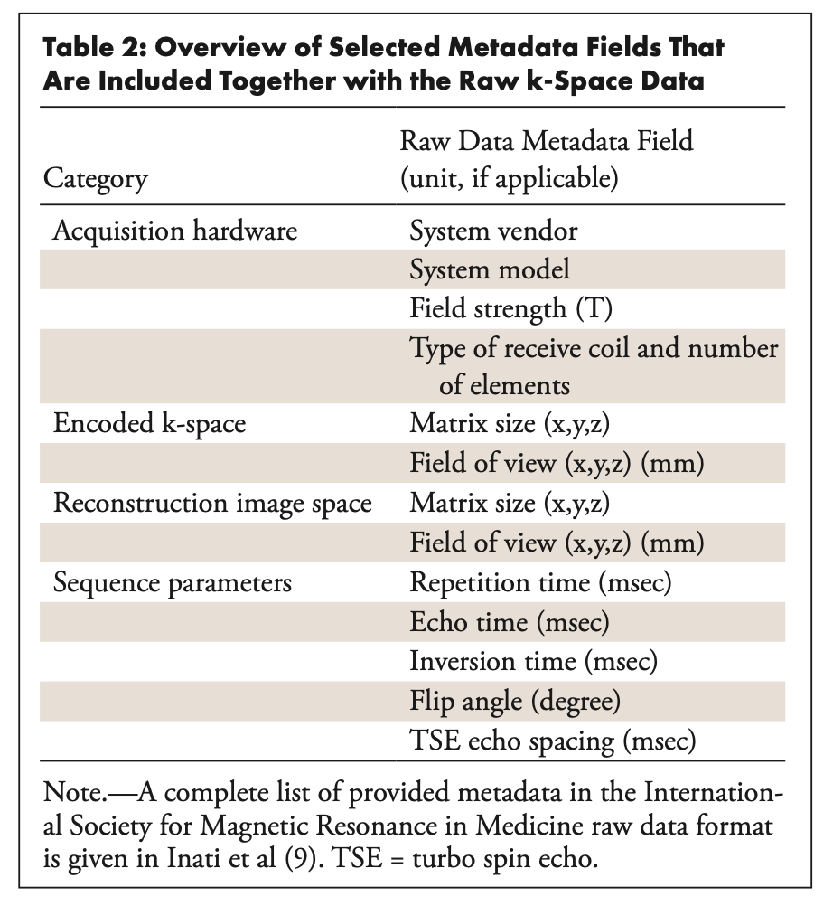

# Deep Into FastMRI Dataset

This article is designed to provide insight into the data details and structure of the fastMRI [^1] dataset, as well as a parsing of the data reads and baseline model of the [fastMRI](https://github.com/facebookresearch/fastMRI) library.

## Data Description

### Single-coil Knee

The dataset includes both raw MRI k-space data and magnitude DICOM images [^2].
- The k-space data comprises $1594$ measurement datasets obtained in knee mRI examinations from a range of MRI systems and clinical patient populations, with responding images derived from the k-space data using reference image reconstruction algorithms.
- The DICOM data represent an additional $10012$ clinical image datasets from $9290$ patients undergoing similar knee MRI examinations.

 Five sequences for different contrasts and image orientations:
 1. coronal proton density weighted
 2. coronal proton density weighted with fat suppression
 3. axial T2 weighted with fat suppression
 4. sagittal proton density weighted, and 
 5. sagittal T2 weighted with fat suppression.

The k-space dataset only contains the coronal acquisitions.

The DICOM dataset contains data from all five sequences, whose parameters can be found directly in the headers of the data.

The k-space data were deidentified via conversion to the vendor-neutral ISMRM raw data format.

DICOM data were deidentified by using the RSNA clinical Trial Processor tool. 

 The k-space is split up into the following files for download:
1. `singlecoil_train` (88 GB)
2. `singlecoil_val` (19 GB)
3. `singlecoil_test` (7 GB)
   
The total size of the combined DICOM image files is approximately 164 GB, which are stored with lossless JPEG 2000 image compression:
1. DICOMs_batch1 (134 GB)  
2. DICOMs_batch2 (30 GB).

#### k-space dataset

Fully sampled k-space data from 1594 consecutive clinical MRI proton density–weighted acquisitions of the knee in the coronal plane with and without  
frequency-selective fat saturation are included.

Scans were performed on three clinical `3-T` systems (*Siemens Magnetom Skyra, Prisma,* and *Biograph-mMR*) and one clinical `1.5-T` system (*Siemens Magnetom Aera*) using clinical multichannel receive coils.

Example images from reference reconstructions are shown in the figure below.

The data are provided together with metadata that allow reconstruction of images by means of a simple inverse Fourier transform. In particular, the individual k-space lines are already correctly sorted accord- ing to their position in the acquisition trajectory. No further preprocessing steps were performed on the data.

Because the data were acquired with a multichannel receive array coil, a proper combination of the individual coil images is a necessary step in the image reconstruction process. The most straightforward approach is to use a *sum-of-squares* combination of the individual coil images.

Image reconstruction of accelerated acquisitions via parallel imaging requires an additional calibration step to obtain coil sensitivity information: either obtaining maps of the coil sensitivity profiles or estimating convolution kernels in k-space.

We also provide simulated single-coil k-space data derived from the acquired multi-coil k-space data using an “emulated single-coil” combination algorithm.

The rationale for providing simulated single-coil data—even though reconstruction from multi-coil data:

1. To lower the barrier of entry for researchers who may not be familiar with MRI data, since the use of a single coil removes a layer of complexity
2. to include a task that is relevant for the single-coil MRI machines still in use through- out the world, and
3. to separate out the aspects of reconstruction related to compressed sensing rather than parallel imaging.

Examples in the test and challenge sets contain undersampled k-space data. The undersampling is performed by retrospectively masking k-space lines from a fully sampled acquisition. k-space lines are omitted only in the phase-encoding direction to simulate physically realisable accelerations in 2D data acquisitions. The undersampling mask is chosen randomly for each example, subject to constraints on the number of fully sampled central lines and the overall undersampling factor.

#### HDF5 File Details

##### Keys

- ***ismrmrd_header***: The XML header from the `ISMRMRD` file that was used to generate the `HDF5` file. Here is [an example](https://gist.github.com/YuyangXueEd/6f1457a788309dcdf7746ef7e2377c5c) of the `ISMRMRD` header from one train file. Here are some important keys:
	- *systemFieldStrength_T*: `1.5T` or `3T`
	- *encoding - encodedSpace - fieldOfView_mm*: Field of view
	- *encoding - encodedSpace - matrixSize*: Crop size
	- *encoding - encodingLimits - slice*: How many slices
	- *encoding - reconSpace - fieldofView_mm*: Field of view in mm
	- *encoding - reconSpace - matrixSize*: Actual reconstruction size
	- *encoding - trajectory*: Cartesian or non-Cartesian
- ***kspace***: `complex64` Numpy data, using `to_tensor()` to convert to PyTorch tensor
- ***reconstruction_esc***: a reconstructed output using ESC algorithm
- ***reconstruction_rss***: a reconstructed output using RSS algorithm

##### Attributes

- ***acquisition***:Acuisition protocol.
	- *Knee*: `CORPD` or `CORPDF`
- ***max***: The largest entry of the target volume. Not shown in test or challenge files.
- ***norm***: The Euclidean norm of the target volume. Not shown in test or challenge files.
- ***patient_id***: A unique string identifying the examination.
- ***acceleration***: Acceleration factor of the undersampled k-space trajectory (either 4 or 8). Only available in the test dataset.
- ***num low frequency***: The number of low-frequency k-space lines in the undersampled k-space trajectory. This attribute is only available in the test dataset.

## Data Manipulation

## Baseline Models

## Reference

[^1]: J. Zbontar _et al._, ‘fastMRI: An Open Dataset and Benchmarks for Accelerated MRI, Dec. 2019, Accessed: Apr. 01, 2022. [Online]. Available: [http://arxiv.org/abs/1811.08839](http://arxiv.org/abs/1811.08839)

[^2]: F. Knoll _et al._, ‘fastMRI: A Publicly Available Raw k-Space and DICOM Dataset of Knee Images for Accelerated MR Image Reconstruction Using Machine Learning’, _Radiology: Artificial Intelligence_, vol. 2, no. 1, p. e190007, Jan. 2020, doi: [10.1148/ryai.2020190007](https://doi.org/10.1148/ryai.2020190007).