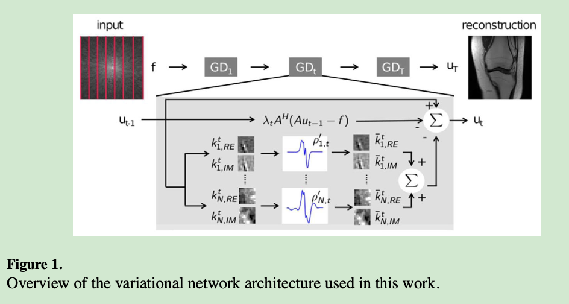

# Assessment of the generalisation of learned image reconstruction and the potential for transfer learning

## Introduction

The main goal of this study is to assess the influence of image *contrast*, *SNR*, *sampling pattern* and *image content* on the generalisation of a learned image reconstruction.

These parameters have a strong influence on the structure of the aliasing artifacts and consequently, the conditioning of the reconstruction problem.

## Methods

Three kind of k-space data:
- clinical patients
	- 15 channel knee coil
	- 2D TSE protocol
	- reconstructed by an inverse Fourier transform followed by a sum-of-squares combination of individual coil elements
	- have fundamentally different *contrast and SNR*
- additionally processed k-space data
	- The noise level $\sigma_{est}$ of the two sequences was estimated from an off-center slice that showed only background $u_\sigma$.
		- performed by averaging the standard deviation from the real and imaginary channels of the uncombined multi-channel data, and then averaging over all $N_k$ training data cases
		- $$\sigma_{est}(u_\sigma)=\frac{1}{N_k}\sum^N_{n=1}(std(Re(u_\sigma))+std(Im(u_\sigma)))$$
		- resulted in an estimated noise level of $\sigma_{est}=10^{-5}$.
	- The signal level $\mu_{est}$ was then estimated by calculating the l2 norm of the complex multi-channel k-space data $f$, averaged over the central $N_{sl}=20$ slices of all training data cases:
		- $$\mu_{est}(f)=\frac{1}{N_k}\sum^{N_k}_{n=1}(\frac{1}{N_{sl}}\sum^{N_{sl}}_{sl=1}\frac{\|f\|_2}{length(f)}$$
	- The central 20 slices were selected to ensure that no slices that contained no signal because they were outside the imaged anatomy were included in this analysis.
	- $f$ is organised as single stacked column vector of the data from all receive coils.
	- The estimate $SNR = \frac{\mu_{est}}{\sigma_{est}}$, PDw data was approximately 80, and PPDwFS data was approximately 20.
	- Generated by adding additional complex Gaussian noise to the PDw data such that the SNR corresponded to the PDwFS data.
- completely synthetic data 
	- Generated using 200 images from the Berkeley segmentation database (BSDS)
	- cropped according to the matrix size of the knee k-space data, including readout oversampling
	- modulated with a synthetic sinusoidal phase using different randomly selected frequencies
	- point-wise multiplication with randomly selected coil sensitivity maps estimated from our knee training data, the images were Fourier transformed.
	- Complex Gaussian noise was then added to this synthetic k-space data according to the noise level of our knee imaging data
	- Three different version
	  1. generated at the SNR level of the PDw
	  2. the SNR level of the PDwFS data
	  3. a randomly selected SNR for every single image using the PDwFS data as the lower and the PDw data as the upper bound of SNR

K-space data were undersampled by a factor of 4, according to a regular Cartesian pattern.

24 reference lines at the centre of k-space were used for the estimation of coil sensitivity maps in both cases, using ESPIRiT.

We followed the learned image reconstruction procedure using a variational network for this study.

$$
E(u)=R(u)+\frac{\lambda}{2}\|Au-f\|^2_2
$$

The input of the variational network is the undersampled k-space raw data $f$ and the corresponding coil sensitivity maps, the output is a complex-valued coil-combined image $u$.

The regulariser is defined as:

$$
R(u) = \sum^{N_k}_{i=1}\rho_i(k_i * u), k_i*u=k_{i, Re} * u_{Re} + k_{i,Im}*u_{Im}
$$

It consists of a set of $N_k$ spatial filter kernels $k$ for the real and imaginary component of an MR image and potential functions $\rho$, which are learned from the data together with the regularisation parameter $\lambda$. Inserting this regulariser in an iterative image reconstruction yields the following update:

$$
u_{t+1} = u_{t}-\sum^{N_k}_{i=1}\bar{k}^{t}_i * \rho'_{i,t} (k^t_i * u_t) - \lambda_t A^*(Au_t-f), \ \ \lambda_t>0, 0\leq t\leq T-1
$$

where $\bar{k}^t_i$rotated by $180\degree$, $\rho'_{i,t}$ are the first derivatives of the potential functions $\rho_{i,t}$.

One gradient step GD of an iterative reconstruction can be related to one stage $t$ in a network with a total of $T$ stages. 10 stages were used, each consisting of 25 convolution kernels of size $11\times 11$. The iPalm optimiser and the variational network were implemented.

Training were performed slice by slice. During both training and testing each slice $u$ was normalised between $0$ and $1$ $u=\frac{u_{orig}}{max(|u_{orig}|)}$ for the application of the learned regulariser.

## Results

The best results can be achieved when applying the network to test data from the same sequence that it was trained on. 

When applying the network trained from high SNR PDw data to lower SNR fs data, a substantial level of noise is present in the reconstructed images (0.89 to 0.81 SSIM).

Applying the network trained from low SNR PDwFS data to higher SNR PDw data leads to slightly blurred images with some residual artifacts (0.94 to 0.91 SSIM).

The network trained from PDw data with additional noise is comparable to the network trained from thel lower SNR PDwFS data.

The PDw test data with additional noise results in substantially lower quality in case of the PDw training (0.74 SSIM) in comparison to all other trainings.

*No substantial differences* in image quality can be observed between the results of these trainings and the individual trainings.

When the sampling pattern is consistent between training and testing, results with out aliasing artifacts and preservation of fine details are obtained. Applying a network that was trained from random undersampled data to regular undersampling leads to subtle residual artifacts.

A joint training with data from both sampling patterns leads to results that are comparable to individual trainings with no deviations in acquisition parameters.residual aliasing artifacts are subtler because the image corruption is mainly dominated by noise amplification in this lower SNR case and aliasing artifacts are buried under the noise level.

## Conclusion

Our results show that mismatches in SNR have the most severe influence. Our experiments also demonstrate that by increasing the heterogeneity of the training data set, trained networks can be obtained that generalise towards wide range acquisition settings, including contrast, SNR and the particular k-space sampling pattern. Finally, our study provides an outlook for the potential of transfer learning to fine-tune trainings of our variational network to a particular target application using only a small number of training cases.