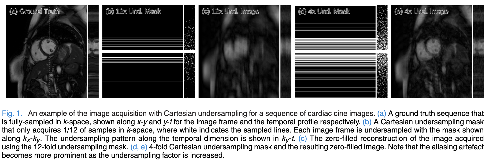

## Introduction

In this work we consider reconstructing dynamic sequence of 2D cardiac MR images with Cartesian undersampling, as well as reconstructing each frame independently, using CNNs.

For dynamic reconstruction, the method is compared to Dictionary Learning with Temporal Gradient (DLTG), kt Sparse and Low-Rank (kt-SLR) and Low-Rank Plus Sparse Matrix Decomposition (L+S), which are the state-of-the-art compressed sensing and low-rank approaches.

## Problem Formulation

Let $x \in \mathbb{C}^N$ represent a sequence of 2D complex-valued MR images stacked as a column vector, where $N=N_xN_yN_t$. Our problem is to reconstruct $x$ from $y \in \mathbb{C}^M (M << N)$ undersampled measurements in $k$-space, such that:

$$
y = F_u x+e
$$

Here, $F_u \in \mathbb{C}^{M\times N}$ is an undersampled Fourier encoding matrix and $e\in\mathbb{C}^M$ is acquisition noise modelled as additive white Gaussian noise.

In the case of Cartesian acquisition, we have $F_u = MF$, where $F \in \mathbb{C}^{N\times N}$ applies two-dimensional DFT to each frame in the sequence and $M \in \mathbb{C}^{M\times N}$ is an undersampling mask selecting lines in $k$-space to be sampled for each frame. The corresponding subset of indices sampled in $k$-space is indicated by $\Omega$. For the fully-sampled case, $M=N$, the sequence is reconstructed by applying the 2D IDFT to each frame. In particular, applying IDFT, which in this case is also called *zero-filled* reconstruction, results in a sequence of aliased images $x_u=F^H_u y$ due to sub-Nyquist sampling; $F^H_u$ is the Hermitian of the encoding matrix, which first map $y \in \mathbb{C}^M$ to the $k-t$ coordinate and then applies the 2D IDFT frame-wise.

In order to reconstruct $x$, one must exploit a-priori knowledge of its properties, which can be done by formulating an unconstrained optimisation problem:

$$
\underset{x}{\min} \mathcal{R}(x)+\lambda \|y-F_ux \|_2^2
$$

$\mathcal{R}$ expresses regularisation terms on $x$ and $\lambda \in \mathbb{R}$ allows the adjustment of data fidelity based on the noise level of the acquired measurements $y$. For the CNN formulation, we force $x$ to be well-approximated by the CNN reconstruction:

$$
\underset{x}{\min} \|x-f_{cnn}(x_u|\theta)\|_2^2 + \lambda\|F_ux-y\|^2_2
$$

Here $f_{cnn}$ is the forward mapping of the CNN parameterised by $\theta$, which takes in the zero-filled reconstruction $x_u$ and directly produces a reconstruction as an output. The approach is limited in the sense that the CNN reconstruction and the data fidelity are two independent terms. Since the CNN operates in the image domain, it is trained to reconstruct the sequence without a-priori information of the acquired data in k-space.

The CNN is now conditioned on $\Omega$ and $\lambda$, the final reconstruction is given simply by the output, $x_{cnn} = f_{cnn} (x_u|\theta, \lambda, \Omega)$.

The loss function is 

$$
\mathcal{L}(\theta) = \sum_{(x_u, x_{gnd})\in \mathcal{D}} l(x_{gnd}, x_{cnn})
$$

where $l$ is a loss function, using MSE.

## Data Consistency Layer

Denote the Fourier encoding of the image reconstructed by CNN as $s_{cnn}=Fx_{cnn}=Ff_{cnn}(x_u|\theta)$, $s_{cnn}(j)$ represents an entry at index $j$ in k-space. The undersampled data $y \in \mathbb{C}^M$ can be mapped onto the vectorised representation of $k-t$ coordinate ($|mathbb{C}^N$) by $s_0=FF^H_u y$, which fills the non-acquired indices in k-space with zeros.

For fixed network parameters $\theta$, a closed form solution $s_{rec}$ in k-space, given in element-wise:

$$
s_{rec}(j)=\begin{cases}
\hat{s}_{cnn}( k) & \mathrm{if,} \ k\notin \ \Omega \\
\frac{\hat{s}_{cnn}( k) +\lambda \hat{s}_{0}( k)}{1+\lambda } & \mathrm{if,} \ k\ \in \ \Omega 
\end{cases}
$$

The final reconstruction in the image domain is then obtained by applying the inverse Fourier encoding $x_{rec}=F^Hs_{rec}$. 

The solution yields a simple interpretation: if the k-space coefficient $s_{rec}(j)$ is initally unknown (i.e., $j\notin \Omega$), then we use the predicted value from the CNN. For the entries that have already been sampled (j \in \Omega), we take a linear combination between the CNN prediction and the original measurement, weighted by the level of noise present in $s_0$. In the limit $\lambda \rightarrow \infty$ we simply replace the $j$-th predicted coefficient in $\Omega$ by the original coefficient. This operation called a *data consistency step* in $k$-space.

In the case of where there is non-neglegible noise present in the acquisition, $\lambda = q / \sigma$ must be adjusted accordingly, where $q$ is a hyper-parameter and $\sigma^2$ is the power of AWG noise in k-space (i.e. $\mathfrak{R}(e_i), \mathfrak{S}(e_i) \sim \mathcal{N}(0, \sigma/\sqrt2)$). In [^1], $p\in [5\times 10^{-5}, 5\times 10^{-6}]$ for $\sigma^2[4\times 10^{-8}, 10^{-9}]$ works sufficiently well.

### A. Forward Pass

The data consistency in k-space can be simply decomposed into three operations:
1. Fourier transform $F$
2. Data consistency $f_{dc}$
3. inverse Fourier transform $F^H$

Assuming $s_0(j) = 0 \forall j \notin \Omega$ can be written in matrix form as:

$$
f_{dc}(s, s_0;\lambda) = \Lambda s+\frac{\lambda}{1+\lambda} s_0
$$

Here $\Lambda$ is a diagonal matrix of the form:

$$
\Lambda_{kk} = \begin{cases}
1 & \mathrm{if,} \ j \notin \Omega \\
\frac{\lambda}{1+\lambda} & \mathrm{if,} \ j\ \in \ \Omega 
\end{cases}
$$

Combining the three operations defined above, we can obtain the forward pass of the layer performing data consistency in k-space:

$$
f_L(x, y;\lambda) = F^H\Lambda Fx+\frac{\lambda}{1+\lambda}F^H_uy
$$

### B. Backward Pass

The Jacobian of the DC layer with respect to the layer input $x$ is therefore given by:

$$
\frac{\partial f_L}{\partial x^T} = F^H\Lambda F
$$

The DC layer has one hyper parameter $\lambda \in \mathbb{R}$. This value can be fixed or made trainable. The derivative $\frac{\partial f_{dc}}{\partial \lambda}$ is given by:

$$
\left[\frac{\partial f_{dc}(s, s_0;\lambda)}{\partial \lambda}\right]_j = \begin{cases}
0\ & \mathrm{if} \ j \notin \Omega\\
\frac{s_0(j) - s_{cnn}(j)}{(1+\lambda)^2} \ & \mathrm{if} \ j \in \Omega
\end{cases}
$$

and the update is $\triangle\lambda = J_e\frac{\partial f_{dc}}{\partial \lambda}$ where $J_e$ is the error backpropagated via the Jacobians of the layers proceeding $f_{dc}$.

## Cascading Network

## Data Sharing Layer

For the case of reconstructing dynamic sequences, the temporal correlation between frames can be exploited as an additional regulariser to further de-alias the undersampled images.

We use 3D convolution to learn spatio-temporal features of the input sequence. We propose incorporating features that could benefit the CNN reconstruction, inspired by *data sharing* approaches: if the change in image content is relatively small for any adjacent frames, then the neighbouring k-space samples along the tempora-axis often capture similar information. As long as theis assumption is valid, for each frame, we can fill the entries using the samples from the adjacent frames to approximate missing k-space samples.

For each frame $t$, all frames from $t- n_{adj}$ to $t+n_{adj}$ are considered, filling the missing $k$-space samples at frame $t$. If more than one frame within the range contains a sample at the same location, we take the weighted average of the samples. 

For CNN reconstruction, we can incorporate these images as an extra input to train the network rather than treating them as the final reconstructions. Note that the reduction in the apparent acceleration factor is non-trivial to calculate: if each frame samples $10\%$ of k-space, combining $5$ adjacent frames in theory should over $50\%$ . However, one often relies on variable density sampling ,which samples low-frequency terms more often, yielding overlapped lines between the adjacent frames. Therefore, the apparent acceleration factor is often much less.

As a remedy, regular sampling can be considered. However, regular sampling results in coherent artifact in the image domain, the removal of which is a different problem from the one we address here, which attempts to resolve incoherent aliasing patterns. However, regular sampling results in coherent artifact in the image domain, the removal of which is a different problem from the one we address here, which attempts to resolve incoherent aliasing patterns.

Alternatively, one can perform a sampling trajectory optimisation to reduce the overlapping factor.

We implement *data sharing layers* which take an input image and generate multiple *data-shared* images for a range $n_{adj}$. The resulting images are concatenated along the channel-axis and treated as a new input fed into the first convolution layer of the CNNs. Therefore, using the images obtained from data sharing can be interpreted as transforming the problem into joint estimation of aliasing as well as the dynamic motion, where the effect of aliasing is considerably smaller. 

For the cascading network architecture, from the second subnetwork onwards, the input to each subnetwork is nolonger "undersampled", but instead contains intermediate predicted values from the previous subnetwork. We average all the entries from the adjacent frames and update the samples which were not intially acquired.

## Architecture and Implementation

## Reference

[^1]: J. Caballero, A. N. Price, D. Rueckert, and J. V. Hajnal, [Dictionary learning and time sparsity for dynamic MR data reconstruction](https://ieeexplore.ieee.org/document/6716020/), _IEEE Trans. Med. Imag._, vol. 33, no. 4, pp. 979–994, Apr. 2014.

[^2]:      

[^3]:      

[^4]:      

