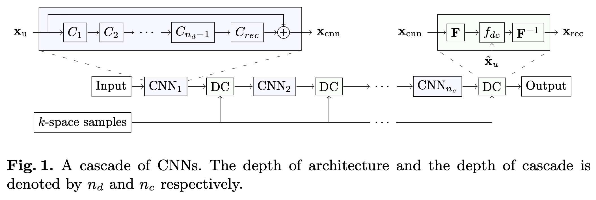

# A Deep Cascade of Convolutional Neural Networks for MR Image Reconstruction

## Introduction

Undersampling in *k*-space violates the Nyquist-Shannon theorem and generates aliasing artefacts when the image is reconstructed. The main challenge in this case is to find an algorithm that taks into account the undersampling undergone and can compensate missing data with a-prior knowledge on the image to be reconstructed.

Using Compressed Sensing (CS), images can be reconstructed from sub-Nyquist sampling, a.k.a, **CS-MRI**:

1. The acquired images must be *compressible*. They have a sparse representation in some transform domain.
2. One must ensure *incoherence* between the sampling and sparsity domains to guarantee that the reconstruction problem has a unique solution and that this solution is attainable.
	* can be achieved with random sub-sampling of *k*-space, which translates aliasing patterns in the image domain into patterns that can be regarded as correlated noise.

One of the contributions of our work is to explore the application of CNNs in undersampled MR reconstruction and investigate whether they can exploit data redundancy through learned representations.
> CNNs have already been applied to compressed sensing from random Gaussian measurements [^1].

We view the reconstruction problem as a de-alising problem in the image domain.

We propose a very deep network archiecture which forms a cascade of CNNs. Our cascade network closely simulates the iterative reconstruction of DL-based methods, however, our approach allows end-to-end-optimisation of the reconstruction algorithm. We show that under the Cartesian undersampling scheme, our CNN approach is capable of producing high-quality reconstructions of 2D cardiac MR images, outperforming DL-based MRI reconstruction.

## Problem Formulation

Let $x \in \mathbb{C}^N$ represent a complex-valued MR image composed of $\sqrt N \times \sqrt N$ pixels stacked as a column vector. Our problem is to reconstruct $x$ from $y \in \mathbb{C}^M$, the measurements in $k$-space, such that:

$$
y = F_u x
$$

Here $F_u \in \mathbb{C}^{M\times N}$ is an undersampled Fourier encoding matrix. For undersampled $k$-space measurements ($M <<N$), the system is undertdetermined and hence the inversion process is ill-defined. In order to reconstruct $x$, one must exploit a-priori knowledge of its properties, which can be done by formulating an unconstrained optimisation problem:

$$
\underset{x}{\min} \mathcal{R}(x) + \lambda\|y-F_ux\|_2^2
$$

$\mathcal{R}$ expresses regularisation terms on $x$ and $\lambda$ allows the adjustment of data fidelity based on the noise level of the acquired measurements $y$. The regularisation terms $\mathcal{R}$ typically involve $l_0$ or $l_1$ norms in the sparsifying domain of $x$. Our problem is formulated as:

$$
\underset{x, D, \{\gamma_i\}}{\min} \sum_i \left(\|R_ix - D\gamma_i\|_2^2 + v\|\gamma_i\|_0 \right) + \lambda \|y-F_ux\|_2^2
$$

Here $R_i$ is an operator which extracts an image patch at $i$, $\gamma_i$ is the corresponding sparse code with respect to a dictionary $D$. The regularisation terms enforce $x$ to be approximated by the reconstructions from the sparse code of patches.  We enforce $x$ to be well-approximated by the CNN reconstruction:

$$
\underset{x, \theta}{\min} \|x - f_{cnn}(x_u|\theta)\|_2^2 + \lambda\|F_ux-y\|^2_2
$$

The $f_{cnn}$ parameterised by $\theta$, which takes in the zero-filled reconstruction $x_u = F_u^Hy$ and directly produces a reconstruction as an output. The CNN reconstruction can be seen as solving de-aliasing problem in the image domain.

The output of the CNN is conditioned on $\Omega$, an index set indicating which $k$-space measurements have been sampled in $y$: $x_{cnn}=f_{cnn}(x_u|\theta, \lambda, \Omega)$. Given training data $\mathcal{D}$ of input-target pairs $(x_u, x_t)$, we can train the CNN to produce an output that attempts to accurately reconstruct the fully-sampled data by minimising an objective function:

$$
\mathcal{L}(\theta)=\sum_{(x_u, x_t)\in\mathcal{D}} l(x_t, x_{cnn})
$$

where $l$ is an element-wise squared loss in this work.

## Data Consistency Layer

For a fixed $\theta$, the function $\underset{x, \theta}{\min} \|x - f_{cnn}(x_u|\theta)\|_2^2 + \lambda\|F_ux-y\|^2_2$ has a closed-form solution in $k$-space [^2] :

$$
\hat{x}_{rec}( k) =\begin{cases}
\hat{x}_{cnn}( k) & \mathrm{if,} \ k\notin \ \Omega \\
\frac{\hat{x}_{cnn}( k) +\lambda \hat{x}_{u}( k)}{1+\lambda } & \mathrm{if,} \ k\ \in \ \Omega 
\end{cases}
$$

where $\hat{x}_{cnn}=Ff_{cnn}(x_u|\theta), \hat{x}_u=Fx_u$, and $F$ is the Fourier encoding matrix. The final image is reconstructed by applying the inverse of the encoding matrix $x_{rec} = F^{-1}\hat{x}_{rec}$. In the noiseless setting (i.e. $\lambda \rightarrow \infty$), we simply replace the $i$th predicted coefficient by the original coefficient if it has been sampled.The operation is called *data consistency step*.

### Forward Pass

The data consistency in $k$-space can be simply decomposed into three operations:
1. Fourier transform
2. Data consistency
3. inverse Fourier transform

In our case, we take Fourier transform to be a 2D DFT of the image representation of $x$, which is written as $\hat{x}=Fx$ in matrix form. The inverse transformation is defined analogously, where $x = F^{-1}\hat{x}$. 

The data consisterncy $f_{dc}$ performs the element-wise operation. We can write it in matrix form as:

$$
f_{dc}(\hat{x}, \hat{x}_u, \lambda) = \Lambda \hat{x} + \frac{\lambda}{1+\lambda}\hat{x}_u
$$

Here $\Lambda$ is a diagonal matrix of the form:

$$
\Lambda _{kk} =\begin{cases}
1 & \mathrm{if,} \ k\notin \ \Omega \\
\frac{1}{1+\lambda } & \mathrm{if,} \ k\ \in \ \Omega 
\end{cases}
$$

Combining the three operations defined above, we can obtain the forward pass of the layer performing data consistency in $k$-space:

$$
f_L(x, \hat{x}_u, \lambda) = F^{-1}\Lambda Fx+\frac{\lambda}{1+\lambda}F^{-1}\hat{x}_u
$$

### Backward Pass

One requires *Wirtinger calculus* [^3] to derive a gradient in complex domain. However, in our case, the derivation greatly simplifies due to the linearity of the DFT matrix and the data consistency operation. The Jacobian of the DC layer with respect to the layer input $x$ is therefore given by:

$$
\frac{\partial f_L}{\partial x^\top}=F^{-1}\Lambda F
$$

1. MR images are complex-valued and the network needs to account for this. One possibility would be to design the network to perform complex-valued operations. A simpler approach, however, is to accommodate the complex nature of the data with real-valued operation in a dimensional space twice as large.
2. Even though the DC layer does not have any additional parameters to be optimised, it allows end-to-end training.

## Cascading Network

It is best to be able to use CNNs for iterative reconstruction approaches. A simple solution is to train a second CNN which learns to reconstruct from the output of the first CNN. We can concatenate a new CNN on the output of the previous CNN to build extremely deep networks which iterate between intermediate de-aliasing and the data consistency reconstruction.

## Architecture and Implementation

Our CNN takes in a two-channeled image $\mathbb{R}^{\sqrt n\times \sqrt n\times 2}$, where each channel stores real and imaginary parts of the undersampled image. 
- It has $n_d-1$ convolution layers $C_i$, which are followed by ReLU. 
- For each of them, we used a kernel size $k=3$ and the number of filters were set to $n_f=64$.
- The network is followed by another convolution layer $C_{rec}$ with kernel size $k=3$ and $n_f=2$, which projects the extracted representation back to image domain.
- We also used residual connection
- we form a cascading network by using the DC layers interleaved with the CNN reconstruction modules.
- We choose $n_d=5$ and $n_c=5$. The result is likely to be improved by changing the architecture and varying the parameters such as kernel size and stride.
- We initialised our network weights using He initialisation.
- Adam optimiser was used to train all models, with the parameters $\alpha = 10^{-4}, \beta_1=0.9, \beta_2=0.999$.
- We also add $l_2$ weight decay of $10^-7$.

## Experimental Results

### Setup

#### Dataset

- The method was evaluated using the cardiac MR dataset used in [^4]. 
	- Each scan contains a single slice SSFP acquisition with 30 temporal frames with a $320 \times 320$ mm filed of view and $10$ mm slice thickness.
	- The raw data consists of $32$-channel data with sampling matrix size $192 \times 190$, which was zero-filled to the matrix size $256 \times 256$.
- The data was combined into a single complex-valued image using SENSE with no undersampling, retrospective gating and the coil sensitivity maps normalised to a body coil image.
- The images were then retrospectively undersampled using Cartesian undersampling masks, where we fully sampled along the frequency-encoding direction but undersample in the phase-encoding direction.
	- For each frame we acquired eight lowest spatial frequencies.
	- The sampling probability of other frequencies along the phase-encoding direction was determined by a zero-mean Gaussian distribution.

- We restrict our experiments to the 2D case only. Each time frame was treated as an independent image, yielding a total of 300 images.
- Applying rigid transformations as a data augmentation was crucial, or overfitted.
- For a fixed undersampling rate, we generated an undersampling mask on-the-fly to allow the network to learn diverse patterns of aliasing artefact.

#### Metric

We evaluated our method from 3-fold and 6-fold acceleration rates.

We use MSE as our quantitative measure.

We assigned an arbitrary but fixed undersampling mask for each in test data.

We also inspected the visual aspect of the reconstructed images for qualitative assessment.

### Results

The CNN approach produced a smaller overall error, produced a more homogeneous reconstruction.

Both CNN and DLMRI suffered from small losses of important anatomical structures in their reconstructions (the orange circle).

## Discussion and Conclusion

The CNN method was capable of reconstructing most of the anatomical structures more accurately, while CS-based methods do not guarantee such behaviour.

The limitation of this work is that the data was first reconstructed by SENSE, which was then used to simulated the acquisition process. It is more practical to consider images with sensitivity map of the surface coils, which allows the model to be used for parallel imaging reconstruction directly. A better approach is to exploit the redundancy of the coil sensitivity maps and combine directly into our model.

A further investigation should consider how tolerant the network is for different undersampling rates. It is interesting to consider other sampling patterns such as radial and spiral trajectories. As these trajectories provide different properties of aliasing artefacts, a further validation is appropriate to determine the flexibility of our approach.

## Reference

[^1]: Kulkarni, K., Lohit, S., Turaga, P., Kerviche, R., Ashok, A.: [ReconNet: Non- iterative reconstruction of images from compressively sensed measurements.](https://ieeexplore.ieee.org/document/7780424) In: Proceedings of the IEEE Conference on Computer Vision and Pattern Recognition. pp. 449–458 (2016)
[^2]: Ravishankar S, Bresler Y. [MR image reconstruction from highly undersampled k-space data by dictionary learning](https://pubmed.ncbi.nlm.nih.gov/21047708/). IEEE Trans Med Imaging. 2011 May;30(5):1028-41. doi: 10.1109/TMI.2010.2090538. Epub 2010 Nov 1. PMID: 21047708.

[^3]: Akira Hirose, "Learning Algorithms in Complex-Valued Neural Networks using Wirtinger Calculus," in [Complex-Valued Neural Networks: Advances and Applications](https://ieeexplore.ieee.org/document/6515223), IEEE, 2013, pp.75-102, doi: 10.1002/9781118590072.ch4.

[^4]: J. Caballero, A. N. Price, D. Rueckert and J. V. Hajnal, [Dictionary Learning and Time Sparsity for Dynamic MR Data Reconstruction](https://ieeexplore.ieee.org/document/6716020), in IEEE Transactions on Medical Imaging, vol. 33, no. 4, pp. 979-994, April 2014, doi: 10.1109/TMI.2014.2301271.