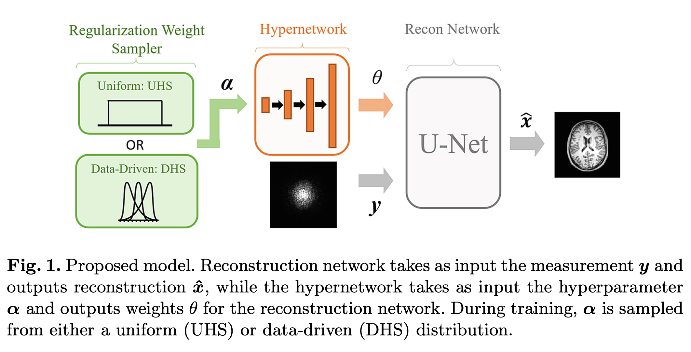
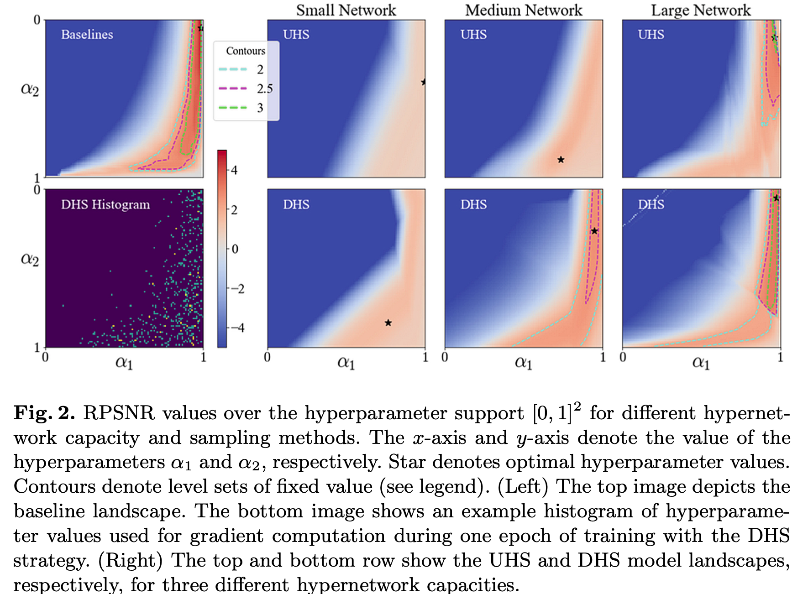
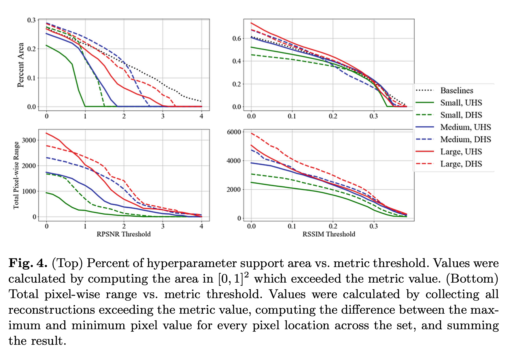
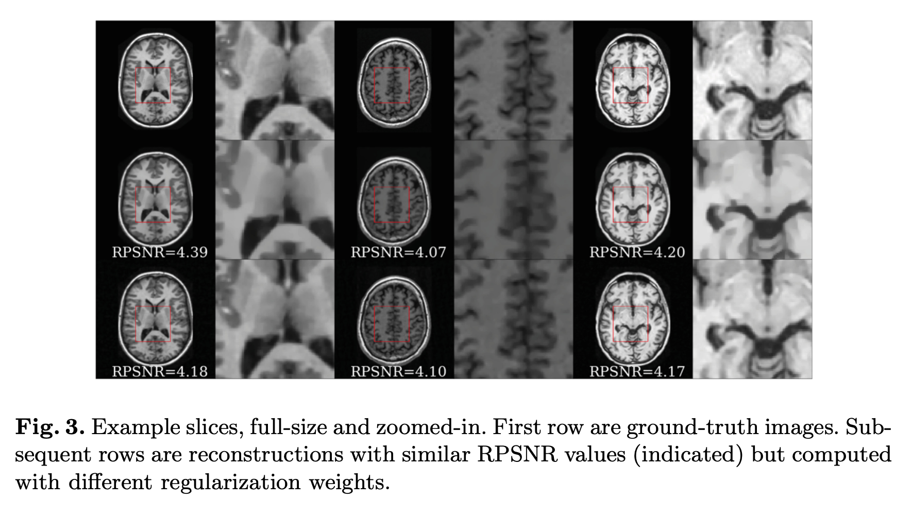

# HyperRecon: Regularisation - Agnostic CS-MRI Reconstruction with Hypernetworks

## Introduction

Amortised optimisation extends this idea by training a neural network to minimise the cost function using large datasets.

Additionally, in contrast to supervised NN recon methods, amortised optimisation is performed without access to full-resolution data.

Regularisation function can vastly affect reconstructions. Considerable time and resources can be spent setting the weights of regularisation, using costly method such as grid-search, random search, or Bayesian optimisation.

Hypernetworks have been proposed to automate hyperparameter tuning; The hypernetwork takes as input the hyperparameter and outputs the weights of the main network which performs the main task.

Hypernetworks have been proposed to automate hyperparameter tuning; the hyper network takes as input the hyperparameter and outputs the weights of the main network which performs the main task.

HyperRecon uses a hypernetwork that takes as input a value for the regularisation weights and outputs the parameters of a reconstruction network which solves the amortised optimisation. At the test-time, arbitrary weight values can be inputted and corresponding reconstructions will be efficiently computed, leading to arbitrarily large numbers of reconstructions.

The flexibility HyperRecon offers two ramifications:

1. rapid and automated hyperparameter tuning is now possible, drawing from a rich set of candidate values in a continuous range
2. analyses on the diversity of reconstruction resulting from different regularisation weights can be conducted

## Background

### Amortised Optimisation of CS-MRI

A reconstruction of the unobserved full-resolution MRI scan $x\in \mathbb{C}^N$ is obtained by solving an optimisation:

$$
\underset{x}{\arg \min}J(x,y)+\sum^p_{i=1}\alpha_i \mathcal{R}_i(x)
$$

For each under-sampled measurement $y \in \mathbb{C}^M$, where $N$ is the number of pixels of the full-resolution grid and $M<N$ is the number of measurements.

The data-consistency loss, which can be defined as $J(x,y)=\|\mathcal{F}_ux-y\|^2_2$ where $\mathcal{F}_u$ denotes the under-sampled Fourier oprator, encourages $x$ to be consistent with the measurment $y$. The $p$ terms regularisation terms, $\mathcal{R}_i(x)$ wighted by a hyperparameter $\alpha_i \in \mathbb{R}_+$ which determine the degree of trade-off between the $p+1$ competing terms. The regularisation terms are engineered to restrict the solutions to the space of probable images, with common choices including sparsity-inducing norms of wavelet coefficients, total variation (TV), and their combinations.

Given a neural network $G_\theta$ parameterised with $\theta$ and a training set $\mathcal{D}$ of under-sampled measurements $y$, the problem reduces to:

$$
\underset{\theta}{\arg \min} \sum_{y\in\mathcal{D}} \left[J(G_\theta(y),y)+\sum^p_{i=1}\alpha_i\mathcal{R}_i(G_\theta(y))\right]
$$

This formulation can be viewed as an amortisation of the instance-specific optimisation of the first equation via a neural network $G_\theta$. Amortised optimisation allows for fast solving of the classical optimisation with a forward pass through $G_\theta$, while also exhibiting advantageous regularisation properties. It does not require any full-resolution data to train, unlike supervised deep learning based reconstruction techniques.

### Hypernetworks

Hypernetworks take as input a set of hyperparameters that are in turn converted to the weights of the network that solves the main task. 

## Proposed Method

### Regulairsation-Agnostic Reconstruction Network

Define a vector of regularisation weights $\mathbf{\alpha} = [\alpha_1, \dots, \alpha_p]^T \in \mathbb{R}^p_+$. Let $G_\theta$ denote a main network which maps measurements $y$ to reconstructions $\hat{x}$, whose parameters are denoted as $\theta \in \Theta$. A hypernetwork $H_\phi:\mathbb{R}^p_+\rightarrow \Theta$ maps $\mathbf{\alpha}$ to the parameter $\theta$ of the main network $G_\theta$. 

Given a dataset $\mathcal{D}$ of measurements $y$, the objective is to minimise:

$$
\underset{\phi}{\arg\min}\mathbb{E}_{\alpha\sim p(\alpha)}\sum_{y\in\mathcal{D}}\left[J\left(G_{H_\phi(\alpha)}(y), y\right) + \sum^p_{i=1} \alpha_i \mathcal{R}_i\left(G_{H_\phi(\alpha)}(y)\right)\right]
$$

In the hypothetical scenario of infinite hypernetwork capacity, the hypernetwork can capture a mapping of any input $\mathbf{\alpha}$ to the optimal $\theta^*=H_{\phi^*}(\mathbf{\alpha})$ that minimises the equation 2 with the corresponding $\mathbf{\alpha}$. The training of the hypernetwork is not sample-limited, since one can draw as many hyperparameter samples as needed. Thus, overfitting for the hypernetwork is not a practical concern. We will have a limited capacity hypernetwork and its learned parameters will in general depend on the assumed distribution for $\mathbf{\alpha}$.

The expression inside the braces of Equation 3 can be manipulated such that the hyperparameter support is bounded to $\mathbf{\alpha}\in [0,1]^p$.

For one regularisation weights:

$$
\mathcal{L}_{p=1}(y,\mathbf{\alpha})=(1-\alpha_1)J(\hat{x},y) + \alpha_1\mathcal{R}_1(\hat{x})
$$

For two regularisation weights:

$$
\mathcal(L)_{p=2}(y,\mathbf{\alpha})=\alpha_1J(\hat{x},y)+(1-\alpha_1)\alpha_2\mathcal{R}_1(\hat{x})+(1-\alpha_1)(1-\alpha_2)\mathcal{R}_2(\hat x)
$$

### Training

#### Uniform Hyperparameter Sampling (UHS)

A straightforward strategy for training the hypernetwork involves sampling the regularisation weights from a uniform distribution $p(\alpha) = U[0,1]^p$ and a measurement $y$ from $\mathcal{D}$ for each forward pass during training. The gradients are then computed with respect to the loss evaluated at the sampled $\mathbf{\alpha}$ via a backward pass. This corresponds to minimising equation 3 with a uniform distribution for $\alpha$.

However, the finite model capacity of the hypernetwork constrains the ability to achieve optimal loss for every hyperparameter value, particularly without resorting to training large hypernetworks. In addition, sampling hyperparmeters from the entire support $[0,1]^p$ might "waste" model capacity on regularisation weight values which, when optimised, do not produce acceptable reconstructions.

These two observations suggest that modifying the hyperparameter sampling distribution could lead to better performance by making better use of limited hypernetwork model capacity.

#### Data-Drien Hyperparamter Sampling (DHS)

In the unsupervised scenario, we propose to use the DC loss induced by a setting of the regularisation weights to assess whether the reconstruction will be useful or not. Intuitively, values of $\mathbf{\alpha}$ which lead to high DC loss $J(G_{H_\phi(\alpha)}(y), y)$ will produce reconstructions that deviate too much from the underlying anatomy, and which therefore can be ignored during training.

To compute a dynamic DC threshold during training, we propose using the $K$ samples with the lowest DC loss within a mini-batch of size $B>K$ to calculate the gradients. In effect, this dedicates model capacity for the subset of the hyperparameter landscape that can produce reconstructions that are most consistent with the data, while ignoring those that do not. The percentage of the landscape which is optimised is $K/B$.

## Experiments

- Case of $p=2$ regularisation functions.
- layer-wise total $l_1$-penalty on the weights $\theta$ of the main reconstruction network 
- the TV of the reconstruction image as two regularisation loss term

### Implementation

- A residual U-Net architecture
	- with 64 hidden channels per encoder layer
	- a total of $n=592,002$ parameters
- The hypernetwork consists of 
	- fully connected layers with leaky ReLU activations and BatchNorms
	- weights were initialised to approximate standard Kaiming initialisation in the main network
- Three hypernetwork architectures, all fully-connected
	- Small: 1-2-4-n
	- Medium: 1-8-32-n
	- Large: 1-832-32-32-n
- Global
	- minibatch size $B=32$
	- Adam optimiser
	- DHS
		- top 25% of samples within a mini-batch
		- i.e. K=8, chosen using a grid-search, the results are not very sensitive to this value

#### Data

- T1-weighted axial brain images
	- intensity-normalised to the range $[0,1]$
	- cropped and re-sampled to a pixel grid of size $256 \times 256$
	- T:V:T = 2000:500:1000
	- No overlapping
	- Undersampled measurements were obtained by retrospective down-sampling with 4-fold acceleration sub-sampling masks using a 2nd-order polynomial Poisson-disk variable density sampling strategy

#### Evaluation Metrics

- PSNR
- SSIM
- RPSNR and RSSIM (R means relative)
	- subtracting the metric value for the zero-filled reconstruction
	- Quantify the range of reconstructions that exceeded a RPSNR threshold
- Range metric
	- compute the difference between the maximum and minimum value at every pixel
	- summed these values over all pixels

#### Baseline Models

- 324 separate U-Net reconstruction networks for each fixed hyperparameter value
- $18\times 18$ grid on the space $[0,1]^2$
- they demand significant computational resources
	- need to be trained and saved separately

### Hypernetwork Capacity and Hyperparameter Sampling

- Evaluate the performance of the proposed models using RPSNR landscapes over the hyper parameter support $(\alpha_1, \alpha_2) \in [0, 1]^2$
	- landscapes generated by sampling in $[0,1]^2$ to create a grid of size $100\times 100$.
	- for each gridpoint, the value was computed by passing the corresponding hyperparameter values to the model along with each measurement $y$ in the test set and taking the average RPSNR value

- Higher capacity hypernetworks approach the baseline models' performance at the cost of increased computational reosurces and training time
- DHS has significant improvement compares to UHS
- Black starts denote the optimal hyperparameter values
- performance improvement ahcieveved by DHS is less for the large hypernetwork

### Range of Reconstructions

- Higher capacity models and DHS yield a consistent increase in the range of reconstructions
	- compared to their lower capacity and UHS counterparts
- the difference in smoothness and sharp detail despite the overall quality of the reconstructions being nearly identical
