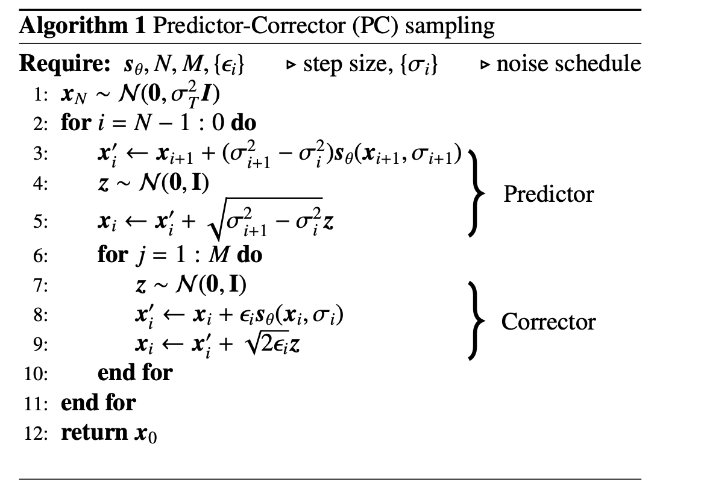
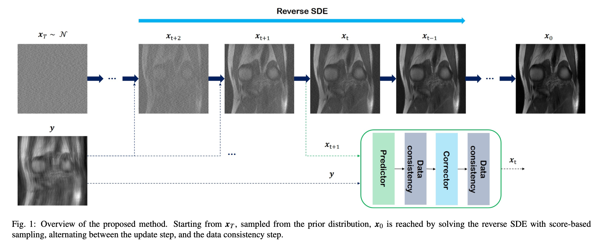

# Score based diffusion models for accelerated MRI

## Background

### Score-based SDE

A continuous diffusion process $\{\mathbf{x}(t)\}^T_{t=0}$ with $\mathbf{x}(t)\in \mathbb{R}^n$, where $t\in [0,T]$ is the time index of the progression and $n$ denotes the image dimension.

We choose $\mathbf{x}(0) \sim p_{data}$ and $\mathbf{x}(T) \sim p_T$, where $p_{data}, p_T$ refers to the **data distribution of interest**, and the **prior distribution which are tractable** to sample from (*spherical Gaussian distribution*).

The stochastic process can be constructed as the solution to the following SDE:

$$
d\mathbf{x}=\mathbf{f}(\mathbf{x},t)dt + g(t)d\mathbf{w}
$$

where $\mathbf{f}$ is the drift coefficient, $g$ correspond to the diffusion coefficient, and $\mathbf{w}$ is a standard n-dimensional Brownian motion.

One can construct different SDEs by choosing different functions for $\mathbf{f}$ and $g$, first by choosing:

$$
\mathbf{f}=-\frac12 \beta(t)\mathbf{x},\ \ \ g=\sqrt{\beta(t)}
$$

where $0<\beta(t)<1$ is a monotonically increasing function of noise scale, one achieves the variance preserving (VP)-SDE.

In this case, the magnitude of the signal decays to $0$, and the variance is preserved to a fixed constant as $t\rightarrow \infty$. In fact, VP-SDE can be seen as the continuous version of DDPM.

On the other hand, variance exploding (VE) SDEs choose 
$$
\mathbf{f}=\mathbf{0},\ \ \ g=\sqrt{\frac{d[\sigma^2(t)]}{dt}}
$$

where $\sigma(t) >0$ is again a monotonically increasing function, typically chosen to be a geometric series. Unlike VP-SDE, VE-SDE diffuses the signal with very large variance, which explodes as $t \rightarrow \infty$. We found that using VE-SDE typically leads to higher sample qualities, and hence focus on developing our method on top of VE-SDE.

The reverse process can be constructed with another stochastic process:

$$
d\mathbf{x}=[\mathbf{f}(x,t) - g(t)^2\underbrace{\triangledown_\mathbf{x}\log p_t(\mathbf{x})}_{\mathrm{score\  function}}]dt+g(t)d\bar{\mathbf{w}}
\\
=\frac{d[\sigma^2(t)]}{dt}\underbrace{\triangledown_\mathbf{x}\log p_t(\mathbf{x})}_{\mathrm{score\ function}}+\sqrt{\frac{d[\sigma^2(t)]}{dt}}d\bar{\mathbf{w}}
$$

where $dt$ is the infinitesimal *negative* timestep, and $\bar{\mathbf{w}}$ is again the standard n-dimensional Brownian motion running backwards.

One can estimate this score function with a time-conditioned neural network $s_\theta(\mathbf{x}(t), t) \simeq \triangledown_\mathbf{x}\log p_t(\mathbf{x}(t))$. Since we do not know the true score, we can instead use denoising score matching, where we replace the unknown $\triangledown_\mathbf{x}\log p_t(\mathbf{x})$ with $\triangledown_\mathbf{x}\log p_t(\mathbf{x}|\mathbf{x}(0))$ is the Gaussian perturbation kernel which perturbs the probability density $p_{0}(\mathbf{x})$ to $p_{t}(\mathbf{x})$.

Under some regularity conditions, $s_\theta$ trained with denoising score matching will satisfy $s_{\theta^*}(\mathbf{x}(t),t)=\triangledown_x \log p_t(x)$ almost surely.

We optimise the parameter $\theta$ of Loscombe network with the following cost:

$$
\underset{\theta}{\min} \mathbb{E}_{t\sim U(0,1)}\left[\lambda(t)\mathbb{E}_{\mathbf{x}(0)}\mathbb{E}_{\mathbf{x}(t)|\mathbf{x}(0)}\left[\|s_\theta(\mathbf{x}(t),t)-\triangledown_x \log p_{0t}(\mathbf{x}(t)|\mathbf{x}(0))\|^2_2\right]\right]
$$

where $\lambda(t)$ is an appropriate weighting function, e.g. likelihood weighting, which put different emphasis according to the time $t$. This can be understood as training the neural network to de-noise $\mathbf{x}(t)$, which was constructed by adding noise to $\mathbf{x}(0)$

In the case of Gaussian perturbation kernels, the gradient of the perturbation kernels can be formulated explicitly:

$$
\triangledown_x \log p_{0t}(\mathbf{x}(t)|\mathbf{x}(0))=(\mathbf{x}(t)-\mathbf{x}(0))/\sigma(t)^2
$$

Once the network is trained, we can plug the approximation $s_\theta(\mathbf{x},t)\simeq \triangledown_x \log (\mathbf{x}(t))$ to solve the reverse SDE in:

$$
d\mathbf{x}=\frac{d[\sigma^2(t)]}{dt}s_\theta(\mathbf{x}(t),t)+\sqrt{\frac{d[\sigma^2(t)]}{dt}}d\bar{\mathbf{w}}
$$

With Euler-Maruyama discretisation, we can solve the SDE numerically. This involves discretising $t$ in range $[0,1]$ uniformly into $N$ intervals such that $0=t_0<t_1<\dots <t_N=1$, with $\triangle t=1/N$. We can correct the direction of gradient ascent with *corrector* algorithms such as Langevin MC. Iteratively applying predictor and corrector steps yield the the predictor-corrector (PC) sampling algorithm, as presented here.

$N$ is the number of discretisation steps for the reverse-time SDE, $M$ is the number of corrector steps.

## Main Contribution

### Forward measurement model

A parameterised forward measurement matrix $A \in \mathbb{C}^{m\times n}$ is defined as:

$$
A:=\mathcal{P}_\Omega\mathcal{FS}
$$

where $\mathcal{S}:=[\mathcal{S}^{(1)};\dots;\mathcal{S}^{(c)}]$ is the sensitivity map for $c$ different coils, $\mathcal{F}$ denotes Fourier transform, and $\mathcal{P}_\Omega$ is a diagonal matrix with zeros and ones that represent the sub-sampling operator with the given sampling pattern $\Omega$.

The sensitivity map $\mathcal{S}$ are normalised such that we have 

$$
\mathcal{S}^*\mathcal{S}=\mathbb{I}
$$

In the case of single-coil acquisition, $S$ reduces to identity matrix such that $A_{(sc)}=\mathcal{P}_\Omega\mathcal{F}$.

### Reverse SDE for Accelerated MR Reconstruction

A classical approach to find the solution of MR Reconstruction is to solve the following constrained optimisation problem:

$$
\underset{x}{\min}\Psi(x)\ \ \ \  \mathrm{subject\ to}\ \ y=Ax
$$

In Bayesian perspective, we immediately see that $\Psi(x)$ is the prior model of the data, i.e. $p(x)$. We can imagine that by more accurately estimating the complex prior data distribution, one would be able to achieve higher quality samples.

Rather than modelling the prior distribution $p(x)$, we exploit its stochastic samples. The samples from the prior distribution can be obtained from the reverse SDE, which can be discretised as illustrated in Algorithm 1 with:

$$
\mathbf{x}_i\leftarrow (\sigma^2_{i+1}-\sigma^2_i)s_\theta(\mathbf{x}_{i+1},\sigma_{i+1})+\sqrt{\sigma^2_{i+1}-\sigma^2_i}\mathbf{z}
$$

Then, the data consistency mapping on the constraint in can be implemented by:

$$
\mathbf{x}_i \leftarrow \mathbf{x}_i +\lambda A^*(\mathbf{y}-A\mathbf{x}_i)=(I-\lambda A^*A)\mathbf{x}_i+A^*\mathbf{y}
$$

for $\lambda \in [0, 1]$, where $A^*$ denotes the Hermitian adjoint of A. We impose the constraint on the operator $A$ such that $(\mathbb{I}-\lambda A^*A)$ is a *non-expansive mapping*:

$$
\|(\mathbb{I}-\lambda A^*A)\mathbf{x}-(\mathbb{I}-\lambda A^*A)\mathbf{x}'\|\leq\|x-x'\|,\ \ \forall x,x'
$$

#### Proposition 1

_With the sensitivity normalisation, $(\mathbb{I}-\lambda A^*A)$ is non-expansive for $\lambda \in [0, 1]$_.

Using the properties of the spectral norm, we have 

$$
\|A^*A\|=\|\mathcal{S^*F^*P^*_\Omega P_\Omega FS}\|\overset{(a)}{=}\|\mathcal{S^*F^*P_\Omega FS}\|\overset{(b)}{\leq}\|\mathcal{S^*F^*FS}\|\overset{(c)}{=}\|S^*S\|
\overset{(d)}{=}1
$$

where $(a)(b)$ come that the subsampling operator $P_\Omega$ is a diagonal matrix with $0, 1$, $(c)$ is from the orthonormality of the Fourier transform. Therefore, we have:

$$
\|\mathbb{I}-\lambda A^*A\|\leq \max\{|1-\lambda|, 1\}\leq 1
$$

for $\lambda \in [0, 1]$. Accordingly,

$$
\|(\mathbb{I}-\lambda A^*A)\mathbf{x}-(\mathbb{I}-\lambda A^*A)\mathbf{x}'\|\leq\|(\mathbb{I}-\lambda A^*A)\|\|\mathbf{x}-\mathbf{x}'\|\leq \|x-x'\|
$$

## Methods

### Experimental data

- fastMRI knee dataset, with $320 \times 320$ size target image magnitude, given as the key `reconstruction_esc`.
	- It is also possible to train the score function with the same target from `reconstruction_rss` of the multi-coil dataset, but no significant difference
- 973 volumes, dropped the first and last five slices from each volume, to avoid training the model with noise-only data.
	- results in 25k slices of training data

### Implementation details

We train the network with the objective given here:

$$
\underset{\theta}{\min} \mathbb{E}_{t~U(0,1)}\left[\lambda(t)\mathbb{E}_{\mathbf{x}(0)}\mathbb{E}_{\mathbf{x}(t)|\mathbf{x}(0)}\left[\|s_\theta(\mathbf{x}(t),t)-\triangledown_x \log p_{0t}(\mathbf{x}(t)|\mathbf{x}(0))\|^2_2\right]\right]
$$

with setting $\lambda(t)=\sigma^2(t)$. Note that this specific choice of $\lambda(t)$ stabilises the noise scale across $t$, and theoretically corresponds to likelihood weighting. Plugging in the weighting fuction, we can train the model with the following cost:

$$
\underset{\theta}{\min} \mathbb{E}_{t\sim U(\epsilon,1)} \mathbb{E}_{\mathbf{x}(0) \sim p_0}\mathbb{E}_{\mathbf{x}(t)\sim \mathcal{N}(\mathbf{x}(0),\sigma^2(t)\mathbb{I})}\left[\|\sigma(t) \mathbf{s}_\theta(x(t),t)-\frac{\mathbf{x}(t)-\mathbf{x}(0)}{\sigma(t)}\|^2_2\right]
$$

with setting $\epsilon = 10^{-5}$ to circumvent numerical issues.

For the step size $\epsilon_i$ used in the Langevin MC corrector step, we follow the advised and set

$$
\epsilon_i=2r\frac{\|z\|_2}{\|s_\theta(\mathbf{x}_i,\sigma_i)\|_2}
$$

where $r=0.16$ is set to a constant value.

For noise variance schedule, we fix $\sigma_{\min}=0.01, \sigma_{\max}=378$, which is similar to what is advised. 
