## Theory

We investigate a linear multi-coil operator:

$$
A: \mathbb{C}^{N_x}\rightarrow\mathbb{C}^{N^2_y}
$$

using an extended set of $M$ coil sensitivity maps to overcome field of view (FOV) issues, reconstructing $x = [x_1, \dots, x_M]$. The dimensions are given as:

$$
N_x=N_{\mathrm{FE}}\cdot N_{\mathrm{PE}} \cdot M
$$

$$
N_y=N_{\mathrm{FE}}\cdot N_{\mathrm{PE}} \cdot Q
$$

where:
- $N_{\mathrm{FE}}$ is the number of frequency encoding (FE) lines
- $N_{\mathrm{PE}}$ is the number of phase encoding (PE) lines
- $Q$ is the number of receive coils.

The final result is obtained by a RSS combination of the reconstruction along the sensitivity map dimension.

### Learning Unrolled Optimisation

An approximate solution is typically obtained by minimising a regularised problem:

$$
\hat{x} \in \underset{x \in \mathbb{C}^{N_x}}{\arg\min}\mathscr{R}[x]+\lambda\mathscr{D}[Ax,y]
$$

where:
- the regularisation term $\mathscr{R}[x]$, which learned from data
- the DC term $\mathscr{R}[Ax,y] = \frac12 \|Ax-y\|^2_2$
- $\lambda$ balances between them

A solution is obtained by alternating optimisation in $\mathscr{R}$ and $\mathscr{D}$ for a fixed number of iterations $T$. We define the fixed unrolled algorithm for MRI reconstruction as:

$$
x^{t+\frac12}=x^t-f_{\theta^t}(x^t)
$$

$$
x^{t+1}=g(x^{t+\frac12}, y, A)
$$

First, we take a step along the direction of the negative gradient $-\triangledown_x\mathscr{R}$, which is replaced by a regularisation network $-f_\theta$. Hence, the regularisation network naturally learns the residual. 

The regularisation network $f_\theta: \mathbb{C}^{N_x} \rightarrow \mathbb{C}^{N_x}$ has complex-valued input and output channels, represented as two-channel real-valued image, and the same network is applied separately to $x_m$.

The DC layer is denoted by $g$. 

#### Regularisation Networks

Commonly used regularisation networks are a $5$-layer CNN, UNET or the fields-of-experts model. 

We introduce DUNETs that serve as an efficient alternative to the expressive UNETs.

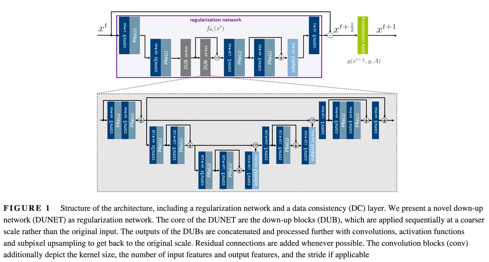

Shifting the computation to a coarser scale is not only more memory efficient, but also does not lower the reconstruction quality at the original scale. The core of DUNET are the multiple down-up blocks (DUBs) applied in an iterative way. This structure allows for an efficient propagation of information at different scales. The output of the DUBs are concatenated and further analysed by a residual convolution/activation block, followed by sub-pixel convolutions, which perform superior in terms of expressiveness and computational efficiency over upsampling convolution.

#### Data Consistency

The DC term allows us to consider the physics of MR acquisition in the image reconstruction problem, and measures the similarity to the acquired k-space data.

One possibility is to perform a gradient step related to the DC term $\mathscr{D}[Ax,y]$:

$$
g_{\mathrm{GD}}(x^{t+\frac12})=x^{t+\frac12}-\lambda^tA^*(Ax^{t+\frac12}-y)
$$

where $A^*$ denotes the adjoint operator of A.

Instead of gradient descent (GD), DC can be modelled by the proximal mapping (PM):

$$
g_{\mathrm{PM}}(x^{(t+\frac12)})=\underset{x}{\arg\min}\frac12 \|x-x^{t+\frac12}\|^2_2+\frac\lambda2 \|Ax-y\|^2_2
$$

This is especially feasible if the PM is easy to compute and a closed-form solution exists. If no closed-form solution exists, or a solution is intractable to compute, as this is typically the case for parallel MRI involving coil sensitivity maps, the PM can be solved numerically using a conjugate gradient optimiser in MODL [^1].

Variable splitting (VS) scheme [^2] is proposed to avoid the extensive computations. 

We first introduce the sensitivity-weighted multi-coil operator for the $q$th coil as $A_q=M\mathscr{F}C_q$, where:

- The operator $C_q: \mathbb{C}^{N_x} \rightarrow \mathbb{C}^{N_x}$ applies the $q$th pre-computed coil sensitivity map to $x$
- $\mathscr{F}$ is a Fourier Transform
- The operator $M:\mathbb{C}^{N_x} \rightarrow \mathbb{C}^{N_x}$ realises the Cartesian sampling pattern and masks out $k$-space lines that where not acquired.

VS divides the problem defined in two sub-problems by using a coil-wise splitting variable $z_q\in \mathbb{C}^{N_x}$:

$$
z^{t+1}_q=\underset{z_q}{\arg\min}\frac\lambda2\sum^Q_{q=1}\|M\mathscr{F}z_q-y_q\|^2_2+\frac\alpha2 \sum^Q_{q=1}\|z_q-C_qx^{t+\frac12}\|^2_2
$$

$$
g_{vs}(x^{t+\frac12})=\underset{x}{\arg\min}\frac\alpha2 \sum^Q_{q=1}\|z^{t+1}_q-C_qx\|^2_2 +\frac\beta2\|x-x^{t+\frac12}\|^2_2
$$

where $\alpha > 0, \beta > 0$ balance the influence of the soft constraints. Solving these sub-problems yields the following closed-form solution:

$$
z_q^{t+1}=\mathscr{F}^{-1}\left(\left(\lambda M^*M+\alpha I*\right)^{-1}\left(\alpha\mathscr{F}C_qx^{t+\frac12}+\lambda M^*y_q\right)\right)
$$

$$
g_{vs}(x^{t+\frac12})=\left(\beta I+\alpha \sum^Q_{q=1} C^*_qC_q \right)^{-1}\left(\beta x^{t+\frac12}+\alpha \sum^Q_{q=1}C_q^*z_q^{t+1}\right)
$$

$I$ denotes the identity matrix and $^*$ the adjoint operation.

All presented DC layers ensure soft DC to the measurement data $y$, representing image reconstruction networks. If $\lambda=0$, DC is omitted and it is a pure residual network performing a post-processing task.

## Methods

### fastMRI datasets

Multi-coil data. The knee dataset consists of two different sequences:

- Coronal proton-density weighted with fat-saturation (PDFS): $N_{\mathrm{train}}=489,\ N_{\mathrm{test}}=99$
- Coronal proton-density weighted without fat-saturation (PD): $N_{\mathrm{train}}=484,\ N_{\mathrm{test}}=100$

Brain dataset:

- Axial FLAIR (AXFLAIR): $N_{\mathrm{train}}= 344,\ N_{\mathrm{test}}= 107$
- Axial T1 (AXT1): $N_{\mathrm{train}}= 498,\ N_{\mathrm{test}} = 169$
- Axial T1 with contrast agent (AXT1POST): $N_{\mathrm{train}}= 949,\ N_{\mathrm{test}} =287$
- Axial T (AXT2): $N_{\mathrm{train}} 2678, \ N_{\mathrm{test}} = 81$

### Data Processing

We defined the target as the sensitivity-weighted coil-combined image of the fully sampled data. We estimated two sets $(M=2)$ of sensitivity maps according to soft SENSE to account for any field-of-view issues or other obstacles in the data.

The number of auto-calibration lines (ACLs) needed for sensitivity map estimation varied according to the acceleration factor and was set to $30$ ACLs for $R=4$ and $15$ ACLs for $R=8$. These numbers were motivated by examining the number of given low frequencies in the test and challenge dataset. The data were normalised by a factor obtained from the low frequency scans by taking the median value of the $20\%$ largest magnitude values, to account for outliers.

We also make use of foreground masks to stabilise training. Foreground masks were extracted semi-automatically for the knee dataset, and by thresholding the RSS combination of the sensitivity maps for the neuro dataset.

### Training setup

Networks were trained using a combined $l_1$ and structural similarity index (SSIM) content loss $\mathscr{L}$ between the reference $x_{\mathrm{ref}}$ and the reconstruction $x_{\mathrm{rec}}=x^T$

$$
\mathscr{L}(x_{\mathrm{rec}}, x_{\mathrm{ref}})=1-\mathrm{SSIM}(m\odot|x_{\mathrm{rec}}|, m\odot|x_{\mathrm{ref}}|) + \gamma_{l_1}l_1(m\odot|x_{\mathrm{rec}}|, m\odot|x_{\mathrm{ref}}|)
$$

where:
- $\odot$ is the pixel wise product
- $|\cdot|$ denotes the RSS reconstruction to combine the individual output channels $[x_1, x_2]$
- This loss also involves a binary foreground mask $m$ to focus the network training on the image content and not on the background
- $\gamma_{l_1}=1-^{-5}$ is chosen empirically to match the scale of the two losses
- This combined loss is beneficial to stabilise training
- We used the ADAM optimiser with learning rate $0.0001$, default momentum $(0.9, 0.999)$
- learning rate scheduling every 15 epochs $\gamma_{lr}=0.5$
- progressive training scheme, starting with $2$ cascades in the first $2$ epochs and increasing the number of cascades with every epoch, up to a total number of $T=10$.
- All network for $60$ epochs
- randomly extract patches of size $96$ in FE direction

### Experimental setup

We study the domain shift problem for image reconstruction experimentally, we study how the different architectures can deal if training and test data do not come from the same data cohort.

#### Network architectures

The DUNETs have:
- $N_f=64$ base features
- We implement three different DC layers, GD, PM and VS
- Baselines:
	- residual UNET with $N_f=64$ based features and kernel size $3$
	- MoDL, 5-layer CNN as regularisation network, and PM for DC, omitted batch normalisation as this results in unstable trainings.
	- VNs, interpreted as unrolled GD scheme with a regularisation network that derives from the FOE model, $N_f=48$ filter kernel of size $11\times 11$ and trainable linear activation function with 31 nodes. The filter kernels are projected on the zero-mean and $l_2$ norm-ball constraint after each parameter update.
- We initialised $\lambda=10$ or $\lambda=1$
- For VS networks, we set $\alpha=\beta=0.1$ empirically for our experiments

#### Training data

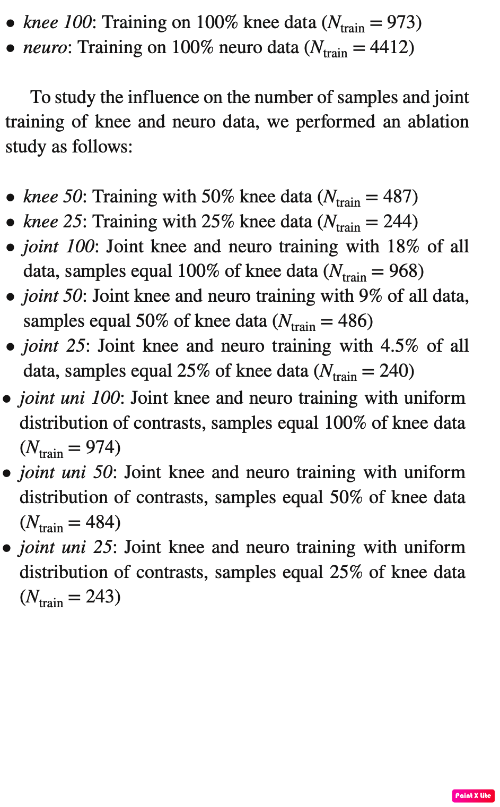

We performed two different sets of joint knee and neuro training, one with uniform and one with non-uniform distribution of the contrasts. The number of samples differ for the knee and neuro set, and also for the different contrasts in the neuro dataset. While the uniform datasets contain the same number of samples from each available contrast, the non-uniform datasets contain only a fraction of samples such that the distribution of the contrasts in the full dataset.

All experiemtns are visualised as ranked lists with descending SSIM. 

## Results

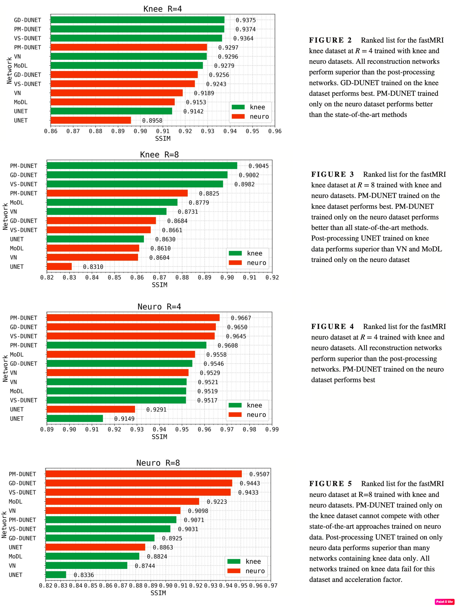

Only on knee and neuro data:
- Figure 2 (knee, R = 4), 
- Figure 3 (knee, R = 8), 
- Figure 4 (neuro, R = 4), 
- Figure 5 (neuro, R = 8).

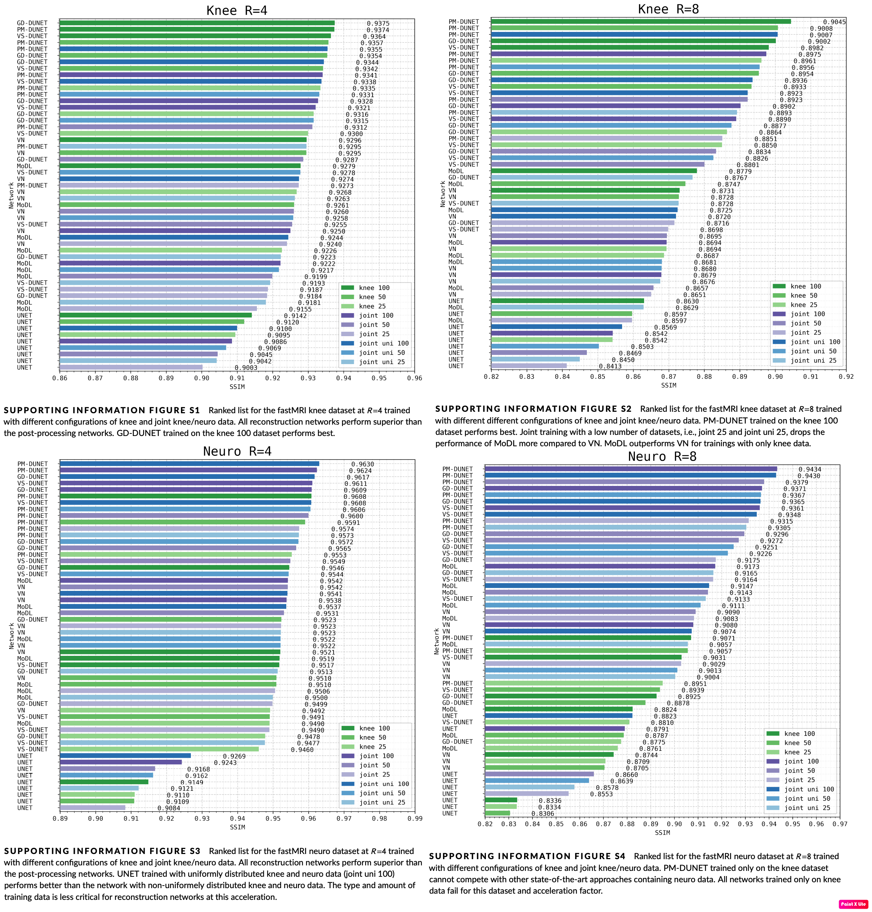

Training on different fractions of knee and joint training data:
- Supporting Information Figure S1 (knee, R = 4),
- Supporting Information Figure S2 (knee, R = 8), 
- Supporting Information Figure S3 (neuro, R = 4), 
- Supporting Information Figure S4 (neuro, R = 8).

For an acceleration factor of R=4, we observe that all post-processing UNETs perform inferior than the worst performing reconstruction network. This effect is more prominent on the neuro data compared to the knee data.

We observe larger performance gain for neuro data compared to knee data, especially for R = 8.

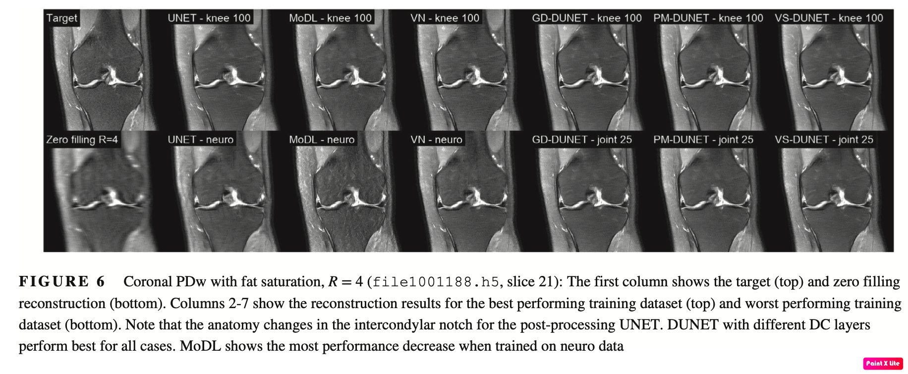

Figure 6 shows results for an example coronal PDw scan with fat saturation and R = 4. The DUNETs have the least artifacts and appear most homogenous compared to VN and MoDL.

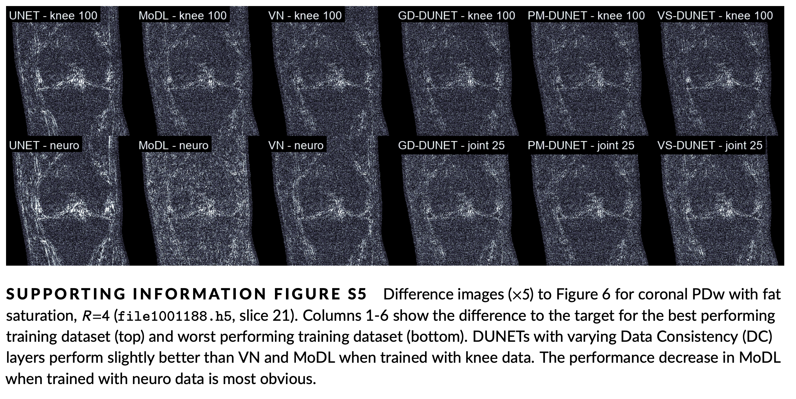

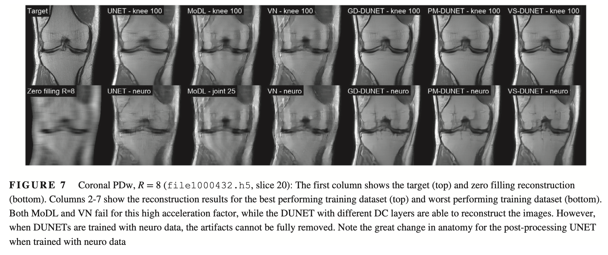

Results for a selected coronal PDw scan and R = 8 are illustrated in Figure 7, along with difference images in Supporting Information Figure S6.

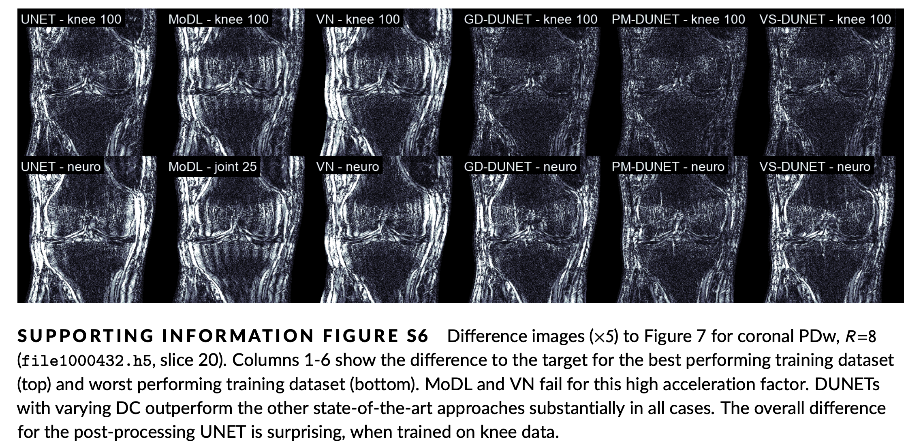

The UNET result appears blurry, however, it has less artifacts than MoDL and VN which have difficulties to reconstruct images at this high acceleration factor. The DUNETs are able to reconstruct the images with high quality when trained with knee data. The VN results between the best and worst performing network do not differ greatly. The UNET reconstructions appear artificial when trained on neuro data.

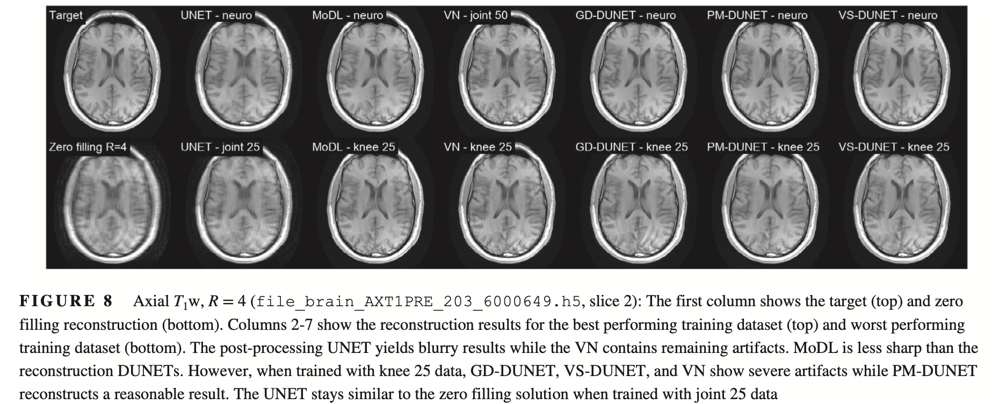

The VN shows the most artifacts of the reconstruction networks. The drop in image quality between different datasets is lowest for MoDL and PM-DUNET, supported by the difference images in Supporting Information Figure S7.

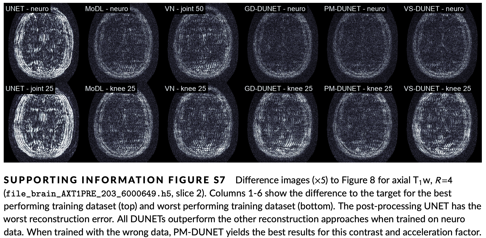

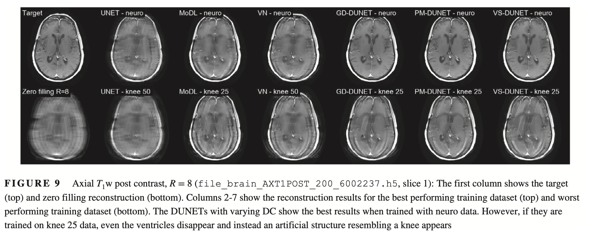

Results for a selected axial T1w post contrast scan for R = 8 is illustrated in Figure 9 along with the difference images in Supporting Information Figure S8. Reconstruction DUNETs trained with neuro data show the best image quality at this high acceleration factor. UNET cannot reconstruct this example. MoDL and VN show severe artifacts at this acceleration factor. When trained with wrong data, the shape of the ventricles changes in all reconstruction DUNETs.

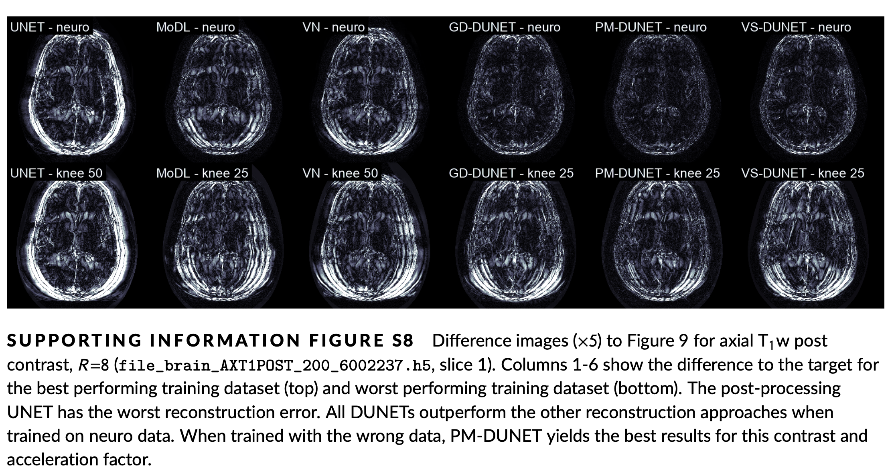

## Discussion

We compare three state-of-the architectures, namely:
- UNET (no DC), 
- MoDL (5-layer CNN, PM as DC), 
- and VN (fields of experts model, GD as DC) 

to our proposed DUNETs with GD, PM, and VS as DC.

Up to now, the robustness of neural networks to training data has not been studied in literature, although this is a crucial part for a successful clinical translation of MRI reconstruction. Recent work focused on the robustness of sampling trajectories, the robustness to noise levels and image contrast, the effect of diverse MSK anatomies, or performed instability analysis of neural networks with respect to image perturbations. Hence, the robustness of these approaches to large, inhomogeneous datasets is unknown.

### Variations in DC

The results depict that the differences between DC layers for acceleration factor R = 4 are minor.

We observe that the PM-DUNET performs most stable over different training datasets, independent of the number and type of training samples, especially at R = 8.

For knee data and R = 4, PM-DUNET trained on neuro data even outperforms the best reported state-of- the-art method. The implicit DC step in the PM allows the network to use a larger regularisation parameter λ, resulting in stronger DC.

A GD layer would require a smaller step size, hence, more iterations to impose the same λ.

VS-DUNET is general performs worse than GD-DNET. This can be explained by the inhomogeneous dataset which makes it more challenging to tune the parameters $\alpha$ and $\beta$.

## Reference 

[^1]: Aggarwal HK, Mani MP, Jacob M. MoDL: model based deep learning architecture for inverse problems. IEEE Trans Med Imaging. 2019;38:394-405.

[^2]: Duan J, Schlemper J, Qin C, et al. VS-net: variable splitting net- work for accelerated parallel MRI reconstruction. In: Shen D, Liu T, Peters TM, Staib LH, Essert C, Zhou S, Yap PT, Khan A, eds. International Conference on Medical Image Computing and Computer-Assisted Intervention. Springer International Publishing; 2019:713-722.