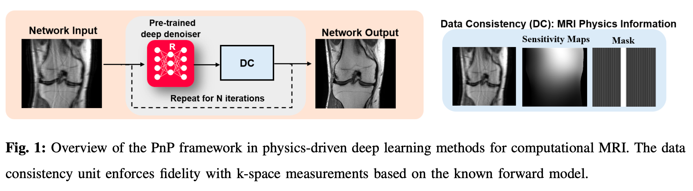
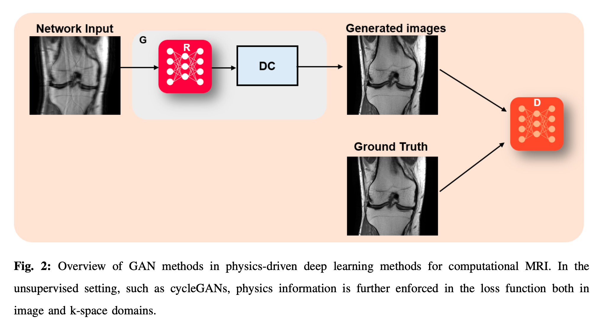
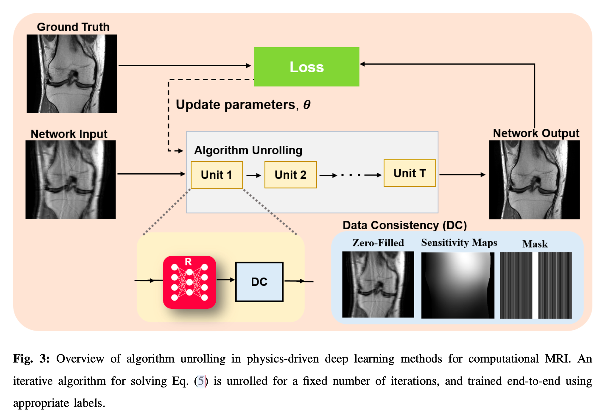

# Physics-Driven Deep Learning for Computational Magnetic Resonance Imaging

## Introduction

$$
\mathrm{y=Ex+n}
$$

where 
- $\mathrm{x}$ is the image of interest,
- $\mathrm{y}$ denotes the corresponding k-space measurements, 
- $\mathrm{E}$ is the forward MRI encoding operator,
	- In its simplest form, $\mathrm{E}$ corresponds to a sub-sampled discrete Fourier transform matrix $\mathrm{F}_\Omega$ while samples the k-space locations specified by $\Omega$
- and $\mathrm{n}$ is measurement noise.

The corresponding multi-coil forward operator $\mathrm{E}$ is given as:

$$
\mathrm{E}=\begin{bmatrix}
\mathrm{F_{\Omega } C_{1}}\\
\vdots \\
\mathrm{F_{\Omega } C}_{n_{c}}
\end{bmatrix}
$$

where
- $n_c$ is the number of coils in the receiver array
- $C_k$ is a diagonal matrix containing the sensitivity profile of the $k^{\mathrm{th}}$ receiver coil。

With the advent of multi-coil receiver arrays, the redundancies among these coil elements became the important information for the next generation of inverse problems.

In addition to canonical linear linear inverse problems, there are a class of computational MRI methods that deal with more complicated non-linear forward models incorporating physical, systemic and physiological parameters, such as *relaxation* [^1] or *motion* [^2]. In this case, the forward model is given as:

$$
\mathrm{y=\mathcal{E}(\vartheta)+n}
$$

where
- $\vartheta$ are a set of parameters that describe the underlying physical or systemic information
- $\mathcal{E}$ is a non=linear encoding operator.

Physics-driven methods have emerged as the most well-received deep learning techniques by the MRI community due to their incorporation of the MR domain knowledge.

## Classical Approaches for Computational MRI

The most commonly used clinical strategy for accelerated MRI is parallel imaging, which uses the redundancies among these coil elements for image reconstruction, and it solved:

$$
\rm\hat{{x}}_{PI}=\underset{x}{\arg\min}\frac12\|\mathrm{y-Ex}\|^2_2=({E^{H}E})^{-1}E^Hy
$$

With $n_c$ coil elements, the ratio between the image size the cardinality of $\Omega$, or the acceleration rate ($R$), can be as high as $n_c$. However, due to dependencies between {$C_k$} and ill-conditioning of $\rm E$ that leads to noise amplification due to the matrix inversion, the achievable rates are often limited. Subsequently, CS methods were proposed to utilise the compressibility of MR images to reconstruct images from sub-sampled k-space data. These methods solve a regularised least squares objective function:

$$
\rm\hat{x}_{CS}=\underset{x}{\arg \min}\frac12\|y-Ex\|_2^2+\tau\|Wx\|_1
$$

where 
- $\|\cdot\|_1$ denotes the $l_1$ norm, 
- $\rm W$ is a sparsifying linear transform
- $\tau$ is a weight term

### Solving the linear inverse problem in classical computational MRI

In general, we will consider a regularised least squares objective with a broader class of regularisers:

$$
\rm \hat{x}_{reg}=\underset{x}{\arg \min}\frac12 \|y-Ex\|^2_2+\mathcal{R}(x)
$$

where $\mathcal{R}$ may be one of the aforementioned regularisers, such as the $l_1$ norm of transform domain coefficients. A classical approach, when $\mathcal{R}(\cdot)$ is differentiable, is based on ***gradient descent***:

$$
\rm x^{(i)}=x^{(i-1)} + \eta E^H(y-Ex^{(i-1)})-\eta\triangledown_x\mathcal{R}(x)|_{x=x^{(i-1)}}
$$

where $x^{(i)}$ is the image of interest at the $i^{th}$ iteration. 

***Proximal gradient descent***, which amounts to solving two sub-problems:

$$
\rm z^P(i) = \underset{z}{\arg\min} \frac12 \|x^{(i-1)}-z\|^2_2+\eta\mathcal{R}(x) \triangleq prox_{\mathcal{R}, \eta}(z)
$$

$$
\rm x^{(i)}=z^{(i)} + \eta E^H(y-Ez^{(i)})
$$

where $x^{(i)}$ and $z^{(i)}$ are the image of interest and an intermediate image at the $i^{\mathrm{th}}$ iteration respectively. The first equation corresponds to the so-called proximal operator for the regulariser, the second enforces data consistency, and $\eta$ is a step size. For differentiable $\mathcal{R}$, proximal gradient descent can be also written in the alternative form:

$$
\rm z^{(i)}=x^{(i-1)} - \eta \triangledown_x\mathcal{R}(x)|_{x=x^{(i-1)}}
$$

$$
x^{(i)} = \arg \min \frac12 \|y-Ex\|^2_2 + \frac\eta2\|x-z^{i}\|_2^2\\=(E^HE+\eta I)^{-1}(E^Hy+\eta z^{(i)}) \triangleq \rm prox_{l_2, \eta}(z^{(i)})
$$

Another class of popular approaches rely on variable splitting, such as the ***alternating direction method of multipliers (ADMM)***, which solves:

$$
x^{(i)} = (E^HE+\rho I)^{-1}(E^Hy+\rho(z^{(i-1)}-u^{(i-1)}))
$$

$$
z^{(i)}=\underset{z}{\arg\min}\frac12 \|x^{(i)} + u^{(i-1)} - z\|^2_2 + \frac1\rho \mathcal{R}(x)
$$

$$
u^{(i)} = u^{(i-1)}+(x^{(i)} - z^{(i)})
$$

where:
- $x^{(i)}$ is the image of interest at the $i^{th}$ iteration
- $z^{(i)}$ and $u^{(i)}$ are intermediate images
- $\rho$ is a penalty weight

This three equations corresponds to data consistency, proximal operator and dual update sub-problems respectively.

### Solving the non-linear inverse problem in classical computational MRI

A more accurate and complete description of the MR signal model is obtained if other effects like tissue relativity, off-resonance, motion, chemical shift, flow, diffusion are taken into account. In this case, the MR signal $y_k$ at the $k^{\rm th}$ receiver coil, prior to discretisation, can be described as:

$$
y_k=\int \rho(r)c_k(r)M(\vartheta,x,t,r)e^{-j2\pi k(t)\cdot r} dr
$$

where
- spin densities $rho$,
- coil sensitivities $c_k$
- the signal model $M(\vartheta, x,t,r)$ of the unknown parameters $\vartheta$
- and k-space sampling at spatial points $r$ defined by the k-space trajectory $k(t)$

The discretised forward operator $\mathcal{E}:\vartheta \rightarrow y$ becomes non-linear and maps the unknown parameters $\vartheta$ to the measured data $y$. It can be decomposed into $\mathcal{E}=E \mathcal{M}$, where $E$ is the canonical forward operator and $\mathcal{M}$ is the singal model describing the spin physics. Given a reconstructed image series $x$, a parametric fitting can be performed by a least-squares minimisation:

$$
\hat{\vartheta} = \underset{\theta}{\arg\min} \|M(\vartheta)-x\|^2_2
$$

that fits the image series into the defined signal model $\mathcal{M}$ parametrised by $\vartheta$.

The signal model can be directly incorporated into the image reconstruction, the unknown parameters $\vartheta$ are estimated from the acquired data $y$ without having to reconstruct individual image first. The general unconstrained optimisation problem for a model-based reconstruction with a class of regularisers {$R_i(\cdot)$} on the underlying unknown parameters $\vartheta$ can be stated as:

$$
\hat{\vartheta} = \underset{\vartheta}{\arg\min} \|\mathcal{E}(\vartheta)-y\|^2_2 + \sum_i \lambda_iR_i(\vartheta)
$$

Intermediate image reconstruction is not necessary for model-based reconstructions, and the parameters of interest can be directly estimated. This description is very general and combines parallel imaging, compressed sensing and model-based reconstruction in a unified formulation. For the inverse problems with non-linear forward operators, the algorithms are less standardised, and typically application-dependent. 

## Physics-Driven ML Methods in Computational MRI

The data-driven methods are typically implemented in image space, as removing artifacts from aliased images. These image enhancement networks are typically trained to map corrupted and undersampled images to artifact-free images. Learning image enhancement networks is the key ingredient to remove artifacts in image domain. 

However, when only image enhancement methods are used, the information of the acquisition physics is entirely discarded, hence, k-space consistency cannot be guaranteed. 

### Physics Information in Image/k-space Enhancement Methods

Image enhancement networks typically learn a mapping from the aliased/degraded image, such as the zero-filled reconstruction to a reference image, without consideration of the measured k-space data during the reconstruction process.

Physics information including enforcing *k-space consistency* directly after image enhancement [^3], which directly replaces the measured k-space lines, leading to artifacts; or *adding k-space consistency as an additional cost function term* during training [^4], which cannot guarantee k-space consistency during inference ,especially for cases with unseen pathologies.

Similarly, enhancement has been proposed in k-space, as a method of interpolation [^5], where a non-linear interpolation function is learned from calibration data. This can be seen as an extension to the linear convolution kernel used in parallel imaging. As only the calibration data is required for training, this approach can be used when large training databases are not available, but its performance may be limited at high acceleration rates where the calibration data may be insufficient [^6].

### Plug-and-play Methods with Deep Denoisers

Plug-and-play (PnP) algorithms decouple image modelling from the physics of the MRI acquisition, by noting that the proximal operators correspond to conventional denoising problems. In the proximal-based formulation, these proximal denoisers are replaced by other powerful denoising algorithms, which do not necessarily have a corresponding closed form $\mathcal{R}(\cdot)$ expression, such as *BM3D* [^7]. A related approach is the regularisation by denoising (RED) framework, which considers finding $x$ that solves the optimality condition:

$$
\mathbf{0}=E^H(Ex-y) + v(x-d(x))
$$

where $d(\cdot)$ is the plug-in denoiser. The advantage of the RED formulation is that under certain conditions, the regulariser, $\mathcal{R}(\cdot)$ can be explicitly tied to the denoiser.

These denoisers are typically trained using reference images in a supervised manner, where different levels of noise are retrospectively added to these images, and a mapping from the noisy images to reference images are learned.

Extending on these works, regularisation by artifact removal (RARE) trained CNN denoisers on a database of pairs of image with artifacts generated from non-Cartesian acquisitions [^8]. These pairs were generated by splitting the acquired measurements in half, and reconstructing these with least squares, corresponding to a parallel imaging reconstruction, which led to starting images of sufficient quality for non-Cartesian trajectories that oversample the central k-space. The appeal of these methods is that the CNN-based denoisers are trained independent of the broader inverse problem. Thus, only the denoising network has to be stored in memory, allowing for easier translation to larger-scale. This approach is also appealing since only one denoiser has to be trained on any data. Hence, this denoiser can be applied across different rates on undersampling patterns. It is beneficial to provide the denoiser with additional information, such as the undersampling artifacts arising from uniform undersampling pattern in order to recognise characteristic aliasing artifacts.

### Generative Models

Regularisation can also be achieved by an implicit prior in order to constrain the solution space for our optimisation problem. This concept is proposed by Deep Image Prior (DIP) [^9] as follows:

$$
\underset{\theta}{\min}\frac12 \|EG(z,\theta)-y\|^2_2
$$

where a generator network, $G$ parametrised by $\theta$, reconstructs an image from a random latent vector $z$. This loss function is used to train the generator network with parameters $\theta$. This formulation has the advantage that it works for limited (even single) datasets without ground-truth. However, early stopping has to be performed to not overfit to the noisy measurement data. DIP's application to MRI reconstruction has also been studied [^10]. Starting from a noise vector, a mapping network first generated an expressive latent space from a fixed low-dimensional manifold, using fully connected layers and non-linearities. A wavelet-sparsity constraint on the generated image was added as regularisation to improve the efficiency of learning and avoid over-fitting to the noisy measurement data, and was further conditioned with a high-resolution image of similar anatomy.

An alternative line of work is based on GANs. The generator network samples from a fixed distribution in latent space such as Gaussian distribution and aims to map the sampling to a real data distribution in ambient image space. The minimax training objective is defined as:

$$
\underset{\theta_G}{\min}\underset{\theta_D}{\max}\mathcal{L}_{GAN}(\theta_G, \theta_D) \triangleq \mathbb{E}_x [\log D(x, \theta_D)] + \mathbb{E}_z[\log(1-D(G(z, \theta_G), \theta_D))],
$$

where the distribution on $x$ is the real data distribution, whereas the one on $z$ is a fixed distribution on the latent space. The generator $G$, parametrised by $\theta_G$, tries to map samples from the latent space to samples from the ambient image space, and the discriminator $D$, parametrised by $\theta_D$, tries to differentiate between the generated and the real samples [^11]. The generator network used the zero-filled images as input instead of a random distribution, leading to the loss function:

$$
\underset{\theta_G}{\min}\underset{\theta_D}{\max} \mathbb{E}_x[\log D(x, \theta_D)]+\mathbb{E}_z[\log (1-D(G(E^Hy,\theta_G), \theta_D))]
$$

and $G$ was in essence an image enhancement network, followed by a data consistency step.

Another approach is based on inverse GANs, which utilise generative learning, followed by optimisation similar to DIP [^12]. First, a GAN is trained to generate MR images from a latent noise vector. The GAN does not involve any physics-based knowledge, as only clean MRI reference images are used for training. The physics-based information is then included in a refinement step, where both the generator parameters and the latent vector are optimised following:

$$
\underset{\theta, z}{\min}\frac12 \|EG(z,\theta)-y\|^2_2
$$

This allows for adaptation of the generator to the undersampled k-space data at test time, and is not restricted to any sampling pattern.

Much work has been done to adapt GANs into a setting that does not require paired input and label data for computational MRI.While traditional GANs and DIP-like networks are based on minimising the statistical distance in k-space, CycleGAN aims to minimise this in both k-space and image domain. The consistency and GAN loss is employed as:

$$
\mathcal{L}_{cycle}(\theta_G)=\mathbb{E}_x[\|x-G(y,\theta_G)\|^2_2]+\mathbb{E}[\|y-EG(y,\theta_G)\|^2_2]
$$

where the generator uses k-space measurements $y$ as input. Here, the first term ensures consistency in the image domain, while the latter enforces consistency in the k-space domain. Wasserstein GAN loss is added to improve training stability.

### Algorithm unrolling and unrolled networks

Algorithm unrolling considers the traditional iterative approaches and adapts them in a manner that is amenable to learning the optimal parameters for image reconstruction. Instead of solving a new optimisation problem for each task, the whole iterative reconstruction procedure, including the image regulariser can be learned.

In this line of work, a conventional iterative algorithm is unrolled and solved for a fixed number of iterations. In practice, any iterative optimisation algorithm can be unrolled. In the context of MRI, algorithm unrolling is based on ADDM, gradient descent schemes, proximal gradient, primal-dual methods, or variable splitting methods.

Variational Networks (VNs) are an example for an unrolled gradient descent scheme. In this method, the gradient descent approach is unrolled for $N_i$ steps. In VNs, the gradient with respect to the regulariser $\triangledown_x \mathcal{R}(x)|_{x=x^{(i-1)}}$ is derived from the Fields-of0Experts (FoE) regulariser:

$$
\mathcal{R}(x)=\sum^{N_k}_{j=1}\left<\Phi_j(K_jx),1\right>
$$

where $1$ denotes a vector of ones. This can be seen as a generalisation of the Total Variation seminorm for a number of $N_k$ convolution operatos $K$ and non-linear potential functions $\Phi$. Calculating the gradient with respect to $x$ yields:

$$
\triangledown \mathcal{R}(x)|_{x=x^{(i-1)}}=\sum^{N_k}_{j=1}K^H_j\Phi'_j(K_jx)
$$

where $\Phi'$ denotes trainable activation functions. The small number of trainable parameters make VNs easy to train and fast to run. VNs are characterised by the energy-based formulation of the regulariser. The FoE model and the Total Deep Variation model [^13] are proposed for energy-based regularisation. In other approaches, this energy-based formulation is discarded and the gradient with respect to $x$ is replaced by a CNN with trainable parameters $\theta$:

$$
\triangledown \mathcal{R}(x)|_{x=x^{(i-1)}}=\mathrm{CNN}_\theta (x^{(i-1)})
$$

Multi-scale regularisers such as UNet, or Down-Up Networks [^14] are commonly used.

Another line of work considers the proximal gradient descent scheme. In data consistent CNNs and MoDL, which again replace the gradient with respect to $x$ by a CNN with trainable parameters $\theta$. This leads to the following scheme:

$$
z^{(i)}=x^{(i-1)} - \mathrm{CNN}_\theta(x^{(i-1)})
$$

$$
x^{(i)} = (E^HE+\eta I)^{-1}(E^Hy+\eta z^{(i)})
$$

where $\eta$ is an additional learnable parameter. The proximal mapping can be solved as closed form solution for single-coil datasets, or using an iterative optimisation approach based on conjugate gradient (CG) for the more commonly used multi-coil setup. In this case, the CG algorithm itself has to be unrolled for a fixed number of iterations for easy back-propagation through the whole network.

The alternative form of proximal gradient descent unrolling leads to the replacement of the proximal operator of $\mathcal{R}(\cdot)$ by a CNN with trainable parameters $\theta$, leading to:

$$
z^{(i)}=\mathrm{CNN}_\theta(x^{(i-1)})
$$
$$
x^{(i)}=z^{(i)}+\eta E^H(y-Ez^{(i)})
$$

This method was utilised in [^15]. This approach leads to a less memory intensive data consistency step, especially for multi coil datasets, but its performance lags the CG approach used in MoDL.

#### Training unrolled networks

The output of the unrolled network depends on the variables in both the regularisation and data consistency units, and can be represented with a function $f_{\mathrm{unroll}}(y, E;\{\theta_i, \eta_i\}^{N_}_{i=1}$, where for the most generalised representation, we allow the regulariser CNN parameters $\theta$ and the data consistency parameters $\eta$ to vary across the unrolled iterations. We have referred to the multi-coil operator as $E$, this operator implicitly includes the sub-sampling mask $\Omega$. We use $E_\Omega$ and $y_\Omega$ for the multi-coil operator and the measured k-space data, respectively.

The standard learning strategy for unrolled network is to train them end-to-end, using the full network that has been unrolled for $N_t$ steps. The most commonly used paradigm relies on supervised learning. The supervised learning loss function can be written as:

$$
\underset{\{\theta_i, \eta_i\}^{N_t}_{i=1}}{\min}\frac1N \sum^N_{n=1}\mathcal{L}(x^n_{\mathrm{ref}}, f(y^n_{\mathrm{ref}}, E^n_\Omega;\{\theta)i, \eta_i\}^{N_t}_{i=1}))
$$

where:
- $N$ is the number of samples in the training database, 
- $\mathcal{L}(\cdot, \cdot)$ is a loss function characterising the difference between network output and referenced data, 
- $x^n_{\mathrm{ref}}$ denotes the ground-truth image for subject $n$.

The domain for the loss function can be image, k-space or a mixture of them.

However, fully-sampled reference data may be impossible to acquire. In these cases, self-supervised learning enables training of neural networks without fully-sampled data by generating training labels from the sub-sampled measurements themselves [^16]. One of the first work is self-supervised learning via data undersampling (SSDU) [^17], partitioins the acquired measurement $\Omega$, for each scan into two disjoint sets, $\Theta$ and $\Lambda$, where $\Theta$ is used during training to enforce data consistency within the network, while the other set $\Lambda$ remains unseen by the unrolled network and is used to define the loss function in k-space. This end-to-end training is solved by the following self-supervised loss:

$$
\underset{\theta}{\min}\frac1N \sum^N_{n=1}\mathcal{L}(y^n_\Lambda, E^n_{\Lambda}(f(y^n_\Theta, E^n_\Theta;\theta)))
$$

where the network output is transformed back to k-space by applying the encoding operator $E^n_\Lambda$ at unseen locations in training. Thus, the self-supervised loss function measure the reconstruction quality of the model by characterising the discrepancy between the unseen acquired measurements and network output measurements at the corresponding locations. 

Another work using Stein's unbiased risk estimate of MSE is leveraged to enable unsupervised MRI reconstruction [^18]. The loss function obtained from an ensemble of images, each acquired by employing different undersampling operator, has been shown to be an unbiased estimator for MSE.

Like generative models based on DIP, there has been interest in training unrolled network on single datasets without a database. The number of trainable parameters is usually larger than the number of pixels/k-space measurements, and training may lead to overfitting. By developing a zero-shot self-supervised learning [^19] that includes a third additional partition, which is used to monitor a self-validation loss in addition to the previous self-supervision setup. This self-validation loss starts to increase once overfitting is observed. Once the model training is stopped, the final reconstruction is calculated by performing a forward pass at stopping epoch using all acquired measurements. 

#### Memory challenges of unrolled networks

A major challenge for training unrolled networks is their large memory footprint. Recently, this was tackled with the development of memory-efficient learning schemes [^20]. In memory-efficient learning, intermediate outputs from each unrolled iteration are stored on host memory during forward pass, and back-propagation gradients are computed using this intermediate data and gradients from the proceeding step.

Another alternative for handling the large memory footprint of unrolled networks is deep equilibrium networks [^21]. These networks solve a fixed point equation for an operator corresponding to a single unroll, which leads to two advantages for training. First, only one unroll has to be stored during training, leading to a small memory usage. Second, the coverage behavior for different values of $N_t$ during inference is more well-behaved compared to unrolled networks, which are designed to achieve maximal performance for a specific value of $N_t#. On the other hand, deep equilibrium network are run until convergence and do not have fixed inference time unlike unrolled networks, which may not be ideal in clinical applications.

## SOTA in MRI Practice and Domain-Specific Challenges

## Reference 

[^1]: N. Seiberlich, V. Gulani, et al., Quantitative magnetic resonance imaging, Academic Press, 2020.

[^2]: P. Batchelor, D. Atkinson, et al., “Matrix description of general motion correction applied to multishot images,” Magnetic Resonance in Medicine: An Official Journal of the International Society for Magnetic Resonance in Medicine, vol. 54, no. 5, pp. 1273–1280, 2005.

[^3]: C. M. Hyun, H. P. Kim, S. M. Lee, S. M. Lee, and J. K. Seo, “Deep learning for undersampled MRI reconstruction,” Physics in Medicine and Biology, vol. 63, no. 13, pp. 135007, 2018.

[^4]: G. Yang, S. Yu, et al., “DAGAN: Deep De-Aliasing Generative Adversarial Networks for Fast Compressed Sensing MRI Reconstruction,” IEEE Transactions on Medical Imaging, vol. 37, no. 6, pp. 1310–1321, 2017.

[^5]: M. Akcakaya, S. Moeller, S. Weingartner, and K. Ugurbil, “Scan-specific robust artificial-neural-networks for k-space interpolation (RAKI) reconstruction: Database-free deep learning for fast imaging,” Magn Reson Med, vol. 81, no. 1, pp. 439–453, Jan 2019.

[^6]: F. Knoll, K. Hammernik, et al., “Deep-learning methods for parallel magnetic resonance imaging reconstruction,” IEEE Signal Processing Magazine, vol. 37, no. 1, pp. 128–140, 2020.

[^7]: R. Ahmad, C. A. Bouman, et al., “Plug-and-play methods for magnetic resonance imaging: Using       denoisers for image recovery,” IEEE Signal Processing Magazine, vol. 37, no. 1, pp. 105–116,2020.

[^8]: J. Liu, Y. Sun, et al., “Rare: Image reconstruction using deep priors learned without groundtruth,” IEEE Journal of Selected Topics in Signal Processing, vol. 14, no. 6, pp. 1088–1099, 2020.

[^9]: D. Ulyanov, A. Vedaldi, and V. Lempitsky, “Deep image prior,” International Journal of Computer Vision, vol. 128, no. 7, pp. 1867–1888, Mar. 2020.

[^10]: J. Yoo, K. H. Jin, et al., “Time-dependent deep image prior for dynamic mri,” IEEE Transactions on Medical Imaging, vol. 40, no. 12, pp. 3337–3348, 2021.

[^11]: M. Mardani, E. Gong, et al., “Deep Generative Adversarial Neural Networks for Compressive Sensing (GANCS) MRI,” IEEE Transactions on Medical Imaging, vol. PP, no. c, pp. 1, 2018.

[^12]: D. Narnhofer, K. Hammernik, F. Knoll, and T. Pock, “Inverse GANs for accelerated MRI reconstruction,” in Wavelets and Sparsity XVIII, D. V. D. Ville, M. Papadakis, and Y. M. Lu, Eds. International Society for Optics and Photonics, 2019, vol. 11138, pp. 381 – 392, SPIE.

[^13]: A. Sriram, J. Zbontar, et al., “End-to-end variational networks for accelerated mri reconstruction,” 2020.

[^14]: K. Hammernik, J. Schlemper, et al., “Systematic evaluation of iterative deep neural networks for fast parallel mri reconstruction with sensitivity-weighted coil combination,” Magnetic Resonance in Medicine, vol. 86, no. 4, pp. 1859–1872, 2021.

[^15]: M. Mardani, Q. Sun, et al., “Neural proximal gradient descent for compressive imaging,” in Proceedings of the 32nd International Conference on Neural Information Processing Systems, Red Hook, NY, USA, 2018, NIPS’18, p. 9596–9606, Curran Associates Inc.

[^16]: M. Akc ̧akaya, B. Yaman, H. Chung, and J. C. Ye, “Unsupervised deep learning methods for biological image reconstruction and enhancement,” IEEE Signal Process. Mag., March 2022.

[^17]: B. Yaman, S. A. H. Hosseini, et al., “Self-Supervised Learning of Physics-Guided Reconstruction Neural Networks without Fully-Sampled Reference Data,” Magn Reson Med, vol. 84, no. 6, pp. 3172–3191, Dec 2020.

[^18]: H. K. Aggarwal, A. Pramanik, and M. Jacob, “Ensure: Ensemble stein’s unbiased risk estimator for unsupervised learning,” in ICASSP. 2021, pp. 1160–1164, IEEE.

[^19]: B. Yaman, S. A. H. Hosseini, and M. Akcakaya, “Zero-shot self-supervised learning for MRI reconstruction,” in International Conference on Learning Representations, 2022.

[^20]: M. Kellman, K. Zhang, et al., “Memory-efficient learning for large-scale computational imaging," IEEE Trans Comp Imaging, vol. 6, pp. 1403–1414, 2020.

[^21]: D. Gilton, G. Ongie, and R. Willett, “Deep equilibrium architectures for inverse problems in imaging,” IEEE Transactions on Computational Imaging, vol. 7, pp. 1123–1133, 2021.