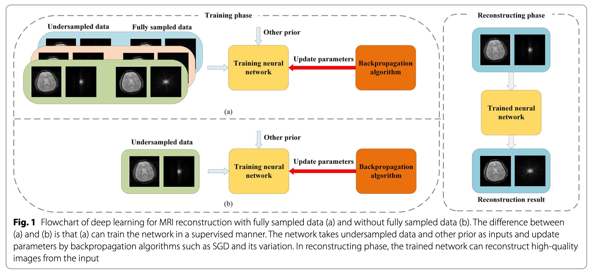
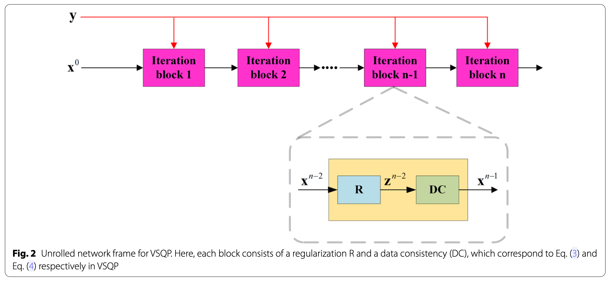
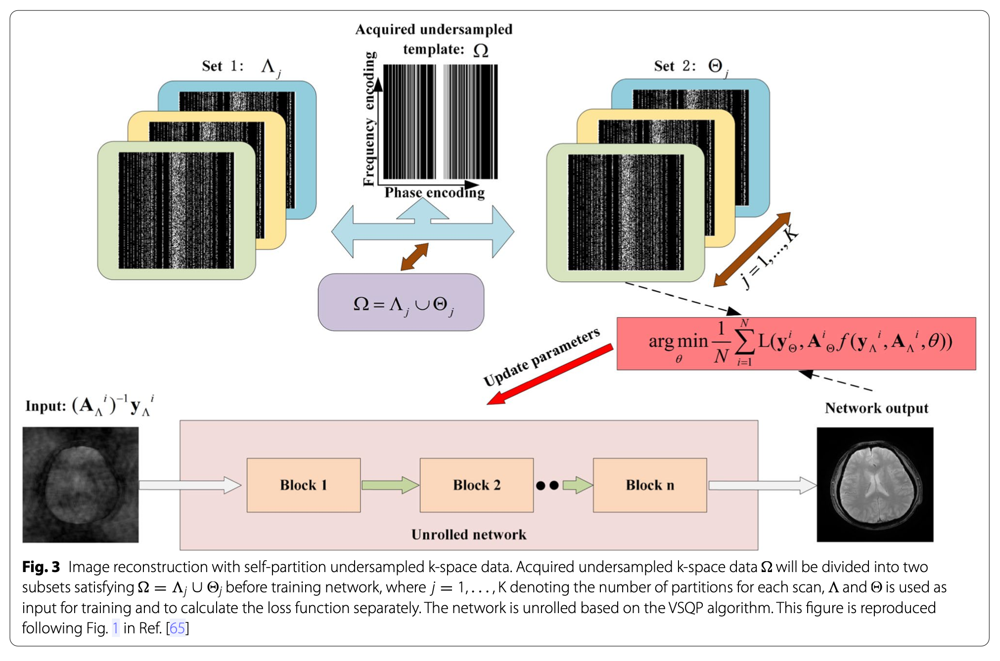
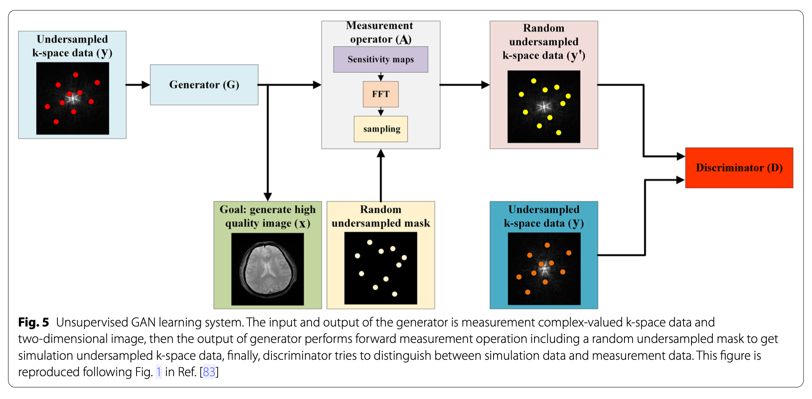

## Introduction

Due to physiological constraints such as organ motion or physical constraints such as signal decay, it is difficult, impractical and impossible to obtain fully sampled data. Here, the main related methods in deep learning based MRI reconstruction without fully sampled data are reviewed.

## Traditional Methods for MRI reconstruction

### Reconstruction model

A multi-coil imaging model can be expressed as follows:

$$
y = Ax + \eta\ \ \mathrm{with} \ \ A_i=UFS_i
$$

where $x \in \mathbb{C}^N$ is the image to be reconstructed, $y \in \mathbb{C}^M$ is the noisy measured data ($M << N$), $\eta$ is the noise, and $A$ denotes a measurement operator consisting of a sampling matrix $U \in \mathbb{R}^{M\times N}$, Fourier transform operator $F$ and the sensitivity map matrix $S_i$ for the $i$th coil. A common reconstruction model is to add a regularisation term to constrain its solution space,

$$
\underset{x}{\arg\min}\frac12 \|y-Ax\|^2_2 + \lambda \mathcal{R}(x)
$$

where $\|y-Ax\|^2_2$ ensures consistency with the measured data, $\mathcal{R}(x)$ is a regularisation item, and $\lambda$ is a tradeoff between the data consistency and the regularisation terms.

Multiple regularisation terms can be chosen such as 2D wavelet, total variation (TV), dictionary, 3D wavelet, 3D k-t sparse, 3D low-rank. Some methods are often used to iteratively solve the above optimisation problems. 

Sparsity or low-rankness constraints are often used as priors to reduce the artefacts of the reconstruction image when the acceleration rate is high. Researchers found that the key to MRI reconstruction based on compressed sensing lies in the design of the sparse domain, which mainly includes pre-constructed or adaptive basis and dictionary .

Low-rankness methods are mainly used for dynamic and high-dimensional imaging by exploring the relationship between multiple images.

Although good achievements have been achieved, traditional optimisation reconstruction methods complete iterations with more time.

### Optimisation Algorithms

Here, we only briefly introduce *variable-splitting with the quadratic penalty* (VSQP), *proximal gradient descent* (PGD), *iterative shrinkage thresholding algorithm* (ISTA), and *alternate direction method of multipliers* (ADMM).

#### VSQP

We use variable-aplitting with the quadratic penalty, the formulation is as follow:

$$
z^i = \underset{z}{\arg \min} \mu \|x^{i-1}-z\|_2^2 + \mathfrak{R}(z)$$
$$
=prox_{\mathfrak{R}}(x^{i-1})
$$
$$
x^i=\underset{x}{\arg \min}\frac12\|y-Ax\|^2_2+\mu \|x-z^i\|^2_2 
$$

where $z^i$ is the auxiliary intermediate variable, $x^i$ is the image to be reconstructed in the $i$th iteration, and $\mu$, $prox_{\mathfrak{R}}(\cdot)$ is the secondary penalty parameter and proximity operator respectively. 

In a deep network, this algorithm can be unrolled for a fixed number of iterations as network architecture, $z^i$ is mainly related to the choice of priors, and can be interpreted as a denoising operation. $x^i$ depends on the selection of the forward model and corresponds to the data-consistency layer in the network, which is usually solved by 

$$
(A^HA+\mu I)x^i = (A^Hy+\mu z^i)
$$

where $^H$ denotes conjugate transpose, the equation above can be updated by using a conjugate gradient to avoid the matrix inversion process and cope with multi-coil reconstruction scenarios.

#### PGD

In VSQP, if the following formula is used to update $x^i$ which formulated as:

$$
x^i = z^i + \rho A^T(y-Az^i)
$$

where $\rho$ is a gradient descent step size. Since the simplest gradient descent is used to update, it often requires more iterations to achieve better results.

#### ISTA

Both VSQP and PGD use a network to directly learn the approximation mapping for $z^i$. Here, an iterative shrinkage-thresholding algorithm is used to guide the completion.

We use the following substitution for $\mathfrak{R}(x)$:

$$
\mathfrak{R}(x)=\lambda \|\Psi x\|_1
$$

we can get the final solution by alternately iterating the following sub-problem:

$$
z^i = \mathbf{\Psi}^Hprox_{\rho\mathfrak{R}}(\Psi x^{i-1})
\\ = \tilde{\hbar}(x^{i-1})\Gamma_{\kappa\mathfrak{R}}(\hbar(x^{i-1}))
$$

where $\mathbf{\Psi}$ represents a right frame, $\Gamma_{\kappa}(x)$ denotes shrinkage operator such that 

$$
\Gamma_\kappa(x) = \mathrm{sign}(x) \cdot \max \{|x|-\kappa,0\}
$$

when ISTA meets deep learning, a nonlinear transform operator $\hbar(x)$ is used here instead of $\mathbf{\Psi}$ and $\tilde{\hbar}(x^{i-1})$ is an inverse operator of $\hbar(x^{i-1})$, meanwhile, $\tilde{\hbar}(x^{i-1})$ and $\hbar(x^{i-1})$ are implemented with a neural network, $\kappa$ is a new parameter that includes $\rho$.

#### ADMM

We can make the following augmented Lagrangian function by utilising a new variable

$$
\underset{u}{\max} \underset{x,v}{\min} \frac12 \|y-Ax\|_2^2 + \mathfrak{R}(v) + \frac v2 \|x-v+u\|^2_2
$$

where $u$ and $v$ denote Lagrangian multiplier and penalty parameter. This equation can be solved by three alternate iteration sub-problems. For simplicity, we do the following substitutions:

$$
f_v(x, v, u) = \frac12\|y-Ax\|^2_2+\mathfrak{R}(v) + \frac v2\|x-v+u\|^2_2
$$

then the alternate iteration subproblem is as follows:

$$
\begin{cases}
x \leftarrow \underset{x}{\min}f_v(x,v,u)\\\
v \leftarrow \underset{v}{\min}f_v(x,v,u)\\\
u \leftarrow u + x - v
\end{cases}
$$

Alternate directions method of multipliers (ADMM) can be combined with TV and dictionary learning to complete MRI reconstruction together.

## Deep Learning with Fully sampled k-space data

MRI reconstruction based on deep learning can be roughly divided into two categories, data-driven and model-driven. The former uses the redundant information in the original input to learn the potential mapping relationship from input to output, including learning the mapping from zero-filled to artefact-free images and the interpolation rules of k-space.

The researchers proposed physical model-driven deep learning methods. The network uses a fixed number of iterations to unroll the traditional optimisation iterative algorithm, which not only achieves better reconstruction results but makes the network more interpretable. When there are a large number of training sample pairs, the supervised reconstruction can be expressed as follows

$$
\underset{\theta}{\arg \min} \frac1N \sum^N_{i=1}L(x^i_{ref}, f(y^i, A^i, \theta))
$$

where $x^I_{ref}$ is the reference image of $i$th subject, $L$ is the loss function between the network output image and reference between the network output image and the reference image. Let $f(y^i, A^i, \theta)$ denotes output image of network for under-sampled k-space data $y^i$ and measurement operator $A^i$ of $i$th subject, where the network is parameterised by $\theta$. The equation can be implemented using SGD, whose basic form is:

$$
\theta^{k+1} = \theta^k - \rho^K \frac1N \sum^N_{i=1}\triangledown L(x^i_{ref}, f(y^i, A^i, \theta))
$$

where $\rho^k$ is the gradient descent size. According to actual needs, it can change with the number of iterations, or be a constant. Due to the slow convergence of the basic SGD, researchers use other variants of SGD to speed up the convergence of the algorithm and avoid convergence to the saddle point. Furthermore, unrolled network based on the traditional optimisation algorithm is often used to improve the interpretability of the network and reconstruction quality. A comprehensive review of model-driven MRI deep learning reconstruction can be found in [^1].

## Deep Learning without fully sampled k-space data

For the scenario without fully sampled data, it is difficult to find the optimal solution from infinite latent solutions without other information. 

For traditional optimisation algorithms, the regularisation term is usually manually pre-defined to obtain the optimal solution by compressing the solution space. How to better discover effective prior information is very important for DL without fully sampled k-space data.

### Deep Image Prior

Only a generation network can still achieve good results in the absence of any other reference data, which illustrate that the CNN can replace the regularisation term by capturing the low-level image implicit prior.

Yazdanpanh et al. [^2] and Senouf et al. [^3] apply this idea to MRI reconstruction, only use the zero-filled image as the input of the network, and then iteratively update the network parameters to approximate the k-space of the output image to the under-sampled k-space data. However, there are also obvious shortcomings, since it required well-designed network and was easy to overfit to noise with the iteration gradually approaches the target as the optimisation function is based on lossy data. Hence, the regularisation term was introduced to alleviate this situation.

Many works illustrate that unroll network based on the physical model can improve the interpretability of the network and reconstruction quality. Wang et al. [^4] proposed to combine a VQSP-based iterative network with the high robustness of the classic iterative algorithm. The loss function adds a regularisation term as follows:

$$
L(y, \theta) = \frac1N \sum^N_{i=1}[\|AI_\theta(y_i)-y_i\|^2_2+\mathfrak{R}(I_\theta(y_i))]
$$

where $I\theta(y_i)$ is an output of the network, the $\mathfrak{R}$ is predefined such as TV, which will encourage the solution to approach the characteristics of the pre-defined regularisation term. The performance of the model was more robust than the supervised learning with out using the above loss function, and has a better reconstruction utility compared with the classical method using the same loss function.

### Self-partition k-space data

Yaman et al. [^4] proposed to divide the measured undersampling space $\Omega$ into two disjoint subsets satisfying $\Omega=\Lambda \cup \Theta$ to train VSQP-based unrolled reconstruction network, where $\Lambda$ was used as the network input for training and $\Theta$ was used to calculate the loss functions, which could be called self-supervised learning via data under-sampling. At a certain moderately acceleration rate the mentioned method can achieve comparable performance to supervised learning with fully sampled data and be better than traditional compressed sensing and parallel imaging.

Since the under-sampled data needs to be divided, the information provided to the network for learning is further reduced, which will result in a poor network reconstruction performance at a high acceleration time.

Yaman et al. [^5] further proposed a multi-mask method increasing the use of under-sampled data to improve the quality of reconstruction at higher acceleration rates. Here, the under-sampling data was divided into multiple disjoint subsets $\Omega = \Lambda_j \cup \Theta_j$ for $i=1, \cdots, K$ denoting the number of partitions for each scan. We can visualise the process through the image below.

The result illustrated that the multi-mask method outperforms SSDU at high acceleration rates. Even so, since the essence that partition will decrease information to the network can not be changed, acceleration rates are still limited.

### k-space information complement each other

The key problem that we can not use supervised learning for network training is that we do not have missing information as a label in each sample.

Inspired by Noise2Noise [^6], the artefact-contaminated dataset obtained by sampling the same object multiple times will supplement the information missing in each sample, which enables the training of the imaging priors. However, sampling multiple times for the same object violates the original intention of accelerating MRI reconstruction and not requiring fully sampled data, hence it has a little restriction on application scenarios.

Specific deep learning models need to be adapted for specific task:
- Gan et al. [^7] use the middle adjacent layers having the most relevant brain regions in each object from open dataset OASIS-3 to simulate multiple sampling of the same object.
	- training two networks simultaneously, one was used for reconstruction by utilising information supplement between different samples, and another to register the image as the object may have moved in the actual scanning process.
	- The method was superior to the unregistered Noise2Noise method and the traditional total variation (TV) method in terms of sharpness, contrast and de-artefacts.
- Similarly, for organs such as cardiac that produce motion, Ke et al. [^8] used a time-interleaved acquisition scheme to build a series of fully encoded data as reference images for network training by merging the k-space of several adjacent frames along the time dimension.
- Experiments have shown that converting advanced denoising devices into regularisation items can achieve good results, regularisation by denoising (RED)[^9] and the plug-and-play-prior (PnP)[^10] are two common skills.
- Liu et al. [^11] proposed to pre-train a de-artefact network as imaging prior through information though information complement between under-sampled data, the regularisation function used the basic framework of RED, where the denoiser was replaced by the pre-train network $I_\theta(x)$ in the following form.
	- $\mathfrak{R}(x)=\frac \tau 2 x^T(x-I-\theta(x))$
	- where $\tau$ is a regularisation parameter

### Assuming known probability distribution as prior

The real probability distribution between the generated output and the input of the discriminator will directly affect the utility of the final generator output as both of them approximating when the generator and discriminator obtaining equilibrium.

Cole et al. [^12] proposed to build an ISTA-based GAN network for MRI reconstruction in the absence of fully sampled data. The network framework shown in the Fig below is based on the assumption that the randomly undersampled k-space $y'$ has the approximate distribution as the initially obtained measured k-space $y$, where $y'$ is obtained by performing forward measurement operation including random undersampled mask on the output of the generator. Hence, since the distribution $A$ is known, the true underlying distribution of $x$ can be uniquely determined $y'$.

Meanwhile， Wasserstein distance is continuous and differentiable compared with Jensen-Shannon to serve as the measure of the distance between two probability distribution, and it is variation WGAN-GP which has proven to have the best convergence performance was selected as the loss function of the network here. Ultimately, the experiment was carried out on dynamic contrast-enhanced data and knee data, and the results showed that the reconstruction quality has competed to supervised counterpart and better than CS.

Lei et al. [^13] suggested 2D images that are easier to obtain can be used as training labels for DCE images to train a PGD-based GAN network. For this type of method, degree of joint probability distribution between unpaired samples will directly affect the experimental results. Thereby, the experimental results can be predicted to be no better than CS because the unpaired samples are completely disjoint.

## Reference

[^1]: Zhang HM, Dong B. [A review on deep learning in medical image reconstruction](https://link.springer.com/article/10.1007/s40305-019-00287-4). J Oper Res Soc. 2020;8:311–40.

[^2]: Yazdanpanah AP, Afacan O, Warfield SK. [Non-learning based deep parallel MRI reconstruction (NLDpMRI)](https://www.spiedigitallibrary.org/conference-proceedings-of-spie/10949/1094904/Non-learning-based-deep-parallel-MRI-reconstruction-NLDpMRI/10.1117/12.2511653.short?SSO=1). In: Medical imaging 2019: image process- ing, vol. 10949. International Society for Optics and Photonics (SPIE); 2019. p. 1094904.

[^3]: Senouf O, Vedula S, Weiss T, Bronstein A, Michailovich O, Zibulevsky M. [Self-supervised learning of inverse problem solvers in medical imaging](https://www.springerprofessional.de/en/self-supervised-learning-of-inverse-problem-solvers-in-medical-i/17267636). Cham: Springer; 2019. p. 111–9.

[^4]: Yaman B, Hosseini SAH, Moeller S, Ellermann J, Uğurbil K, Akçakaya M. [Self-supervised learning of physics-guided reconstruction neural networks without fully sampled reference data](https://onlinelibrary.wiley.com/doi/abs/10.1002/mrm.28378). Magn Reson Med. 2020;84(6):3172–91.

[^5]: Yaman B, Hosseini SAH, Moeller S, Ellermann J, Uğurbil K, Akçakaya M. [Multi-mask self-supervised learning for physics-guided neural networks in highly accelerated MRI](https://arxiv.org/abs/2008.06029); 2020. https://arxiv.org/abs/2008.06029.

[^6]: Lehtinen J, Munkberg J, Hasselgren J, Laine S, Karras T, Aittala M. [Noise2noise: learning image restoration without clean data](https://arxiv.org/abs/1803.04189); 2018. https://arxiv. org/abs/1803.04189.

[^7]: Gan W, Sun Y, Eldeniz C, Liu J, An H, Kamilov US. [Deep image reconstruc- tion using unregistered measurements without groundtruth](https://ieeexplore.ieee.org/document/9434079); 2020. https://arxiv.org/abs/2009.13986.

[^8]: Ke Z, Cheng J, Ying L, Zheng H, Liang D. [An unsupervised deep learning method for multi-coil cine MRI](https://arxiv.org/abs/1912.12177). Phys Med Biol. 2020;65(23):235041.

[^9]: Romano Y, Elad M, Milanfar P. [The little engine that could: regularization by denoising (RED)](https://arxiv.org/abs/1611.02862). SIAM J Imaging Sci. 2017;10(4):1804–44.

[^10]: Venkatakrishnan SV, Bouman CA, Wohlberg B. [Plug-and-play priors for model based reconstruction](https://ieeexplore.ieee.org/document/6737048). In: Proceeding of the 2013 IEEE global conference on signal and information processing (GlobalSIP); 2013. p. 945–8.

[^11]: Liu J, Sun Y, Eldeniz C, Gan W, An H, Kamilov US. [RARE: Image reconstruction using deep priors learned without ground truth](https://arxiv.org/abs/1912.05854). IEEE J Sel Top Signal Process. 2020;14(6):1088–99.

[^12]: Cole EK, Pauly JM, Vasanawala SS, Ong F. [Unsupervised MRI reconstruction with generative adversarial networks](https://arxiv.org/abs/2008.13065); 2020. https://arxiv.org/abs/ 2008.13065.