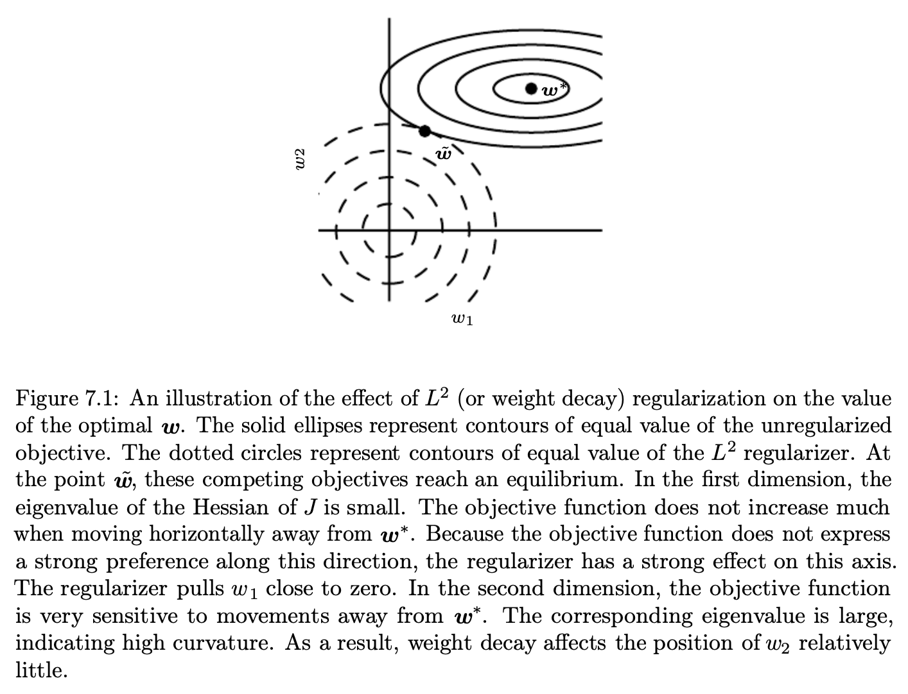

# Regularisation

## Regularisation for Deep Learning

> From *Deep Learning - regularization*, by *Ian Goodfellow, et al.*

Any modification we make to a learning algorithm that is intended to reduce its generalisation error but not its training error is **regularisation**.

An effective regulariser is one that makes a profitable trade, reducing variance significantly while not overly increasing the bias.

### Parameter Norm Penalties

Many regularisation approaches are based on limiting the capacity of models, by adding a parameter norm penalty $\Omega(\theta)$ to the objective function $J$. We denote the regularised objective function by $\tilde{J}$:

$$
\tilde{J}(\theta; X,y)=J(\theta; X, y) + \alpha \Omega(\theta)
$$

where $\alpha \in [0, \infty]$ is a hyperparameter that weights the relative contribution of the norm penalty term, $\Omega$, relative to the standard objective function $J$.

When the algorithm minimises the regularised objective function $\tilde{J}$ it will decrease both the original objective $J$ on the training data and some measure of the size of the parameters $\theta$.

#### $L^2$ Parameter Regularisation

The $L^2$ parameter norm penalty commonly known as *weight decay*. This regularisation strategy drives the weights closer to the origin by adding a regularisation term $\Omega(\theta)=\frac12\|w\|^2_2$ to the objective function. Also known as *ridge regression* or *Tikhonov regularisation*. 

To simplify the presentation, we assume no bias parameter, so $\theta$ is just $w$. The total objective function is:

$$
\tilde{J}(w;X,y) = \frac\alpha 2 w^\top w + J(w;X, y)
$$

With the corresponding parameter gradient:

$$
\triangledown_w \tilde{J}(w;X, y)=\alpha w + \triangledown_w J(w;X,y)
$$

To take a single gradient step to update the weights, we perform this update:

$$
w \leftarrow w - \epsilon(\alpha w + \triangledown_w J(w;X,y))
$$

We can rewrite this as:

$$
w \leftarrow (1-\epsilon \alpha)w - \epsilon \triangledown_w J(w;X,y)
$$

The addition of the weight decay term has modified the learning rule to multiplicative shrink the weight vector by a constant factor on each step, just before performing the usual gradient update.

We will further simplify the analysis by making a quadratic approximation to the objective function in the neighbourhood of the value of the weights that obtains minimal unregularised training cost, $w*=\arg\min_w J(w)$. The approximation $\hat{J}$ is given by:

$$
\hat{J}(\theta) = J(w^*) + \frac12 (w-w^*)^\top \mathbf{H}(w-w^*)
$$

where $\mathbf{H}$ is the Hessian matrix of $J$ with respect to $w$ evaluated at $w^*$. There is no first-order term in this quadratic approximation, because $w^*$ is defined to be a minimum, where the gradient vanishes. Because $w^*$ is the location of a minimum of $J$, we can conclude that $\bf{H}$ is positive semidefinite.

The minimum of $\hat{J}$ occurs where its gradient:

$$
\triangledown_w \hat{J}(w) = H(w-w^*)
$$

is equal to $0$.

We modify equation above by adding the weight decay gradient. We can now solve for the minimum of the regularised version of $\hat{J}$. We use the variable $\tilde{w}$ to represent the location of the minimum:

$$
\alpha \tilde{w} + \mathbf{H}(\tilde{w}-w^*)=\\(\mathbf{H}+\alpha I)\tilde{w} =\mathbf{H}w^* \\ \tilde{w} = (\mathbf{H}+\alpha I)^{-1}\mathbf{H}w^*
$$

As $\alpha$ approaches $0$, the regularised solution $\tilde{w}$ approaches $w^*$.

What happens as $\alpha$ grows. $\mathbf{H}$ is real and symmetric, we can decompose it into a diagonal matrix $\Lambda$ and an orthonormal basis of eigenvectors $Q$, such that $H=Q\Lambda Q^\top$. Applying decomposition:

$$
\tilde{w} = (Q\Lambda Q^\top + \alpha I)^{-1}Q\Lambda Q^\top w^*\\=[Q(\Lambda + \alpha I) Q^\top]^{-1}Q\Lambda Q^\top w^*\\ = Q(\Lambda+\alpha I)^{-1}\Lambda Q^\top w^*
$$

The effect of weight decay is to rescale $w^*$ along the axes defined by the eigenvectors of $H$. The component of $w^*$ that is aligned with the $i$-th eigenvector of $H$ is rescaled by a factor of $\frac{\lambda_i}{\lambda_i+\alpha}$.

Only directions along which the parameters contribute significantly to reducing the objective function are preserved relatively intact. In directions that do not contribute to reducing the objective function, a small eigenvalue of the Hessian tells us that movement in this direction will not significantly increase the gradient. Components of the weight vector corresponding to such unimportant directions are decayed away through the use of the regularisation throughout training.

For linear regression, the cost function is the sum of squared errors:

$$
(Xw-y)^\top(Xw-y)
$$

When we add $L^2$ regularisation, the objective function changes to:

$$
(Xw-y)^\top(Xw-y)+\frac12 \alpha w^\top w
$$

This changes the normal equation for the solution to:

$$
w=(X^\top X+\alpha I)^{-1}X^\top y
$$

The matrix $X^\top X$ is proportional to the covariance matrix $\frac1m X^\top X$. Using $L^2$ replaces this matrix with  $(X^\top X+\alpha I)$, with the addition of $\alpha$ to the diagonal. The diagonal entries of this matrix correspond to the variance of each input feature, which makes it shrink the weights on features whose covariance with the output target is low compared to this added variance.