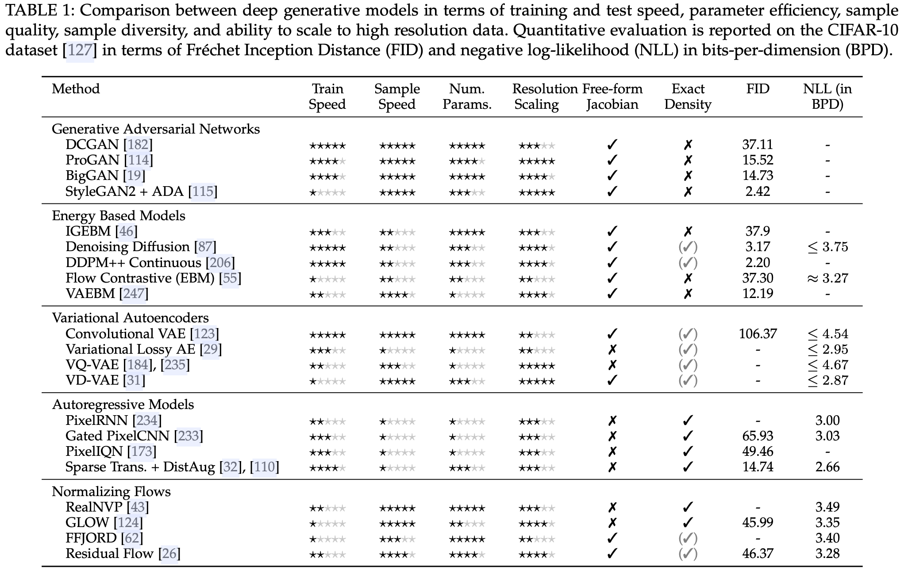
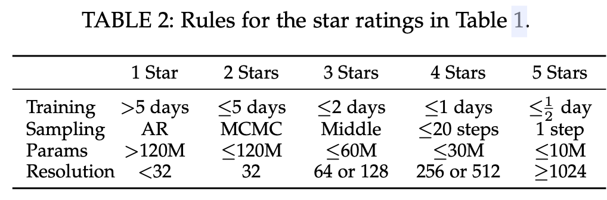
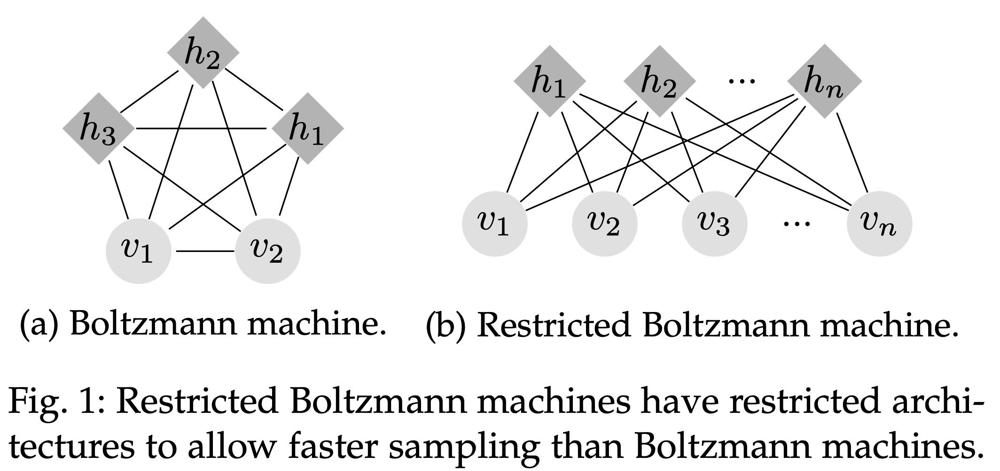

# Deep Generative Modelling: A Comparative Review of VAEs, GANs, Normalizing Flows, Energy-Based and Autoregressive Models

## Introduction

- Aims to learn about data with no supervision, potentially providing benefits for standard classification tasks.
- Collecting training data for unsupervised learning is naturally much lower effort and cheaper.

The central idea of generative modelling stems around training a generative model whose samples $\tilde{x}\sim p_\theta(\tilde{x})$  come from the same distribution as the training data distribution $x\sim p_\theta(x)$.

- Early energy-based models achieved this by defining an *energy function* on data points proportional to likelihood. 
	- However, these struggled to scale to complex high dimensional data such as natural images, and require low iterative MCMC sampling during both training and inference.
- In recent cases, this has been achieved using latent variable $z$, which are easy to sample from and/or calculate the density of, instead learning $p(x,z)$;
	- this requires marginalisation over the unobserved latent variables
	- however, in general, this is intractable

Interrelated with generative models is the field of self-supervised learning where the focus is on learning good intermediate representations that can be used for downstream tasks without supervision. As such, generative models can in general also be considered self-supervised.

Types of self-supervised objectives:

- auxiliary classification losses
- masked loss: the model must predict the true value of some inputs which have been masked out
- contrastive losses which learn an embedding space where similar data points are close and different points are far apart

## Energy-based Models

EBMs are based on the observation that any probability density function $p(x)$ for $x \in \mathbb{R}^D$ can be expressed in terms of an energy function $E(x): \mathbb{R}^D \rightarrow \mathbb{R}$. which associates realistic points with low values and unrealistic points with high values:

$$
p(x)=\frac{e^{-E(x)}}{\int_{\tilde{x}\in \mathcal{X}}e^{-E(\tilde{x})}}
$$

Modelling data in such a way offers a number of perks:

- the simplicity and stability associating with training a single model
- utilising a shared set of features thereby minimising required parameters
- the lack of any prior assumptions eliminates related bottlenecks

The key issue with EBMs is how to **optimise** them. The denominator in the equation above is intractable for most models, a popular proxy objective is *contrastive divergence* where where energy values of data samples are *pushed* down, while samples from the energy distribution are *pushed* up.

Formally, the gradient of the negative log-likelihood loss $\mathcal{L}(\theta) = \mathbb{E}_{x\sim p_d}[-\ln p_{theta}(x)]$ has been shown to approximately demonstrate the following property:

$$
\triangledown_\theta \mathcal{L} = \mathbb{E}_{x^+\sim p_d}[\triangledown_\theta E_\theta(x^+)] - \mathbb{E}_{x^-\sim p_\theta}[\triangledown_\theta E_\theta (x^-)]
$$

where $x^-\sim p_\theta$ is a sample from the EBM found through a MCMC generating procedure.

### Early Energy-based Models

#### Boltzmann Machine

A Boltzmann machine is a fully connected undirected network of binary neurons that are turned on with probability determined by a weighted sum of their inputs, for some state $s_1$:

$$
p(s_i=1)=\sigma(\sum_j w_{i,j}s_j)
$$

The neurons can be divided into visible $v \in \{0, 1\}^D$ units, those which are set by inputs to the model, and hidden $h\in \{0, 1\}^P$ units, all other neurons. The energy of the state $\{v, h\}$ is defined as:

$$
E_\theta(v,h)=-\frac12 v^TL_v-\frac12h^TJh-\frac12 v^TWh
$$

where $W, L, J$ are symmetrical learned weight matrices. In order to train Boltzmann machines via contrastive divergence, equilibrium states are found via Gibbs sampling, however, this takes an exponential amount of time in the number of hidden units making scaling impractical.

#### Restricted Boltzmann Machine

RBM is to remove connections between units in the same group, allowing exact calculation of hidden units. Although obtaining negative samples still requires Gibbs sampling, it an be parallelised and in practice a single step is sufficient if $v$ is initially sampled from the dataset.

By stacking RBM, using features from lower down as inputs for the next layer, more powerful functions can be learned; these models are known as Deep Belief networks. Training an entire model at once is intractable so instead they are trained greedily layer by layer, composing densities thus improving the approximation of $p(v)$.

### Deep EBMs via Contrastive Divergence

To train more powerful architectures through contrastive divergence, one must be able to efficiently sample from $p_\theta$. We would like to model high dimensional data using an energy function with a DNN.

MCMC methods such as random walk and Gibbs sampling, when applied to high dimensional data, have long mixing times, making them impractical. New approaches use *stochastic gradient Langevin dynamics*, which permits sampling through the following iterative process:

$$
x_0 \sim p_0 (x)\ \ \ x_{i+1} = x_i-\frac\alpha2 \frac{\partial E_\theta(x_i)}{\partial x_i} + \epsilon
$$

where $\epsilon \sim \mathcal{N}(0, \alpha I), p_0(x)$ is typically a uniform distribution over the input domain and $\alpha$ is the step size. As the number of updates $N\rightarrow \infty$ and $\alpha \rightarrow 0$, the distribution of samples converges to $p_\theta$; however, $alpha$ and $\epsilon$ are often tweaked independently to speed up training.

While Langevin MCMC is more practical than other approaches, sampling still requires a large number of steps. One solution is to use ***persistent contrastive divergence***, where a replay buffer stores previously generated samples that are randomly reset to noise; this allows samples to be continually refined with a relatively small number of steps while maintaining diversity.

- Short-run MCMC: samples using as few as 100 updates steps from noise has been used to train deep EBMs
	- it allows image interpolation and reconstruction
	- since the number of steps is so small, samples are not truly from the correct probability density.
- initialising MCMC chains with data points and samples from an implicit generative model
- adversarially training an implicit generative model, mitigating mode collapse somewhat by maximising its entropy
- Improved/augmented MCMC samplers with NN can also improve the efficiency of sampling.

One application of EBMs of this form comes by using standard classifier architecture, $f_\theta: \mathbb{R}^D\rightarrow \mathbb{R}^K$, which map data points to logits used by a softmax function to compute $p_\theta(y|x)$. By marginalising out $y$, these logits can be used to define an energy model that can be simultaneously trained as both a generative and classification model:

$$
p_\theta(x) = \sum_y p_\theta(x,y)=\frac{\sum_y \exp(f-\theta(x[y]))}{Z(\theta)}
$$

$$
E_\theta(x)=-\ln \sum_y \exp(f_\theta(x[y]))
$$

### Score Matching and Denoising Diffusion

Although Langevin MCMC has allowed EBMs to scale to high dimensional data, training times are still slow due to the need to sample from the model distribution.

An alternative approach is score matching which is based on the idea of ***minimising the difference between the derivatives of the data and model's log-density functions***; the score function is defined as $s(x)=\triangledown_x \ln p(x)$ which does not depend on the intractable denominator and can therefore be applied to build an energy model by minimising the Fisher divergence between $p_d$ and $p_\theta$,

$$
\mathcal{L}=\frac12 \mathbb{E}_{p_d}[\| s_\theta(x)-s_d(x)\|^2_2]
$$

The score function of data is usually not available. 

Various methods exists to estimate the score function including spectral approximation, sliced score matching, finite difference score matching, and notably denoising score matching which allows the score to be approximated using corrupted data samples $q(\tilde{x}|x)$. In particular, when $q = \mathcal{N}(\tilde{x}|x, \sigma^2 I)$, and $\mathcal{L}$ simplifies to:

$$
\mathcal{L} = \frac12 \mathbb{E}_{p_d(x)} \mathbb{E}_{\tilde{x}\sim \mathcal{N}(x, \sigma^2 I)}\left[\|s_\theta (\tilde{x}+\frac{\tilde{x}-x}{\sigma^2}) \|^2_2\right]
$$

That is, $s_\theta$ learns to estimate the noise thereby allowing it to be used as a generative model. Since the Langevin update step uses $\triangledown_x \ln p(x)$ it is possible to sample from a score matching model using Langevin dynamics. This is only possible when trained over a large variety of noise levels so that $\tilde x$ covers the whole space.

#### Denoising Diffusion Probabilistic Models

Diffusion models gradually destroy data $x_0$ by adding noise noise over a fixed number of steps $T$ using a noise schedule $\beta_{1:T}$ determined so that $x_T$ is approximately normally distributed.

The forward process is defined by a discrete Markov chain:

$$
q(x_{1:T}|x_0) = \prod^T_{t=1} q(x_t|x_{t-1})
$$

$$
q(x_t|x_{t-1}) = \mathcal{N}(x_t;\sqrt{1-\beta_t}x_{t-1}, \beta_i I)
$$

The parameterised reverse process is trained to gradually remove noise, i.e. approximate $p_\theta (x_{t-1}|x_t)$, by optimising a re-weighted variant of the ELBO.

Diffusion models have also been applied to categorical data; multinomial diffusion define a forward process where each discrete variable switches randomly to a different value and the reverse process is trained to approximate the noise.

#### Speeding up Sampling

Sampling from score-based models requires a large number of steps leading to various techniques techniques being developed to reduce this. 

A simple approach is to skip steps at inference: cosine schedules spend more time where larger visual changes are made reducing the impact of skipping. Another approach is to use dynamic programming to find what steps should be taken to minimise ELBO based on a computation budget.

Taking the continuous time limit of a diffusion model results in a stochastic differential equation (SDE), numerical solvers can therefore be used, reducing the number of steps required. 

Another proposed approach is to model noisy data points as $q(x_{t-1}|x_t, x_0)$, allowing the generative process to skip some steps using its approximation of end samples $x_0$.

### Correcting Implicit Generative Models

While EBMs offer powerful representation ability due to unnormalised likelihoods, they can suffer from high variance training, long training and sampling times, and struggle to support the entire data space. 

#### Exponential Tilting

An EBM can instead be used to correct samples from an implicit generative network, simplifying the function to learn and allowing easier sampling. This procedure, referred o as exponentially tilting an implicit model, is defined as:

$$
p_{\theta, \phi}(x)=\frac{1}{Z_{\theta,\phi}}q_\theta (x)e^{-E_\theta(x)}
$$

By parameterising $q_\phi(x)$ as a latent variable model such as normalising flow, or VAE generator, MCMC sampling can be performed in the latent space rather than the data space. Since the latent space is much simpler, and often uni-modal, MCMC mixes much more effectively.

This limits the freedom of the model, however, leading some to jointly sample in latent and data space.

#### Noise Contrastive Estimation

Noise contrastive estimation transforms EBM training into a classification problem using a noise distribution $q_\theta(x)$ by optimising the loss function,

$$
\mathbb{E}_{p_d}\left[\ln \frac{p_\theta(x)}{p_\theta(x)+q_\phi(x)}\right] + \mathbb{E}_{q_\phi}\left[\ln \frac{p_\theta(x)}{p_\theta(x)+q_\phi(x)}\right]
$$

where $p_\theta(x)=e^{E_\theta(x)-c}$. This approach can be used to train a correction via exponential tilting, but can also be used to directly train an EBM and normalising flow.