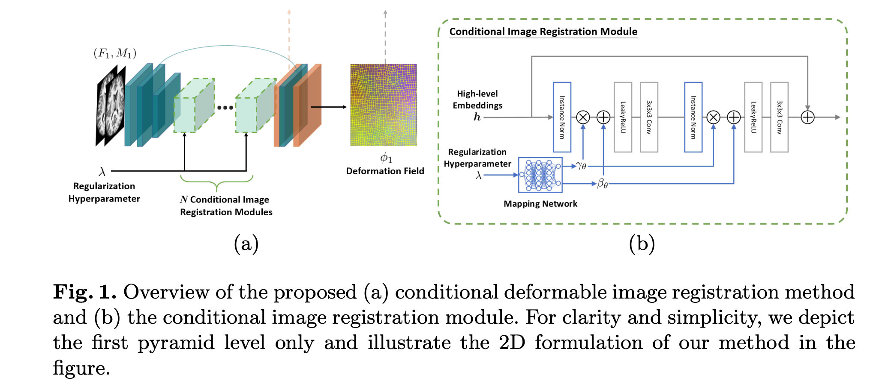

# Conditional Deformable Image Registration with Convolutional Neural Network

## Abstract

- Analysing the effects of hyperparameters and searching for optimal regularisation parameters prove to be too prohibitive.
- A conditional image registration method and a new self-supervised learning paradigm is proposed.

## Introduction

- The optimal regularisation parameter is subject to the degree of misalignment between the input images, modality, and intensity distribution.
- The prior knowledge of the learned model cannot be utilised in the traditional hyperparameter searching technique.

## Methods

- A dense non-linear correspondence between a fixed image $F$ and a moving image $M$, and the solution $\phi$ is often subject to a weighted smoothness regularisation.
- A learning problem:

$$
\phi = f_\theta(F, M)
$$

- Instead of learning to adapt a particular weighted smoothness regularisation, the proposed method learns the conditional features that correlated with arbitrary hyperparameter values.

### Conditional Deformable Image Registration

- A fixed $F$, a moving 3D $M$, and a conditional variable $c$, we parametrise the proposed condition image method as function $f_\theta(F, M, c) = \phi$ with CNN.
- We parameterise an example of the function $f_\theta$ with the deep Laplacian pyramid image registration network (LapIRN) and set the conditional variable to the smoothness regularisation parameter $\lambda$.
- To condition a CNN model on a conditional variable, a concatenation-based conditioning approach in generative models is directly concatenate the condition variable with the input image scans.
	- the concatenation-based conditioning approach cannot capture a wide range of regularisation parameters and bias to a limited range of hyperparameter values.
	- extended the feature-wise linear modulation approach instead.
- Condition the hidden layers on the regularisation parameter directly.
- We replace the $N$ residual blocks with the proposed conditional image registration modules.
- The feature encoder extracts the necessary low-level features for deformable image registration, while the feature decoder upsamples and outputs the targeted displacement fields.

### Conditional Image Registration Module

- The designed conditional image registration module that takes input hidden feature maps and the regularisation hyperparameter as input, and output hidden features with shifted feature statistics based on conditional instance normalisation (CIN).
- The proposed conditional image registration module adopts the pre-activation structure and includes two CIN layers, each followed by a leaky ReLU activation with a negative slope of 0.2 and a convolutional layer with 28 filters.
- A skip connection is added to preserve the identity of the features.

#### Conditional Instance Normalisation

- The centralised mapping network generates a conditional representation with less memory consumption and computational cost, we argue that the effective representation of the hyperparameter should be diverse and adaptable to different layers in CNN.
- We propose to include distributed mapping networks that learn a separate intermediate non-linear latent variable for each conditional image registration module, which shared among all the CIN layers.
- Given a normalised regularisation hyperparameter $\lambda \in \bar{\lambda}$, the distributed mapping network $g: \bar{\lambda}\rightarrow \mathcal{Z}$ first maps $\lambda$ to latent code $z \in \mathcal{Z}$.
- The CIN layers learn a set of parameters that specialise $z$ to the regularisation smoothness.
- The distributed mapping network is parameterised with a 4-layer MLP.
	- the number of perceptrons in each MLP and the dimensionality of the latent space to $64$.
	- The middle layers in the distributed mapping network use the leaky ReLU to further introduce the non-linearity into the latent code.
- The CIN operation for each feature map $h_i$ is defined as $h_i'=\gamma_{\theta, i}(z)(\frac{h_i-\mu(h_i)}{\sigma(h_i)})+\beta_{\theta, i}(z)$
	- where $\gamma_{\theta, i},\beta_{\theta, i} \in \mathbb{R}$ are affine parameters learned from the latent code $z$, and $\mu(h_i), \sigma(h_i) \in \mathbb{R}$ are the channel-wise mean and standard deviation of feature map $h-I$ in channel $i$.
	- the control of smoothness regularisation is learned by normalising and shifting the feature statistics of the feature map with corresponding affine parameters $\gamma_{\theta, i}$ and $\beta_{\theta, i}$ for each channel in the hidden feature map $h$.

### Self-supervised Learning

The objective is to compute the optimal deformation field corresponding to the hyperparameter of smoothness regularisation.

$$
\phi^* = \underset{\phi}{\arg \min}\mathcal{L}_{sim}(F, M(\phi)) + \lambda_p\mathcal{L}_{reg}(\phi)
$$

where: 
- $\phi^*$ denotes the optimal displacement field $\phi$, 
- $\mathcal{L}_{sim}(\cdot, \cdot)$ denotes the dissimilarity function, 
- $\mathcal{L}_{reg}(\cdot)$ represents the smoothness regularisation function and 
- $\lambda_p$ is uniformly sampled over a predefined range.

The only difference between the objective in common unsupervised DLIR methods and our objective is that we learn to optimise the objective function over a predefined range of hyperparameter instead of a fixed hyperparameter value.

We also adopt a progressive training scheme to train the network in a coarse-to-fine manner.

We follow and instantiate the objective function with a similarily pyramid and a diffusion regulariser on the spatial gradients of displacement fields.

$$
\mathcal{L}_l(F, M(\phi), \phi, \lambda_p)=\sum_{i \in [1\dots l]}-\frac{1}{2^{l-i}}\mathrm{NCC}_w(F_i, M_i(\phi))+\lambda_p\|\triangledown_\phi\|^2_2
$$

where $lambda_p$ is sampled uniformly in $[0, 10]$ for each iteration and $\mathrm{NCC}_w(\cdot, \cdot)$