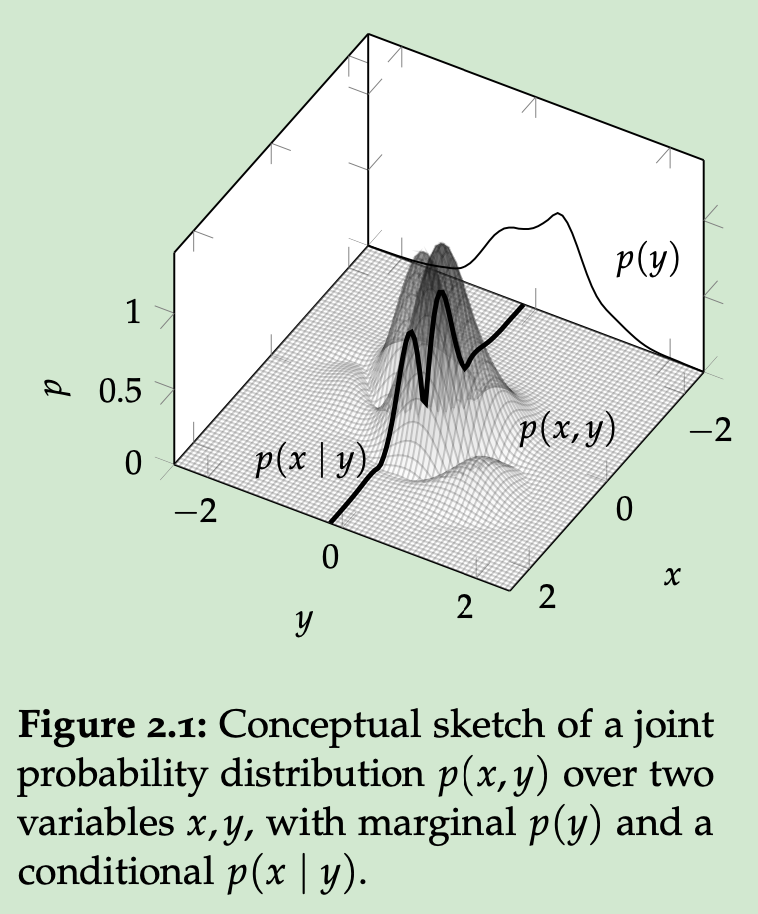

# Mathematical Background

## Probabilistic Inference

Consider a continuous variable $X \in \mathbb{R}$, and assume that its value $x$ is not known precisely. 
It is only known that the probability for the value of $X$ to fall into the set $\mathcal{U} \subset \mathbb{R}$ is $P_X(\mathcal{U})$.
If $P_X$ is sufficiently regular, one can define the probability density function $p(x)$ as the *Radon-Nikodym derivative* of $P_X$ with respect to the *Lebesgue measure*. That is, the function $p(x)$ with the property $P_X(\mathcal{U}) = \int_\mathcal{U}p(x)dx$ for all measurable sets $\mathcal{U} \subset \mathbb{R}$.

- If two variable $x, y \in \mathbb{R}$ are assign the density function $p(x, y)$, then the *marginal* distribution is given by the *sum rule*:
  $$
  p(y)=\int p(x, y)dx
  $$
- the *conditional* distribution $p(x|y)$ for $x$ given that $\mathcal{Y}=y$ is provided implicitly by the *product rule*:
  $$
  p(x|y)p(y)=p(x,y)
  $$

The Bayes' theorem describes how *prior knowledge*, combined with *data* generated according to the conditional density $p(y|x)$, gives rise to the *posterior* distribution on $x$:

$$
\underbrace{p( x|y)}_{\mathrm{posterior}} =\frac{\overbrace{p( y|x)}^{\mathrm{likelihood}}\overbrace{p( x)}^{\mathrm{prior}}}{\underbrace{\int p( y|x) p( x) dx}_{\mathrm{evidence}}}
$$

Computing the posterior amounts to *inference* on $x$ from $y$.

## Gaussian Algebra

The *Gaussian* probability distribution over $\mathbb{R}^D$ is identified by its probability density function:

$$
\mathcal{N}(x;\mu,\Sigma)=\frac{1}{(2\pi)^{D/2}|\Sigma|^{1/2}}\exp(-\frac12 (x-\mu)^\top\Sigma^{-1}(x-\mu))
$$

A parameter vector $\mu \in \mathbb{R}^D$ specifies the *mean* of the distribution, and a *symmetric positive definite* matrix $\Sigma \in \mathbb{R}^{D\times D}$ defines the *covariance* of the distribution:

$$
\mu_i=\mathbb{E}_{\mathcal{N}(x;\mu,\Sigma)}(x_i),\ \ \Sigma_{ij}=\mathrm{cov}_{\mathcal{N}(x;\mu, \Sigma)}(x_i, x_j)
$$

If $p(x)=\mathcal{N}(x;\mu, \Sigma)$, then the variance of $x_i$ *conditioned on the value of* $x_j,j\neq i$ is: $\mathrm{var}_{|x_{j\neq i}}(x_i)=1/[\Sigma^{-1}]_{ii}$

The connection between linear functions and Gaussian distribution runs deeper: Gaussians are a family of probability distributions that are preserved under all linear operations.

The following properties will be used extensively:

- If a variable $x\in\mathbb{R}^D$ is normal distributed, then *every affine transformation* of it also has a Gaussian distribution:
	- If $p(x) = \mathcal{N}(x;\mu, \Sigma)$, and $y:=Ax+b$ for $A \in \mathbb{R}^{M\times D}, b \in \mathbb{R}^M$, then $p(y)=\mathcal{N}(x;A\mu+b, A\Sigma A^\top)$
- The product of two Gaussian probability density function is another Gaussian probability distribution, scaled by a constant. The value of that constant is itself given by the value of Gaussian density function:
  $\mathcal{N}(x;a, A)\mathcal{N}(x;b,B)=\mathcal{N}(x;c,C)\mathcal{N}(a;b,A+B)$
  where $C:=(A^{-1}+B^{-1})^{-1}$
  and $c:=C(A^{-1}a+B^{-1}b)$

There two properties also provide the mechanism for *Gaussian inference*: If the variable $x \in \mathbb{R}^D$ is assigned a Gaussian prior, and observations $y \in \mathbb{R}^M$, given $x$, are Gaussian distributed:
$$
p(x)=\mathcal{N}(x;\mu, \Sigma)\ \mathrm{and}\ p(y|x)=\mathcal{N}(y;Ax+b, \Lambda)
$$
then both the posterior and the marginal distribution for $y$ (the evidence) are Gaussian:

$$

$$
