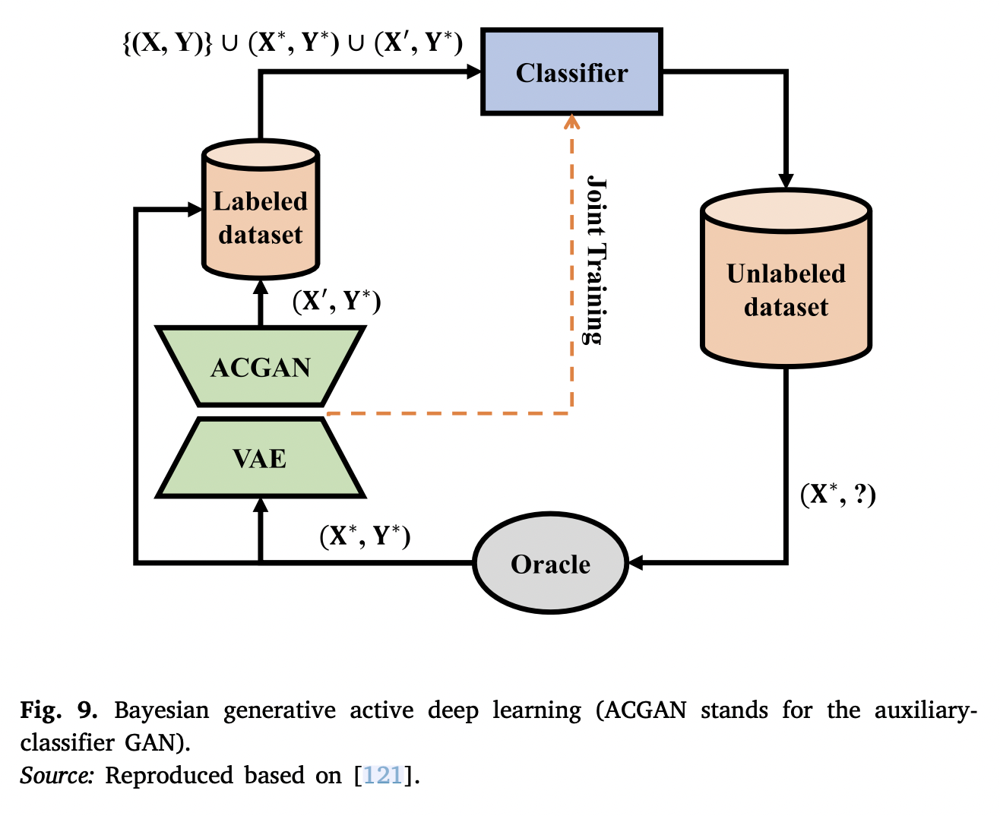

## Introduction

Active learning methods aim to learn from unlabelled samples by querying an oracle [^1]. Defining the right acquisition function, i.e., the condition under which a sample is most informative for the model, is the main challenge for AL-based methods.

Existing AL frameworks lack scalability to high-dimensional data. In this regard, Bayesian approaches can be integrated into the DL structure to represent uncertainty and then combined with a deep AL acquisition function to probe for uncertain samples in the oracle.

## Method

Deep Bayesian AL (DBAL) [^2] combines an AL framework with Bayesian DL to deal with high-dimensional data problems. DBAL uses batch acquisition to select the *n* samples with the highest Bayesian AL by disagreement (BALD) [^3] score.

- Model priors from empirical Bayes (MOPED) [^4] uses BALD to evaluate uncertainty.
	- MC dropout has been applied to estimate model uncertainty.
- Krische et al. [^5] proposed BatchBALD, which uses a greedy algorithm to select a batch in linear time, reducing the runtime. 
	- They modeled uncertainty by leveraging Bayesian AL using dropout sampling.
- In [^6], two types of uncertainty measures, namely, entropy and BALD were compared.
- ActiveHARNet [^7], which is an AL-based framework for human action recognition, modeled uncertainty by linking BNNs with GP using dropout.
	- dropout was applied before each fully connected layer to estimate the mean and variance of the BNN.
- DeepBASS [^8], a deep AL semisupervised learning method, is an expectation-maximisation-based [^9] technique paired with an AL component.
	- It applies MC dropout to estimate uncertainty.

## Applications

- Scandalea et al. [^10] proposed a framework based on the UNet structure for deep AL to segment biomedical images
	- it used an uncertainty measure obtained by MC dropout to suggest samples to be annotated.
	- uncertainty was defined based on the standard deviation of the posterior probabilities of the MC samples.
- Zeng et al. [^11] varied the number of Bayesian layers and their positions to estimate uncertainty through AL on the MNIST dataset.
	- the outcome indicated that a few Bayesian layers near the output layer are enough to fully estimate the uncertainty of the model.
- Bayesian batch AL [^12], which selects a batch of samples at each AL iteration to perform posterior inference over the model parameters.
- Active user training [^13], which is a BAL-based crowdsourcing model, was proposed to address high-dimensional and complex classification problems.
- the Bayesian inference method [^14] was used to consider the uncertainty of the confusion matrix of the annotators.

As for generative-based AL framework:
- A semi-supervised Bayesian AL model [^15] that uses BNNs to obtain the discriminative component. 
- Tran et al. [^16] proposed Bayesian-based generative deep AL (BGADL) for image classification problems.
	- they first used the concept of DBAL to select the most informative samples, and then VAE-ACGAN was applied to generate new samples based on the selected ones.
	- 
- Akbari et al [^17] proposed a unified BDL framework to quantify both aleatoric and epistemic uncertainty for activity recognition.
	- They used an unsupervised DL model to extract features from the time series
	- Then their posterior distributions were learned through a VAE model.
	- Finally, dropout was applied after each dense layer and test phase for the randomness of the model weights and samples from the approximate posterior.

## Reference

[^1]: H.S. Hossain, M.A.A.H. Khan, N. Roy, [Active learning enabled activity recognition](https://www.sciencedirect.com/science/article/abs/pii/S1574119216302073), Pervasive Mob. Comput. 38 (2017) 312–330.

[^2]: Y. Gal, R. Islam, Z. Ghahramani, [Deep Bayesian active learning with image data](https://arxiv.org/abs/1703.02910), in: Proceedings of the 34th International Conference on Machine Learning-Vol. 70, JMLR. org, 2017, pp. 1183–1192.

[^3]: N. Houlsby, F. Huszár, Z. Ghahramani, M. Lengyel, [Bayesian active learning for classification and preference learning](https://arxiv.org/abs/1112.5745), 2011, arXiv:1112.5745.

[^4]: R. Krishnan, M. Subedar, O. Tickoo, [Specifying weight priors in Bayesian deep neural networks with empirical Bayes](https://arxiv.org/abs/1906.05323), arXiv:1906.05323 (2019) arXiv:arXiv: 1906.05323.

[^5]: A. Kirsch, J. van Amersfoort, Y. Gal, [BatchBALD: Efficient and diverse batch acquisition for deep Bayesian active learning](https://arxiv.org/abs/1906.08158), 2019, arXiv:1906.08158.

[^6]: S. Burkhardt, J. Siekiera, S. Kramer, [Semisupervised Bayesian active learning for text classification](https://arxiv.org/abs/1803.01216), in: Bayesian Deep Learning Workshop At NeurIPS, 2018.

[^7]: G.K. Gudur, P. Sundaramoorthy, V. Umaashankar, Activeharnet: [Towards on- device deep Bayesian active learning for human activity recognition](https://arxiv.org/abs/1906.00108), in: The 3rd International Workshop on Deep Learning for Mobile Systems and Applications, 2019, pp. 7–12.

[^8]: R. Matthias, K. Karsten, G. Hanno, [Deep Bayesian active semi-supervised learning](https://ieeexplore.ieee.org/abstract/document/8614056), in: IEEE International Conference on Machine Learning and Applications, ICMLA, IEEE, 2018, pp. 158–164.

[^9]: A.P. Dempster, N.M. Laird, D.B. Rubin, [Maximum likelihood from incomplete data via the EM algorithm](https://rss.onlinelibrary.wiley.com/doi/10.1111/j.2517-6161.1977.tb01600.x), J. R. Stat. Soc. Ser. B Stat. Methodol. 39 (1) (1977) 1–22.

[^10]: M.L. di Scandalea, C.S. Perone, M. Boudreau, J. Cohen-Adad, [Deep active learning for axon-myelin segmentation on histology data](https://arxiv.org/abs/1907.05143), 2019, arXiv:1907. 05143.

[^11]: J. Zeng, A. Lesnikowski, J.M. Alvarez, [The relevance of Bayesian layer position- ing to model uncertainty in deep Bayesian active learning](https://arxiv.org/abs/1811.12535), 2018, arXiv preprint arXiv:1811.12535.

[^12]: R. Pinsler, J. Gordon, E. Nalisnick, J.M. Hernández-Lobato, [Bayesian batch active learning as sparse subset approximation](https://proceedings.neurips.cc/paper/2019/hash/84c2d4860a0fc27bcf854c444fb8b400-Abstract.html), in: Advances in Neural Information Processing Systems, 2019, pp. 6356–6367.

[^13]: M. Servajean, A. Joly, D. Shasha, J. Champ, E. Pacitti, [Crowdsourcing thousands of specialized labels: A Bayesian active training approach](https://ieeexplore.ieee.org/abstract/document/7819540), IEEE Trans. Multimed. 19 (6) (2017) 1376–1391.

[^14]: E. Simpson, S. Roberts, [Bayesian methods for intelligent task assignment in crowdsourcing systems, in: Decision Making: Uncertainty, Imperfection, Deliberation and Scalability](https://link.springer.com/chapter/10.1007/978-3-319-15144-1_1), Springer, 2015, pp. 1–32.

[^15]: J. Gordon, J.M. Hernández-Lobato, [Bayesian semisupervised learning with deep generative models](https://arxiv.org/abs/1706.09751), 2017, arXiv preprint arXiv:1706.09751.

[^16]: T. Tran, T.-T. Do, I. Reid, G. Carneiro, [Bayesian generative active deep learning](https://arxiv.org/abs/1904.11643), 2019, arXiv preprint arXiv:1904.11643.

[^17]: A. Akbari, R. Jafari, [Personalizing activity recognition models with quantifying different types of uncertainty using wearable sensors](https://ieeexplore.ieee.org/abstract/document/8949726), IEEE Trans. Biomed. Eng. (2020).

