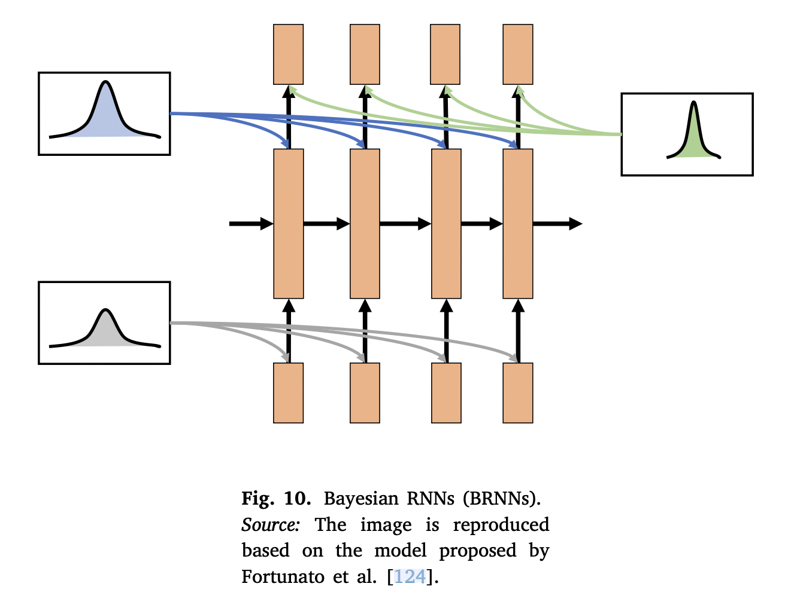

## Introduction

Blundell et al. [^1] proposed a novel yet efficient algorithm named **Bayes by Backprop (BBB)**  to quantify the uncertainty of these weights.

The porposed BBB minimises the compression cost, which is known as the variational free energy (VFE) or the (expected) lower bound of the marginal likelihood.

## Method

Defining a cost function:

$$
F(\mathcal{D}, \theta) = \mathrm{KL}[q(\omega|\theta)\| P(\omega)] - \mathbb{E}_{q(\omega, \theta)}[\log P(\mathcal{D}|\omega)]
$$

The BBB algorithm uses the unbiased gradient estimates of the cost function to learn a distribution over the weights of NNs.

- Fortunato et al. [^2] proposed a new Bayesian RNN (BRNN) using the BBB algorithm.
	- they used a simple adaptation of truncated back-propagation throughout time.
	- 

## Applications

- Ebrahimi et al. [^3] proposed an uncertainty-guided continual approach with BNNs (uncertainty-guided continual learning technique with BNNs (UCB))
	- CL enables learning a variety of new tasks while incorporating previously learned ones.
	- The proposed UCB exploits the predicted uncertainty of the posterior distribution to formulate the modification of *important* parameters both by setting a hard threshold as well as in a soft way.
- de la Riva and Mettes [^4] proposed a Bayesian 3D CNN to analyse a small number of videos to solve big data requirement and time-consuming process.
	- BBB was extended for use by 3D CNNs and then employed to deal with uncertainty over the convolution weights in the proposed model.
	- To this end, a Gaussian distribution was applied to approximate the correct posterior in the proposed 3D convolution layers using the mean and STD as:
		- $\theta = (\mu, \alpha)$
		- $\sigma^2 = \alpha\cdot\mu^2$
		- $q_\theta(w_{ijhwt}|\mathcal{D})=\mathcal{N}(\mu_{ijh\omega t}, \alpha_{ijh\omega t}\mu^2_{ijh\omega t})$
		- where $i$ represents the input, $j$ is the output, $h$ is the filter height, $\omega$ is the filter width, and $t$ is the time dimension.
- Ng et al. [^5] compared the performance of two well-known uncertainty methods (MC dropout and BBB) in medical image segmentation on a U-Net model.
	- The results showed that MC dropout and BBB had similar performance in medical image segmentation tasks.

## Reference

[^1]: C. Blundell, J. Cornebise, K. Kavukcuoglu, D. Wierstra, [Weight uncertainty in neural networks](https://arxiv.org/abs/1505.05424), 2015, arXiv preprint arXiv:1505.05424. 

[^2]: M. Fortunato, C. Blundell, O. Vinyals, [Bayesian recurrent neural networks](https://arxiv.org/abs/1704.02798), 2017, arXiv preprint arXiv:1704.02798.

[^3]: S. Ebrahimi, M. Elhoseiny, T. Darrell, M. Rohrbach, [Uncertainty-guided con- tinual learning with Bayesian neural networks](https://arxiv.org/abs/1906.02425), 2019, arXiv preprint arXiv: 1906.02425.

[^4]: M. de la Riva, P. Mettes, [Bayesian 3D convnets for action recognition from few examples](https://ieeexplore.ieee.org/document/9022569), in: Proceedings of the IEEE International Conference on Computer Vision Workshops, 2019.

[^5]: S.Z. Dadaneh, S. Boluki, M. Yin, M. Zhou, X. Qian, [Pairwise supervised hashing with Bernoulli variational auto-encoder and self-control gradient estimator](https://arxiv.org/abs/2005.10477), 2020, arXiv preprint arXiv:2005.10477.
