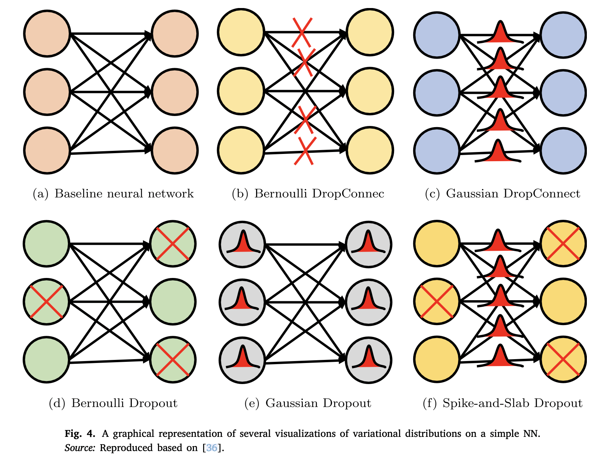
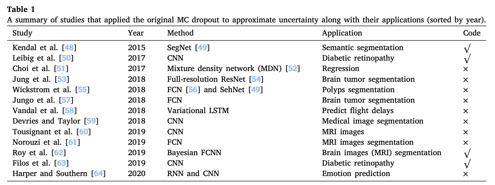

## Introduction

It is difficult to compute an exact posterior inference, but it can be approximated.

Monte Carlo is an effective method. However, it is a slow and computationally expensive method when integrated into a deep architecture.

## Methods

MC dropout [^1] uses dropout as a regularisation term to compute the prediction uncertainty. Dropout is an effective technique that has been widely used to solve overfitting problems in DNNs. During the training process, dropout randomly drops some units of the NN to prevent excessive co-tuning.

Assume an NN with $L$ layers, where $W_l, b_l$ and $K_l$ denote the weight matrices, bias vectors and dimensions of the $l$th layer, respectively. The output of the NN and the target class of the $i$th input $x_i (i=1, \dots, N)$ are indicated by $\hat y_i$ nad $y_i$, respectively. The objective function using $L_2$ regularisation can be written as:

$$
\mathcal{L}_{dropout}:=\frac1N \sum^N_{i=1} E(y_i, \hat{y_i})+\lambda \sum^L_{l=1}(\|W_i\|_2^2+\|b_i\|_2^2)
$$

Dropout samples binary variables for each input data value and every network unit in each layer, with a probability of $p_i$ for the $i$th layer; if its value is $0$, the unit $i$ is dropped for a given input data value. The same values are used in the backward pass to update the parameters.

## Applications

- Wang et al. [^2] analysed epistemic and aleatoric uncertainty for DCNN-based medical image segmentation problems at both pixel and structure levels.
	- They augmented the input image during the test phase to estimate the transformation uncertainty.
	- MC sampling was used to estimate the distribution of the output segmentation.
- Liu et al. [^3] proposed a unified model using SGD to approximate both epistemic and aleatoric uncertainty for CNN in the presence of universal adversarial perturbations.
	- The epistemic uncertainty was estimated by applying MC dropout with Bernoulli distribution at the output of the neurons.
	- They introduced texture bias to better approximate the aleatoric uncertainty.
- Nasir et al. [^4] used MC dropout to estimate four types of uncertainties
	- including the *variance of MC samples, predictive entropy, and mutual information (MI)*, in a 3D CNN to segment lesion from MRI sequences.
- Amini et al. [^5] used two dropout methods, i.e. element-wise Bernoulli dropout and spatial Bernoulli dropout [^6], were implemented to compute the model uncertainty in BNNs for end-to-end autonomous vehicle control.
- The sampling of weights using Bernoulli or Gaussian dropout can lead to a more accurate depiction of uncertainty than the sampling of units. It can be argued that using either Bernoulli or Gaussian dropout can improve the classification accuracy of a CNN [^7]. 
- Teye et al. [^8] proposed MC batch normalisation (MCBN), which can be used to estimate the uncertainty of networks with batch normalisation.
	- They showed that batch normalisation can be considered an approximate Bayesian model.

### Comparison of MC dropout with other UQ methods

- Foong et al. [^9] empirically and theoretically studies MC dropout and mean-field Gaussian VI.
	- They found that both models can express uncertainty well in shallow BNNs.
	- mean-field Gaussian VI could not approximate the posterior well in estimating uncertainty for deep BNNs.
- Hubschneider et al. [^10] compared MC dropout with a bootstrap ensembling-based method and a Gaussian mixture for the task of vehicle control. 
- Mukhoti [^11] applied MC dropout in several models to estimate uncertainty in regression problems.

## Reference

[^1]: Y. Gal, Z. Ghahramani, [Dropout as a Bayesian approximation: Representing model uncertainty in deep learning](http://proceedings.mlr.press/v48/gal16.html), in: International Conference on Machine Learning, 2016, pp. 1050–1059.
[^2]: G. Wang, W. Li, M. Aertsen, J. Deprest, S. Ourselin, T. Vercauteren, [Aleatoric uncertainty estimation with test-time augmentation for medical image segmentation with convolutional neural networks](https://www.sciencedirect.com/science/article/pii/S0925231219301961), Neurocomputing 338 (2019) 34–45.
[^3]: H. Liu, R. Ji, J. Li, B. Zhang, Y. Gao, Y. Wu, F. Huang, [Universal adversarial perturbation via prior driven uncertainty approximation](https://ieeexplore.ieee.org/document/9008259), in: Proceedings of the IEEE International Conference on Computer Vision, 2019, pp. 2941–2949.
[^4]: T. Nair, D. Precup, D.L. Arnold, T. Arbel, [Exploring uncertainty measures in deep networks for multiple sclerosis lesion detection and segmentation](https://www.sciencedirect.com/science/article/abs/pii/S1361841519300994), Med. Image Anal. 59 (2020) 101557.
[^5]: A. Amini, A. Soleimany, S. Karaman, D. Rus, [Spatial uncertainty sampling for end-to-end control](https://arxiv.org/abs/1805.04829), 2018, arXiv:1805.04829.
[^6]: J. Tompson, R. Goroshin, A. Jain, Y. LeCun, C. Bregler, [Efficient object localization using convolutional networks](https://arxiv.org/abs/1411.4280), in: Proceedings of the IEEE Conference on Computer Vision and Pattern Recognition, 2015, pp. 648–656.
[^7]: P. McClure, N. Kriegeskorte, [Representing inferential uncertainty in deep neural networks through sampling](https://arxiv.org/abs/1611.01639), in: International Conference on Learning Representations, ICLR 2017-Conference Track Proceedings, 2016.
[^8]: M. Teye, H. Azizpour, K. Smith, [Bayesian uncertainty estimation for batch normalized deep networks](https://arxiv.org/abs/1802.06455), in: J. Dy, A. Krause (Eds.), Proceedings of the 35th International Conference on Machine Learning, in: Proceedings of Machine Learning Research, vol. 80, PMLR, Stockholmsmässan, Stockholm Sweden, 2018, pp. 4907–4916.
[^9]: A.Y. Foong, D.R. Burt, Y. Li, R.E. Turner, [On the expressiveness of approximate inference in Bayesian neural networks](https://proceedings.neurips.cc/paper/2020/hash/b6dfd41875bc090bd31d0b1740eb5b1b-Abstract.html), 2019, arXiv arXiv–1909.
[^10]: C. Hubschneider, R. Hutmacher, J.M. Zöllner, [Calibrating uncertainty models for steering angle estimation](https://ieeexplore.ieee.org/document/8917207), in: IEEE Intelligent Transportation Systems Conference, 2019, pp. 1511–1518.
[^11]: J. Mukhoti, P. Stenetorp, Y. Gal, [On the importance of strong baselines in Bayesian deep learning](https://arxiv.org/abs/1811.09385), 2018, arXiv preprint arXiv:1811.09385.