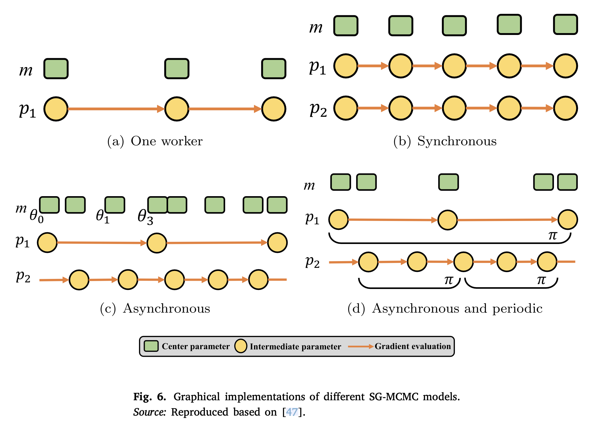

## Introduction

MCMC [^1] is another effective method that has been used to approximate inference. 

## Method

It starts by taking a randomly drawn value $z_0$ from the distribution $q(z_0)$ or $q(z_0|x)$.  Then, it applies a stochastic transition to $z_0$, as follows: 

$$
Z_t \sim q(z_t|z_{t-1}, x)
$$

This transition operator is chosen and repeated $T$ times, and the outcome, which is a random variable, converges in the distribution to the exact posterior.

The sufficient number of iterations is unknown. In addition, MCMC requires much time to converge to a desired distribution.

Although SG-MCMC reduces the computational complexity by using a small subset, i.e., a mini-batch, of the dataset at each iteration to update the model parameters, these small subsets of data add noise to the model and consequently increase the uncertainty of the system.

MCMC was integrated into generative-based methods to approximate posteriors. 

## Applications

- Salakhutdinov et al. [^2] used MCMC to approximate a predictive distribution of the rating values of movies.
- Stochastic gradient MCMC (SG-MCMC) [^3][^4] was proposed to train DNNs.
	- It can converge to the true posterior by decreasing the step size.
- Gong et al. [^5] combined amortised inference with SG-MCMC to increase the generalisation ability of the model. 
- Li et al. [^6] proposed an accelerating SG-MCMC to improve the speed of the conventional SG-MCMC.
	- However, within a short time, SG-MCMC suffers from a bounded estimation error, and it loses the surface when applied to multilayer networks.
- Zhang et al. [^7] developed a cyclical SG-MCMC to compute the posterior over the weights of NNs.
	- a cyclical step size was used instead of a decreasing one.
	- A large step size allows the sampler to make large moves, while a small step size encourages the sampler to explore local modes.

To address the issue of increased uncertainty:
- Luo et al. [^8] introduced a sampling method called *thermostat-assisted continuously tempered Hamiltonian Monte Carlo*, which is an exteded version of conventional Hamiltonian MC, which is an MCMC mthod.
	- Specifically, they used Nose-Hoover thermostats to handle the noise generated by the mini-batch datasets.
- Dropout HMC (D-HMC) [^9] was proposed for uncertainty estimation, and it was compared with SG-MCMC and SGLD.

In generation models:

- MCMC was applied to stochastic object models, which were learned by GANs to approximate the ideal observer [^10]. 
- A visual tracking system based on variational autoencoder (VAE) MCMC (VAE-MCMC) was proposed [^11].

## Reference

[^1]: M.A. Kupinski, J.W. Hoppin, E. Clarkson, H.H. Barrett, [Ideal-observer computation in medical imaging with use of Markov-chain Monte Carlo techniques](https://pubmed.ncbi.nlm.nih.gov/12630829/), J. Opt. Soc. Amer. A 20 (3) (2003) 430–438.

[^2]: R. Salakhutdinov, A. Mnih, [Bayesian probabilistic matrix factorization using Markov chain Monte Carlo](https://dl.acm.org/doi/10.1145/1390156.1390267), in: Proceedings of the International Conference on Machine Learning, ICML ’08, Association for Computing Machinery, 2008, pp. 880–887.

[^3]: T. Chen, E. Fox, C. Guestrin, [Stochastic gradient Hamiltonian Monte Carlo, in: International Conference on Machine Learning](https://proceedings.mlr.press/v32/cheni14.html), 2014, pp. 1683–1691.

[^4]: N. Ding, Y. Fang, R. Babbush, C. Chen, R.D. Skeel, H. Neven, [Bayesian sampling using stochastic gradient thermostats](https://papers.nips.cc/paper/2014/hash/21fe5b8ba755eeaece7a450849876228-Abstract.html), in: Advances in Neural Information Processing Systems, 2014, pp. 3203–3211.

[^5]: W. Gong, S. Tschiatschek, S. Nowozin, R.E. Turner, J.M. Hernández-Lobato, C. Zhang, [Icebreaker: Element-wise efficient information acquisition with a Bayesian deep latent Gaussian model](https://arxiv.org/abs/1908.04537), in: Advances in Neural Information Processing Systems 32, 2019, pp. 14820–14831.

[^6]: C. Li, C. Chen, Y. Pu, R. Henao, L. Carin, [Communication-efficient stochastic gradient MCMC for neural networks](https://ojs.aaai.org/index.php/AAAI/article/view/5190), in: Proceedings of the AAAI Conference on Artificial Intelligence, Vol. 33, 2019, pp. 4173–4180.

[^7]: R. Zhang, C. Li, J. Zhang, C. Chen, A.G. Wilson, [Cyclical stochastic gradient mcmc for Bayesian deep learning](https://arxiv.org/abs/1902.03932), 2019, arXiv preprint arXiv:1902.03932.

[^8]: R. Luo, J. Wang, Y. Yang, J. WANG, Z. Zhu, [Thermostat-assisted continuously- tempered hamiltonian Monte Carlo for Bayesian learning](https://proceedings.neurips.cc/paper/2018/hash/fcf1d8d2f36c0cde8eca4b86a8fe1df8-Abstract.html), in: S. Bengio, H. Wallach, H. Larochelle, K. Grauman, N. Cesa-Bianchi, R. Garnett (Eds.), Ad- vances in Neural Information Processing Systems 31, Curran Associates, Inc., 2018, pp. 10673–10682.

[^9]: S. Hernández, D. Vergara, M. Valdenegro-Toro, F. Jorquera, [Improving predictive uncertainty estimation using dropout–Hamiltonian Monte Carlo](https://link.springer.com/article/10.1007/s00500-019-04195-w), Soft Comput. 24 (6) (2020) 4307–4322.

[^10]: W. Zhou, M.A. Anastasio, [Markov-Chain Monte Carlo approximation of the Ideal Observer using generative adversarial networks](https://arxiv.org/abs/2001.09526), in: Medical Imaging 2020: Image Perception, Observer Performance, and Technology Assessment, Vol. 11316, International Society for Optics and Photonics, 2020, 113160D.

[^11]: J. Kwon, [Robust visual tracking based on variational auto-encoding Markov chain Monte Carlo](https://www.sciencedirect.com/science/article/abs/pii/S0020025519308618), Inform. Sci. 512 (2020) 1308–1323.