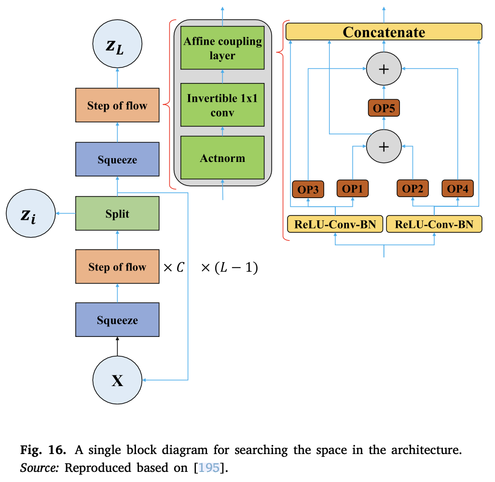

## Introduction

OoD is a common error that appears when the training data have different distribution. NADS was proposed to address this issue.

## Method

Ardywibowo [^1] introduced a new UA architecture called *Neural Architecture Distribution Search (NADS)*. The NADS finds an appropriate distribution of different architecture that perform significantly well on a specific task. A single block diagram for searching the space in the architecture is presented.

NADS enables the recognition of common blocks among all UA architectures. The cost functions for an uncertainty-oriented NN are not always convergent. An optimised prediction interval (PI) is not always generated by converged NNs. The convergence of training is uncertain, and the NNs are not customisable for such cost functions.

## Applications

## Reference

[^1]: R. Ardywibowo, S. Boluki, X. Gong, Z. Wang, X. Qian, [NADS: Neural architecture distribution search for uncertainty awareness](https://arxiv.org/abs/2006.06646), 2020, arXiv preprint arXiv:2006.06646.