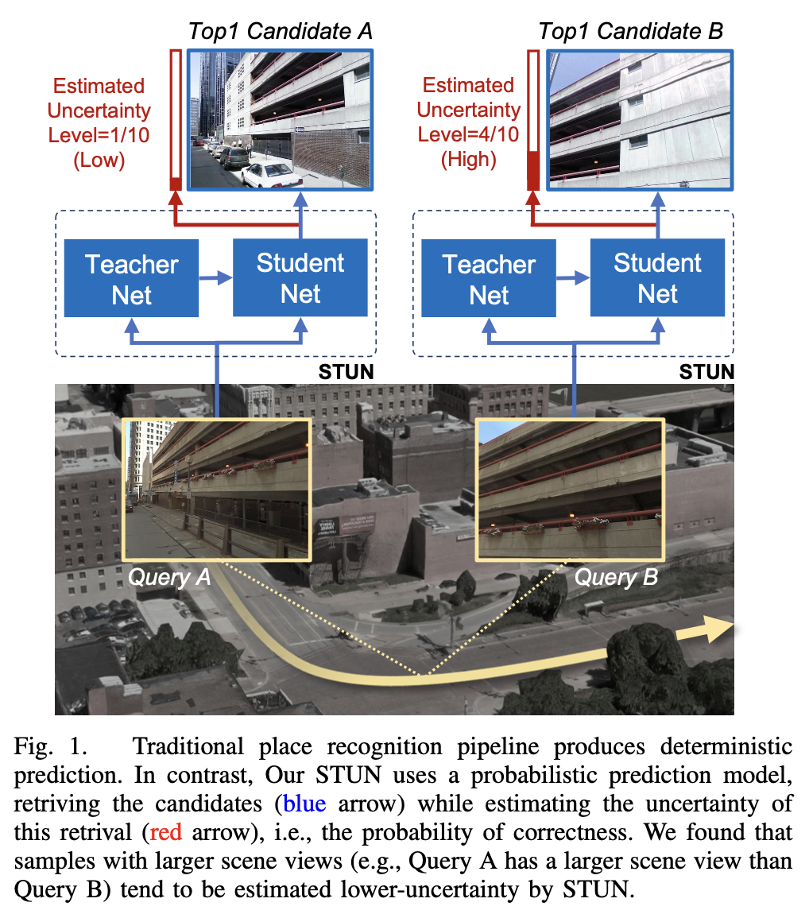
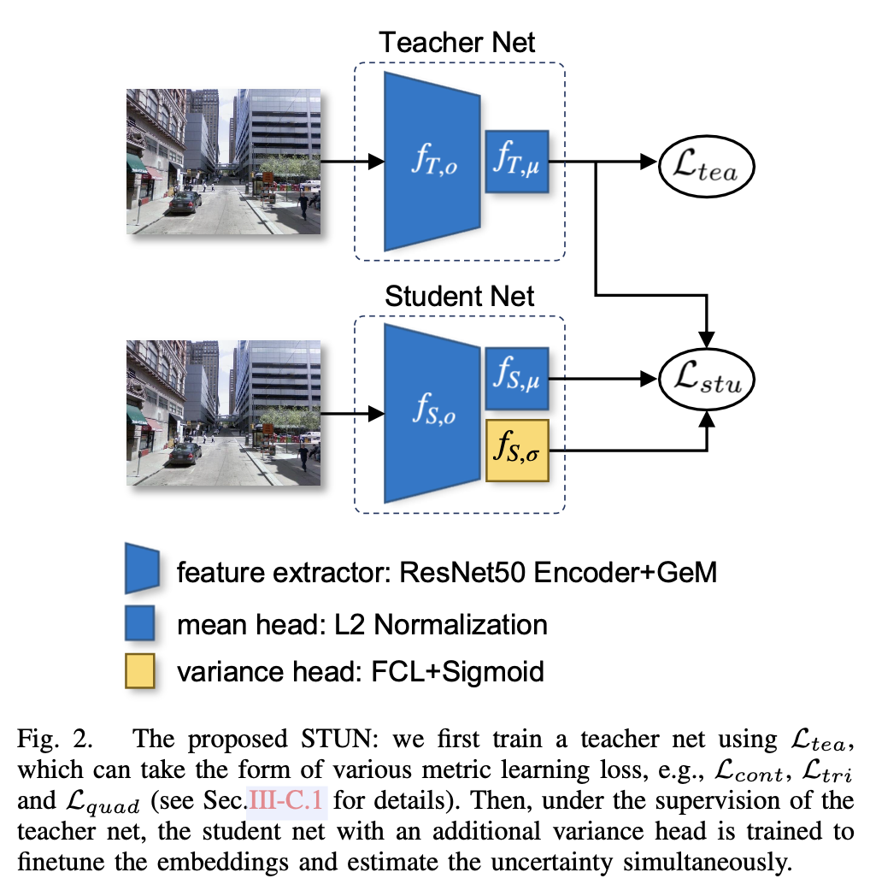
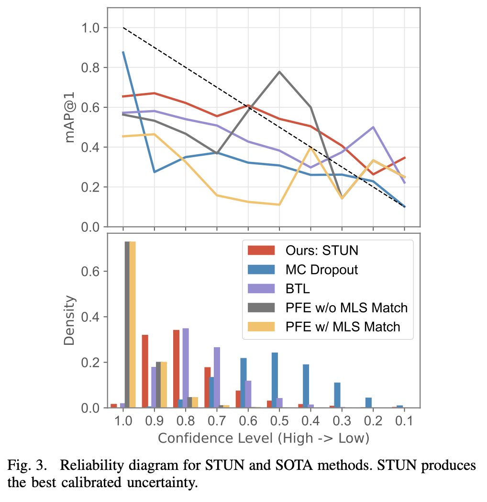

## Abstract

This paper proposes STUN, a self-teaching framework that learns to simultaneously predict the place and estimate the prediction uncertainty given an input image.

We first train a teacher net using a standard metric learning pipeline to produce embedding priors. Then, supervised by the pretrained teacher net, a student net with an additional variance branch is trained to fine-tune the embedding priors and estimate the uncertainty sample by sample.

During the online inference phase, we only use the student net to generate a place prediction in conjunction with the uncertainty.

## Introduction

For metric learning-based methods, MC Dropout is used to estimate epistemic uncertainty, which requires the changes to the original network architecture and induces an expensive computational cost.

In this paper, we focus on the following research questions:
1. Can we estimate uncertainty (for place recognition) for free, i.e., *without* compromising recognition accuracy?
2. Can an uncertainty estimation pipeline be generic to all predominant metric learning loss functions?

To answer the above two questions, we cast the uncertainty estimation as a Knowledge Distilling task and particularly focus on estimating the aleatoric uncertainty. 

The proposed STUN pipeline does not compromise the recognition accuracy because we keep the student net as same as the original recognition network, with the additional information from the teacher net being used only when computing the loss. Additionally, the teacher-student framework is intrinsically agnostic to loss function because only the student net is utilised for estimating uncertainty while the teacher net can be flexibly trained with different loss function.

The contributions:

1. A first work on large scale uncertainty-aware place recognition by leveraging the Knowledge Distilling technique
2. STUN achieves a better-calibrated uncertainty as well as a higher recognition accuracy compared with the existing methods for similar tasks
3. STUN is able to accommodate various loss functions predominantly used in place recognition, including pairwise, triplet, and quadruplet losses.
4. [Open source code](https://github.com/ramdrop/STUN)

## Related Work
### Uncertainty Estimation

To quantify uncertainty in DL, Kendall et al. [^1] associate epistemic uncertainty and aleatoric uncertainty with model and data. Based on Kendall's framework, Feng et al. [^2] quantifies uncertainty for LiDAR point cloud vehicle detection, and Wang et al. [^3] learns aleatoric uncertainty for visual odometry.

Another framework of estimating aleatoric uncertainty, Assumed Density Function (ADF) [^4], captures the inherent sensor noise.

### Uncertainty in Related Tasks

Taha et al. [^5][^6] casts triplet loss as trivariate regression loss and then uses the framework of [^1] to either learn aleatoric uncertainty or estimate model uncertainty using MC Dropout. However modified triplet loss function might lead to sub-optimal performance.

BTL[^7] outperforms Taha's by deriving a likelihood for triplet loss, which is then used to train the network; but the proposed complex likelihood loss function requires more attention to assure the training convergence and cannot consistently achieve comparable recognition performance as a standard triplet metric learning method.

This work inspired by [^8], which uses a teacher-student framework to learn pixel depth uncertainty. Though proved effective in self-supervised depth estimation, it remains unknown how it can be utilised to solve the challenging estimate uncertainty problem in place recognition.

## Method

### Preliminary

In a metric learning based place recognition setting, one will first map samples from image space $\mathcal{X}$ to embedding space $\mathcal{Y}$, and then uses nearest neighbor search to conduct a retrieval. Every embedding is a (deterministic) vector that can be regarded as a high-dimensional point in the embedding space. The mapping function $f_\mu:\mathcal{X} \rightarrow \mathcal{Y}$ is represented by a DNN.

### Probabilistic Place Recognition Pipeline

We propose to introduce probabilistic embedding model, which describes an embedding as a distribution rather than a point. As Gaussian model shows good performance in metric leraning, we adopt a Gaussian distribution:

$$
y'_i ~\mathcal{N}(f_\mu(x_i), f_\sigma(x_i))
$$

The motivation behind the probabilistic embeddings is that the learned variance acts like a predictor telling how well an embedding represents a place. For those images that contribute little to a place's character, our probabilistic place recognition pipeline will not brutally push their embeddings close to other embeddings of the same place.

### Self-Teaching Uncertainty Estimation (STUN)

To avoid performance degradation, we utilise KD and only extract uncertainty from embeddings. In this way, *no modification to network or loss* is required and the original recognition performance is preserved. 

We adopt a teacher-student network and first train a teacher net to output embedding mean priors. Then, under the teacher net's supervision, we train a student net to fine-tune the embedding mean and in the meantime estimate the embedding variance.

#### Teacher Net

We denote the feature extractor of the teacher net as $f_{T, o(\cdot)}$, and the mean head as $f_{T, o}(\cdot)$. Given an input image $x_i$, the teacher net predicts the embedding mean $\mu_{T, x_i}$ by using:

$$
\mu_{T, x_i} = f_{T, \mu}(f_{T, o}(x_i))
$$

Our feature extractor backbone $f_{T,o}(\cdot)$ follows [^7], consisting of layers of ResNet50 before the global average pooling layer and a GeM pooling layer [^9]. The mean head $f_{T, \mu}(\cdot)$ is simply L2 normalisation layer, which is $\mu_{T,x_i}\in \mathbb{R}^{2048}$.

Our teacher net is a generic uncertainty estimation framework that can be trained using any metric learning loss, such as contrastive loss [^10], triplet loss [^11], quadruplet loss [^12], angular loss [^13] and margin loss [^14]. This study will show the flexibility of STUN by training our teacher net using the most common losses.

##### Contrastive Loss

This loss is to learn a discriminative mapping that can distinguish between similar and dissimilar pairs. Given an input doublet images $\{(x_i, x_j\}$, the loss function is formulated as follows:

$$
\mathcal{L}_{cont}=\mathbb{1}_{x_i,x_j}\cdot d^2(\mu_{T, x_i}, \mu_{T, x_j}) + \bar{\mathbb{1}}_{x_i, x_j} \cdot (m-d^2(\mu_{T, x_i}, \mu_{T, x_j}))
$$

where $\mathbb{1}\{\cdot\}$ is an indicator function such that it is $1$ when $x_i$ and $x_j$ are a ground truth similar pair, $0$ otherwise. $d$ means euclidean distance, and $m$ a predefined constant margin.

##### Triplet Loss

This loss could be more efficient in learning a discriminative embeddings as it involves three samples at a time, while contrastive loss takes two samples as input. The triplet loss is given as:

$$
\mathcal{L}_{tri} = \max\{d(\mu_{T, x_a}, \mu_{T, x_p}) - d(\mu_{T, x_a}, \mu_{T, x_n}) +m, 0\}
$$

where $x_a, x_p, x_n$ are the anchor, positive and negative sample.

##### Quadruplet Loss

aims to further enlarge inter-class distance for metric learning by introducing an additional negative sample on top of the triplet loss: 

$$
\mathcal{L}_{quad} = \max\{d(\mu_{T, x_a}, \mu_{T, x_p}) - d(\mu_{T, x_a}, \mu_{T, x_{n1}}) +m1, 0\} + \max\{d(\mu_{T, x_a}, \mu_{T, x_p}) - d(\mu_{T, x_a}, \mu_{T, x_{n1}}) +m2, 0\}
$$

where $x_a, x_p$ are the achor and postive sample, and $x_{n1}$ is the negative sample to the anchor, $x_{n2}$are the two negative sample that dissimilar to any other samples in the quadruplet.

#### Student Net

The deterministic training of the teacher net does not consider
the inherent aleatoric uncertainty, rendering the teacher net
a sub-optimal mapping function. In this regard, we take the
mapping function represented by the teacher net as a prior
and train a student net to fine-tune the prior while learning
an aleatoric uncertainty simultaneously.

The student net shares the same feature extractor as the
teacher net, except that, to capture the aleatoric uncertainty,
an additional variance head is added in parallel to the mean
head.

We denote the feature extractor of the student net as $f_{S,o}(\cdot)$, the mean head as $f_{S,\mu}(\cdot)$, and the variance head as $f_{S,\sigma}(\cdot)$. The variance head $f_{S,\sigma}(\cdot)$ comprises a fully connected layer and a sigmoid activation layer. Given an input image $x_i$, the embedding $\mu_{S, x_i}$ is predicted by the student net using:

$$
\mu_{S, x_i} = f_{S,\mu}(f_{S,o}(x_i))\\
\sigma_{S, x_i} = f_{S,\sigma}(f_{S,o}(x_i))
$$

where $\mu_{S, x_i}, \sigma_{S, x_i} \in \mathbb{R}^{2048}$.

The student net is trained using the following proposed uncertainty-aware loss:

$$
\mathcal{L} = \sum^N_i \frac{(\mu_{S, x_i}-\mu_{T, x_i})^2}{2\sigma_{S, x_i}^2} + \frac12 \ln \sigma_{S, x_i}^2
$$

During training, the numerator of the first term will push the learned embedding close to the embedding prior. For the embedding that is far from its prior, a large variance $\sigma_{S, x_i}^2$ will be assigned to the denominator, avoiding the network being updated by an unreasonable large loss. The last term of the loss function as a regulariser, preventing the network from always outputting a large variance.

Since the teacher net and the student net share the same feature extractor architecture, and no additional groundtruth information is needed to enforce the uncertainty-aware training, we refer to our teacher-student framework as a self-teaching framework.

## Experiments

### Evaluation Metrics

#### Uncertainty Estimation Performance 

The uncertainty is evaluated by ECE (expected calibration error). ECE illustrates the correlation between uncertainty level and recognition performance. Ideally, and uncertainty-aware place recognition system generates the best recognition performance or the lowest uncertainty samples, and shows degraded recognition performance as the uncertainty grows.

To calculate ECE for r@N, we first divide the recognition results of all test queries into $M$ equal bins $\B_i|i=1, 2, \dots, M$ based on uncertainties of the query samples, and then calculate the r@N for queries in each bin. $M$ bins will result in $M$ uncertainty level $\mathcal{U}(B_i)$, which are normalised such that he maximum uncertainty level equals $1.0$. In order to calculate ECE, a confidence level $\mathcal{C}$ is defined as $\mathcal{C} = 1.0 - \mathcal{U}$. The final ECE for r@N score is obtained by:

$$
ECE_{r@N}=\frac{\sum^M_i|B_i|\cdot|r@N(B_i)-\mathcal{C}(B_i)|}{\sum^M_i|B_i|}
$$

Intuitively, the term $|r@N(B_i)-\mathcal{C}(B_i)$ encourages recognition accuracy to match confidence level. Replacing r@N with mAP@N will generate $ECE_{mAP@N}$ and $ECE_{AP}$. We use reliability diagram [^15] as a qualitative metric.

## Results 

### Comparison

#### MC Dropout

We employed dropout layers after every convolutional layer in our ResNet50 backbone and setting dropout rate $p=0.2$ during both training and inference phase.

We note that MC dropout is designed for epistemic uncertainty estimation rather than the aleatoric uncertainty targeted by STUN.

#### PFE

PFE first trains a deterministic embedding mean head, and then freezes it. After that, it only trains the variance head. To make a fair comparison, we only substitute our $L_{std}$ with MLS loss when training the variance head.

#### BTL

We follow the parameters of the original paper without extra modification for a fair comparison.

### Quantitative Analysis

#### Uncertainty Quantity

The figure shows the reliability diagram for methods trained with triplet inputs. It shows that the STUN curve is closest to the ideally calibrated line.

With respect of $ECE_{r@1}, ECE_{mAP@1}$ and $ECE_{AP}$, STUN produces the best-calibrated embedding uncertainty among methods trained with triplet inputs.

When comparing  $ECE_{mAP@5/10}$, we found MC Dropout deliver the best uncertainty estimation quality while STUN ranks second place. However, MC Dropout achieves this at the cost of drastically losing recognition performance.

In summary, by leveraging a self-teaching strategy, sTUN not only estimates the best-calibrated uncertainty with $ECE_{mAP@1}=0.171$, but also achieves the highest recognition performance with $r@1=0.613$.

## Reference

[^1]: A. Kendall and Y. Gal, [What uncertainties do we need in bayesian deep learning for computer vision?](https://dl.acm.org/doi/10.5555/3295222.3295309), arXiv preprint arXiv:1703.04977, 2017.

[^2]: D.Feng,L.Rosenbaum,andK.Dietmayer, [Towards safe autonomous driving: Capture uncertainty in the deep neural network for lidar 3d vehicle detection](https://arxiv.org/abs/1804.05132), in 2018 21st International Conference on Intelligent Transportation Systems (ITSC). IEEE, 2018, pp. 3266–3273.

[^3]: S.Wang,R.Clark,H.Wen,andN.Trigoni,[End-to-end,sequence-to- sequence probabilistic visual odometry through deep neural networks](https://journals.sagepub.com/doi/abs/10.1177/0278364917734298), The International Journal of Robotics Research, vol. 37, no. 4-5, pp. 513–542, 2018.

[^4]: A. Loquercio, M. Segu, and D. Scaramuzza, [A general framework for uncertainty estimation in deep learning](https://arxiv.org/abs/1907.06890), IEEE Robotics and Automation Letters, vol. 5, no. 2, pp. 3153–3160, 2020.

[^5]: A. Taha, Y.-T. Chen, X. Yang, T. Misu, and L. Davis, [Exploring un- certainty in conditional multi-modal retrieval systems](https://arxiv.org/abs/1901.07702), arXiv preprint arXiv:1901.07702, 2019.

[^6]: A. Taha, Y.-T. Chen, T. Misu, A. Shrivastava, and L. Davis, [Unsupervised data uncertainty learning in visual retrieval systems](https://arxiv.org/abs/1902.02586), arXiv preprint arXiv:1902.02586, 2019.

[^7]: F.Warburg,M.Jørgensen,J.Civera,andS.Hauberg, [Bayesian triplet loss: Uncertainty quantification in image retrieval](https://arxiv.org/abs/2011.12663), in Proceedings of the IEEE/CVF International Conference on Computer Vision, 2021, pp. 12 158–12 168.

[^8]: M. Poggi, F. Aleotti, F. Tosi, and S. Mattoccia, [On the uncertainty of self-supervised monocular depth estimation](https://arxiv.org/abs/2005.06209), in Proceedings of the IEEE/CVF Conference on Computer Vision and Pattern Recognition, 2020, pp. 3227–3237.

[^9]: F. Radenovic ́, G. Tolias, and O. Chum, [Fine-tuning cnn image retrieval with no human annotation](https://arxiv.org/pdf/1711.02512.pdf),” IEEE transactions on pattern analysis and machine intelligence, vol. 41, no. 7, pp. 1655–1668, 2018.

[^10]: R. Hadsell, S. Chopra, and Y. LeCun, [Dimensionality reduction by learning an invariant mapping](https://ieeexplore.ieee.org/document/1640964), in 2006 IEEE Computer Society Conference on Computer Vision and Pattern Recognition (CVPR’06), vol. 2. IEEE, 2006, pp. 1735–1742.

[^11]: F. Schroff, D. Kalenichenko, and J. Philbin, [Facenet: A unified embedding for face recognition and clustering](https://ieeexplore.ieee.org/document/7298682), in Proceedings of the IEEE conference on computer vision and pattern recognition, 2015, pp. 815–823.

[^12]: W. Chen, X. Chen, J. Zhang, and K. Huang, [Beyond triplet loss: a deep quadruplet network for person re-identification](https://arxiv.org/abs/1704.01719), in Proceedings of the IEEE conference on computer vision and pattern recognition, 2017, pp. 403–412.

[^13]: J. Wang, F. Zhou, S. Wen, X. Liu, and Y. Lin, [Deep metric learning with angular loss])(https://www.computer.org/csdl/proceedings-article/iccv/2017/1032c612/12OmNvJXeE0), in Proceedings of the IEEE International Conference on Computer Vision, 2017, pp. 2593–2601.

[^14]: C.-Y. Wu, R. Manmatha, A. J. Smola, and P. Krahenbuhl, [Sampling matters in deep embedding learning](https://arxiv.org/abs/1706.07567), in Proceedings of the IEEE International Conference on Computer Vision, 2017, pp. 2840–2848.

[^15]: C. Guo, G. Pleiss, Y. Sun, and K. Q. Weinberger, [On calibration of modern neural networks](https://arxiv.org/abs/1706.04599), in International Conference on Machine Learning. PMLR, 2017, pp. 1321–1330

[^16]:

[^17]:

[^18]:

[^19]:

[^11]:

