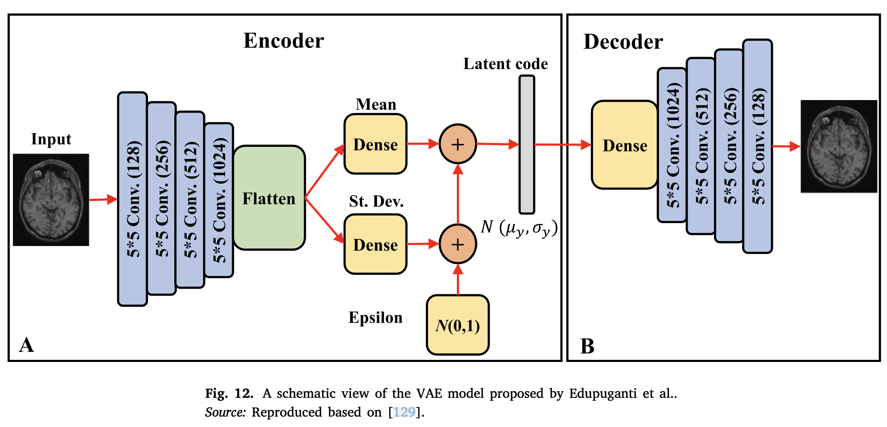

## Introduction

An autoencoder is a variant of DL that consists of two components, an encoder and a decoder. The encoder aims to map high- dimensional input samples $x$ to a low-dimensional latent variable $z$, while the decoder reproduces the original samples $x$ using the latent variable $z$.

The latent variables are compelled to conform a given prior distribution $P(z)$.  VAEs are effective method to model the posterior. They cast learning representations for high-dimensional distributions as a VI problem [^1].

## Method

A probabilistic model $P_\theta(x)$ of sample $x$ in a data space with a latent variable $z$ in a latent space can be written as follows:

$$
p_\theta(x)=\int_z p_\theta(x|z)p(z)
$$

VI can be used to model the evidence lower bound $\log p_\theta(x)$ as follows:

$$
\log p_\theta(x) = \mathbb{E}_{q_\phi(z|x)}[\log p_\theta(x|z)] - D_{KL}(q_\phi(z|x)\|p(x))
$$

where $q_\phi(z|x)$ and $p_\theta(x|z)$ are the encoder and decoder models, respectively, and $\phi$ and $\theta$ indicate their parameters.

- Zamani et al. [^2] developed a discrete VAE framework with Bernoulli latent variables as binary hashing code
	- The stochastic gradient was exploited to learn the model. The proposed a pairwise supervised hashing (PSH) framework to derive better hashing codes.
	- PSH maximises the ELBO with weighted KL regularisation to learn more information binary codes, and it adapts a pairwise loss function to reward within-class similarity and between-class dissimilarity to minimise the distances among the hashing codes of samples from the same class and vice versa.
	- 
- Bohm et al. [^3] studies UQ for linear inverse problems using VAEs.
	- a vanilla VAE with a mean-field Gaussian posterior was trained on uncorrupted samples under the ELBO.
	- The EL$_2$O [^4] method was adopted to approximate the posterior.
- Edupuganti et al. [^5] studied UQ tasks in magnetic resonance image recovery
	- a VAE-GAN, which is a probabilistic recovery scheme, was developed to map low-quality images to high-quality ones.
	- The VAE-GAN consisted of a VAE and a multilayer CNN as the generator and discriminator
	- Stein's unbiased risk estimator (SURE) was leveraged as a proxy to predict error and estimate the uncertainty of the model
	- 

## Applications

- A framework [^6] based on variational U-Net architecture was proposed for UQ tasks in reservoir simulations
	- 
- Cosmo VAE [^7] was proposed to restore missing observations in the cosmic microwave background (CMB) map.
	- variational Bayes approximation was used to determine the ELBO of the likelihood of the reconstructed image.
- Mehrasa et al. [^8] proposed the action point process VAE for action sequences
	- APP VAE consists of two LSTMs to estimate the prior and posterior distributions.
- Sato et al. [^9] proposed a VAE-based UA for anmaly detection
	- they used MC sampling to estimate the posterior

Since VAEs are not stochastic processes, they are limited to encoding finite-dimensional priors.
- Mishra et al. [^10] developed the prior encoding VAE, i.e., $\pi$VAE.
	- inspired by the Gaussian process, $\pi$VAE is a stochastic process that learns a distribution over function.
	- the $\pi$VAE encoder first transforms the locations to a high-dimensional space and then uses a linear mapping to link the feature space to the outputs.
	- The encoder aims to recreate a linear mapping from a lower-dimensional probabilistic embedding.
	- The recreated mapping is used to obtain the reconstruction of the outputs.
- Guo et al. [^11] used a VAE to deal with data uncertainty under a just-in-time learning framework.
	-  A Gaussian distribution was employed to describe the latent space features variablewise, and when KL divergence was used to ensure that the selected samples were the most relevant to a new sample.
- Daxberger et al. [^12] tried to detect OoD samples during the test phase
	- an unsupervised probabilistic framework was developed based on a BVAE
	- They estimated the posterior over the decoder parameters by applying SG-MCMC.

## Reference

[^1]: P. Ghosh, M.S.M. Sajjadi, A. Vergari, M. Black, B. Schölkopf, [From variational to deterministic autoencoders](https://arxiv.org/abs/1903.12436), 2019, arXiv:1903.12436.

[^2]: S.Z. Dadaneh, S. Boluki, M. Yin, M. Zhou, X. Qian, [Pairwise supervised hashing with Bernoulli variational auto-encoder and self-control gradient estimator](https://arxiv.org/abs/2005.10477), 2020, arXiv preprint arXiv:2005.10477.

[^3]: V. Böhm, F. Lanusse, U. Seljak, [Uncertainty quantification with generative models](https://arxiv.org/abs/1910.10046), 2019, arXiv preprint arXiv:1910.10046.

[^4]: U. Seljak, B. Yu, [Posterior inference unchained with EL2O](https://arxiv.org/abs/1901.04454), 2019, arXiv:1901. 04454.

[^5]: V. Edupuganti, M. Mardani, J. Cheng, S. Vasanawala, J. Pauly, [Uncertainty analysis of VAE-GANs for compressive medical imaging](https://arxiv.org/abs/1901.11228), 2019, arXiv preprint arXiv:1901.11228.

[^6]: L. Jin, H. Lu, G. Wen, [Fast uncertainty quantification of reservoir simulation with variational U-Net](https://arxiv.org/abs/1907.00718), 2019, arXiv:1907.00718.

[^7]: K. Yi, Y. Guo, Y. Fan, J. Hamann, Y.G. Wang, [CosmoVAE: Variational autoencoder for CMB image inpainting](https://arxiv.org/abs/2001.11651), 2020, arXiv:2001.11651.

[^8]: N. Mehrasa, A.A. Jyothi, T. Durand, J. He, L. Sigal, G. Mori, [A variational auto-encoder model for stochastic point processes](https://arxiv.org/abs/1904.03273), 2019, arXiv:1904.03273.

[^9]: K. Sato, K. Hama, T. Matsubara, K. Uehara, [Predictable uncertainty-aware un- supervised deep anomaly segmentation](https://ieeexplore.ieee.org/document/8852144), in: 2019 International Joint Conference on Neural Networks, IJCNN, 2019, pp. 1–7.

[^10]: S. Mishra, S. Flaxman, S. Bhatt, [𝜋VAE: Encoding stochastic process priors with variational autoencoders](https://arxiv.org/abs/2002.06873), 2020, arXiv:2002.06873.

[^11]: F. Guo, R. Xie, B. Huang, [A deep learning just-in-time modeling approach for soft sensor based on variational autoencoder](https://www.sciencedirect.com/science/article/abs/pii/S0169743919307622), Chemometr. Intell. Lab. Syst. 197 (2020) 103922.

[^12]: E. Daxberger, J.M. Hernández-Lobato, [Bayesian variational autoencoders for unsupervised out-of-distribution detection](https://arxiv.org/abs/1912.05651), 2019, arXiv:1912.05651.

