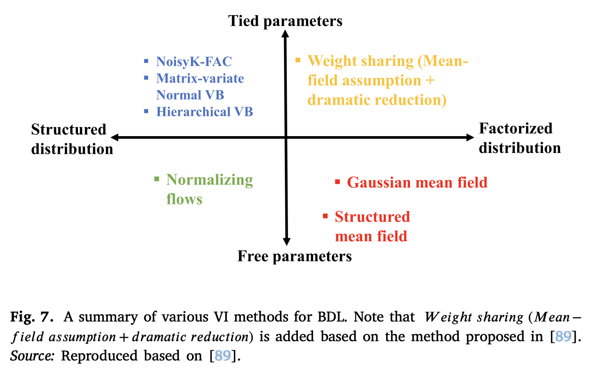
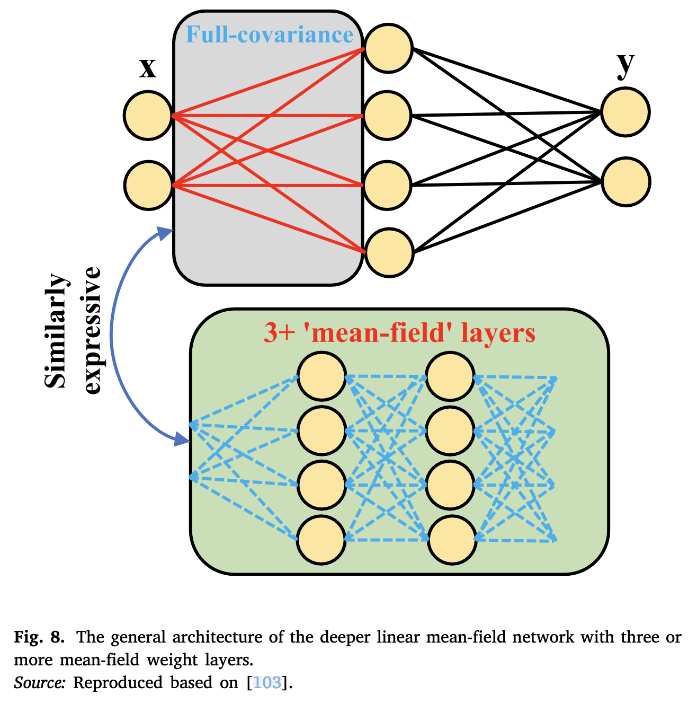

## Introduction

Variational inference (VI) is an approximation method that learns the posterior distribution over BNN weights. VI-based methods consider the Bayesian inference problem as an optimisation problem that is used by the SGD to train DNNs [^1]. 

## Method

For BNNs, VI-based methods aim to approximate posterior distributions over the weights of the NN. To achieve this, the loss can be defined as follows:

$$
\mathcal{L}(\Phi)\approx \frac1{2|\mathcal{D}|}\sum^{|\mathcal{D}|}{i=1}\mathcal{L}_R(y^{(i)}, x^{(i)}) + \frac{1}{|\mathcal{D}|}\mathrm{KL}(q_\phi(\omega)\|p(\omega))
$$

where $|\mathcal{D}|$ indicates the number of samples, and 

$$
\mathcal{L}_R(y, x)=-\log(\hat\tau_x)^T1+\|\sqrt{\hat{\tau}_x} \odot (y-\hat{\mu}_x)\|^2\\
$$
$$
\hat{\mu}_x = \hat{\mu}(x, \omega_\mu), \ \ \omega \sim q_\phi(\omega)
$$
$$
\hat{\tau}_x=\hat{\tau}(x, \omega_r)
$$

where $\odot$ and $1$ represent the element-wise product and a vector filled with ones.

## Applications

- Posch et al. [^2] defined the variational distribution using a product of Gaussian distributions along with diagonal covariance matrices.
	- For each network layer, a posterior uncertainty of the network parameter was represented.
	- The diagonal covariance matrices were replaced with the traditional ones to allow the network parameters to correlate with each other [^3].
- MOPED [^4], inspired by transfer learning and empirical Bayes (EB), used deterministic weights, which were derived from a pretrained DNN with the same architecture, to select meaningful prior distributions over the weight space.
	- an approach based on parametric EB was integrated into MOPED for mean-field VI in BDNNs, and it used a fully factorised Gaussian distribution to model the weights [^5].
- Subedar et al. [^6] proposed an uncertainty-aware framework based on multimodal Bayesian fusion for activity recognition.
	- They scaled a BDNN to a deeper structure by combining deterministic and variational layers.
- Marino et al. [^7] proposed a stochastic modeling-based approach to model uncertainty.
	- a DBNN was used to perform stochastic learning for the system. A variational BNN, which is a generative-based model, was proposed to predict the superconducting transition temperature.
	- VI was adapted to compute the distribution in the latent space for the model.

- Louizos and Welling [^8] adopted stochastic gradient VI [^9] to compute the posterior distribution over the weights of NNs.
- Hubin and Storvik [^10] proposed to stochastic VI method that jointly considers both model and parameter uncertainties in BNNs
	- they introduced latent binary variables to include or exclude certain weights of the model.
- Liu et al. [^11] integrated VI into a spatial-temporal NN to approximate the posterior parameter distribution of the network and estimate the probability of the prediction.
- Ryu et al. [^12] integrated a GCN into the Bayesian framework to learn representations and predict molecular properties.
- Swiatkowski et al. [^13] empirically studied Gaussian mean-field VI.
	- they decomposed the variational parameters into a low-rank factorisation to obtain a more compact approximation and improved the signal-to-noise ratio of the stochastic gradient in estimating the lower bound of the variation.
- Franquhar et al. [^14] used mean-field VI to better train deep models.
	- They argued that a deeper linear mean-field network can provide an analogous distribution of the function space to that of shallowly full-covariance network.
	- As shown in the figure below.
	- 

## Reference

[^1]: J. Swiatkowski, K. Roth, B.S. Veeling, L. Tran, J.V. Dillon, S. Mandt, J. Snoek, T. Salimans, R. Jenatton, S. Nowozin, [The k-tied normal distribution: A compact parameterization of Gaussian mean field posteriors in Bayesian neural networks](https://arxiv.org/abs/2002.02655v2), 2020, arXiv preprint arXiv:2002.02655.

[^2]: K. Posch, J. Steinbrener, J. Pilz, [Variational inference to measure model uncertainty in deep neural networks](https://arxiv.org/abs/1902.10189), 2019, arXiv preprint arXiv:1902.10189.

[^3]: K. Posch, J. Pilz, [Correlated parameters to accurately measure uncertainty in deep neural networks](https://arxiv.org/abs/1904.01334), 2019, arXiv:1904.01334.

[^4]: R. Krishnan, M. Subedar, O. Tickoo, [Efficient priors for scalable variational inference in Bayesian deep neural networks](https://ieeexplore.ieee.org/abstract/document/9022308), in: 2019 IEEE/CVF International Conference on Computer Vision Workshop, ICCVW, 2019, pp. 773–777.

[^5]: R. Krishnan, M. Subedar, O. Tickoo, A. Filos, Y. Gal, [Improving MFVI in Bayesian neural networks with empirical Bayes: a study with diabetic retinopa- thy diagnosis](https://oatml.cs.ox.ac.uk/publications/201912_Krishnan2019Improving.html), in: Fourht Workshop on Bayesian Deep Learning, NeurIPS 2019, 2019.

[^6]: M. Subedar, R. Krishnan, P.L. Meyer, O. Tickoo, J. Huang, [Uncertainty-aware audiovisual activity recognition using deep Bayesian variational inference](https://arxiv.org/abs/1811.10811), in: 2019 IEEE/CVF International Conference on Computer Vision, ICCV, 2019, pp. 6300–6309.

[^7]: D. Marino, M. Manic, [Modeling and planning under uncertainty using deep neural networks](https://ieeexplore.ieee.org/document/8717678), IEEE Trans. Ind. Inf. 15 (8) (2019) 4442–4454.

[^8]: C. Louizos, M. Welling, [Multiplicative normalizing flows for variational Bayesian neural networks](https://arxiv.org/abs/1703.01961), in: Proceedings of the 34th International Conference on Machine Learning-Vol. 70, JMLR. org, 2017, pp. 2218–2227.

[^9]: D.P. Kingma, M. Welling, [Auto-encoding variational Bayes](https://arxiv.org/abs/1312.6114v10), 2013, arXiv:1312. 6114.

[^10]: A. Hubin, G. Storvik, [Combining model and parameter uncertainty in Bayesian neural networks](https://arxiv.org/abs/1903.07594), 2019, arXiv preprint arXiv:1903.07594.

[^11]: Y. Liu, H. Qin, Z. Zhang, S. Pei, Z. Jiang, Z. Feng, J. Zhou, [Probabilistic spatiotemporal wind speed forecasting based on a variational Bayesian deep learning model](https://www.sciencedirect.com/science/article/abs/pii/S0306261919319464), Appl. Energy 260 (2020) 114259.

[^12]: S. Ryu, Y. Kwon, W.Y. Kim, [A Bayesian graph convolutional network for reliable prediction of molecular properties with uncertainty quantification](https://pubs.rsc.org/en/content/articlelanding/2019/SC/C9SC01992H), Chem. Sci. 10 (36) (2019) 8438–8446.

[^13]: J. Swiatkowski, K. Roth, B.S. Veeling, L. Tran, J.V. Dillon, S. Mandt, J. Snoek, T. Salimans, R. Jenatton, S. Nowozin, [The k-tied normal distribution: A compact parameterization of Gaussian mean field posteriors in Bayesian neural networks](https://arxiv.org/abs/2002.02655), 2020, arXiv preprint arXiv:2002.02655.

[^14]: S. Farquhar, L. Smith, Y. Gal, [Try depth instead of weight correlations: Mean- field is a Less restrictive assumption for variational inference in deep networks](https://oatml.cs.ox.ac.uk/publications/202001_Farquhar2020Try.html), in: Bayesian Deep Learning Workshop At NeurIPS, 2020.

