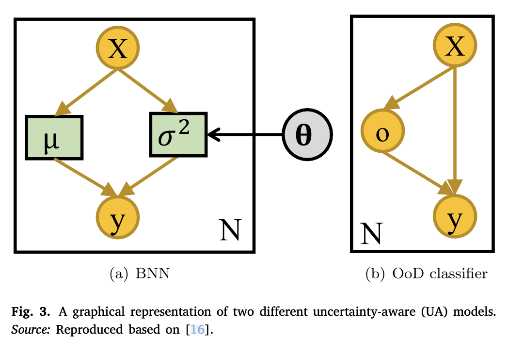

## Uncertainty Modeling

Uncertainty quantification plays a pivotal role in the reduction of uncertainties during both optimisation and decision making, applied to solve a variety of real-world applications [^1]. Predictions made without UQ are usually not trustworthy and inaccurate.

Bayesian approximation and ensemble learning techniques are two widely-used types of UQ methods.

The sources of uncertainty occurs when the test and training data are mismatched and data uncertainty occurs because of class overlap or due to the presence of noise in the data [^2].

There are several uncertainties that need to be quantified in the steps involved:
 1. Selection and collection of training data
 2. completeness and accuracy of training data
 3. understanding the DL model with performance bounds and its limitations
 4. Uncertainties corresponds to the performance of the model based on operational data

DL associated with UQ poses at least four overlapping groups of challenges:
 1. absence of theory
 2. absence of casual models
 3. sensitivity to imperfect data
 4. computational expenses
 
The predictive uncertainty (PU) consists of two parts, which can be written as sum of the two parts:

$$
PU = EU+AU
$$

### Aleatoric

Irreducible uncertainty in data giving rise to uncertainty in predictions is an *aleatoric uncertainty* (also known as *data uncertainty*). It is an inherent property of the data distribution.

The aleatoric uncertainty has two types: *homoscedastic* and *heteroscedastic* [^3].

### Epistemic

*Epistemic uncertainty* (also known as model uncertainty) occurs due to inadequate knowledge and data. 

Epistemic uncertainties can be formulated as probability distribution over model parameters. Let $D_{tr}=\{X,Y\}=\{(x_i, y_i)\}^N_{i=1}$ denotes a training dataset with inputs $x_i \in \mathfrak{R}^D$ and their corresponding classes $y_i \in \{1, \dots, C\}$, where $C$ represents the number of classes. The aim is to optimise the parameter, i.e., $\omega$, of a function $y =f^\omega(x)$ that can produce the desired output. The Bayesian approach defines a model likelihood, $p(y|x, \omega)$. For classification, the softmax likelihood can be used:

$$
p(y=c|x, \omega)=\frac{\exp(f^\omega_c(x))}{\sum_{c'}\exp(f^\omega_{c'}(x))}
$$

The Gaussian likelihood can be assumed for regression:

$$
p(y|x, \omega)=\mathcal{N}(y;f^\omega(x), \tau^{-1}I)
$$

where $\tau$ represents the model precision.

The posterior distribution, i.e., $p(\omega|x, y)$, for a given dataset $D_{tr}$ over $\omega$ by applying Bayes' theorem can be written as follows:

$$
p(\omega|X, Y)=\frac{p(Y|X,\omega)p(\omega)}{p(Y|X)}
$$

For a given test ample $x^*$, a class label with regard to the $p(\omega|X, Y)$ can be predicted:

$$
p(y^*|x^*, X, Y)=\int p(y^*|x^*,\omega)p(\omega|X, Y)d\omega
$$

This process is called inference or marginalisation. $p(\omega|X, Y)$ cannot be computed analytically, but it can be approximated by variational parameters, i.e., $q_\theta(\omega)$. The KL divergence is needed to be minimised with regards to $\theta$. The level of similarity among two distributions can be measured as follows:

$$
KL(q_\theta(\omega)\|p(\omega|X,Y))=\int q_\theta(\omega)\log \frac{q_\theta(\omega)}{p(\omega|X, Y)}d\omega
$$

The predictive distribution can be approximated by minimising KL divergence, as follows:

$$
p(y^*|x^*, X, Y)\approx \int p(y^*|x^*, \omega)q^*_\theta(\omega)d\omega =: q^*_\theta(y^*, x^*)
$$

where $q^*_\theta(\omega)$ indicates the optimised objective.

KL divergence minimisation can also be rearranged into the *evidence lower bound* (ELBO) maximisation.

$$
\mathcal{L}_{VI}(\theta):=\int q_\theta(\omega) \log p(Y|X, \omega)d\omega - KL(q_\theta(\omega)\|p(\omega))
$$

where $q_\theta(\omega)$ is able to describe the data well by maximising the first term, and be as close as possible to the prior by minimising the second term. This process is called variational inference (VI).

Dropout VI is one of the most common approaches that has been widely used to approximate inference in complex models [^4]. The minimisation objective is as follows:

$$
\mathcal{L}(\theta, p)=-\frac1N \sum^N_{i=1}\log p(y_i|x_i, \omega) + \frac{1-p}{2N}\|\theta\|^2
$$

where $N$ and $P$ represent the number of samples and dropout probability.

To obtain data-depedent uncertainty, the precision $\tau$ can be formulated as a function of data. One approach to obtain epistemic uncertainty is to mix two functions: predictive mean, $f^\theta(x)$, and model precision $g^\theta(x)$, and the likelihood function can be written as $y_i=\mathcal{N}(f^\theta(x), g^\theta(x)^{-1})$. A prior distribution is placed over the weights of the models, and then the amount of change in the weights for given data samples is computed.

$$
E^{W_1, W_2, b}:=
\frac12(y-f^{W_1, W_2, b}(x))g^{W_1, W_2, b}(x)(y-f^{W_1, W_2, b}(x))^T-\\\frac12\log det  g^{W_1, W_2, b} + \frac{D}2\log 2\pi\\=-\log \mathcal{N}(f^\theta(x), g^\theta(x)^{-1})
$$

The predictive variance can be obtained as follows:

$$
\widehat{Var}[x^*]:=\frac1T \sum^T_{t=1}g^{\widetilde{\omega_t}}(x)\mathbf{I}+f^{\widetilde{\omega_t}}(x^*)^Tf^{\widetilde{w_t}}(x^*)\\-\tilde{\mathbb{E}}[y^*]^T\tilde{\mathbb{E}}[y^*]\underset{T\rightarrow\infty}{\rightarrow} Var_{q^*_\theta(y^*|x^*)}[y^*]
$$

## Methods

### Bayesian Techniques

Bayesian Deep Learning can be used to interpret the model parameters. BNNs are robust to over-fitting problem and can be trained on both small and big datasets.

- [Monte Carlo (MC) dropout ](Uncertainty/Methods/MCD)
- [Markov chain Monte Carlo (MCMC)](Uncertainty/Methods/MCMC)
- [Variational inference (VI)](Uncertainty/Methods/VI)
- [Bayesian Active Learning (BAL)](Uncertainty/Methods/BAL)
- [Bayes By Backprop (BBB)](Uncertainty/Methods/BBB)
- [Deep Gaussian Processes (GDPs)](Uncertainty/GDPs)
- [Variational Autoencoder (VAE)](Uncertainty/Methods/VAE)
- [Laplacian Approximations (LA)](Uncertainty/Methods/LA)
- [UQ in RL](Uncertainty/Methods/UQ-in-RL)

### Ensemble Techniques

- [General idea](Uncertainty/Methods/Emsemble)
- [Deep Ensemble](Uncertainty/Methods/Deep-Ensemble)

### Further studies of UQ methods

-[NADS](Uncertainty/Methods/NADS)
- [DGP](Uncertainty/Methods/DGP)

## Applications 

## Further Studies

## Reference

[^1]: M. Abdar et al., ‘A Review of Uncertainty Quantification in Deep Learning: Techniques, Applications and Challenges’, Information Fusion, vol. 76, pp. 243–297, Dec. 2021, doi: 10.1016/j.inffus.2021.05.008.

[^2]: B. T. Phan, “Bayesian deep learning and uncertainty in computer vision,” Master’s thesis, University of Waterloo, 2019.

[^3]: A. Kendall and Y. Gal, “What uncertainties do we need in bayesian deep learning for computer vision?” in Advances in neural information processing systems, 2017, pp. 5574–5584.

[^4]: Y. Gal and Z. Ghahramani, “Bayesian convolutional neural net- works with bernoulli approximate variational inference,” arXiv preprint arXiv:1506.02158, 2015