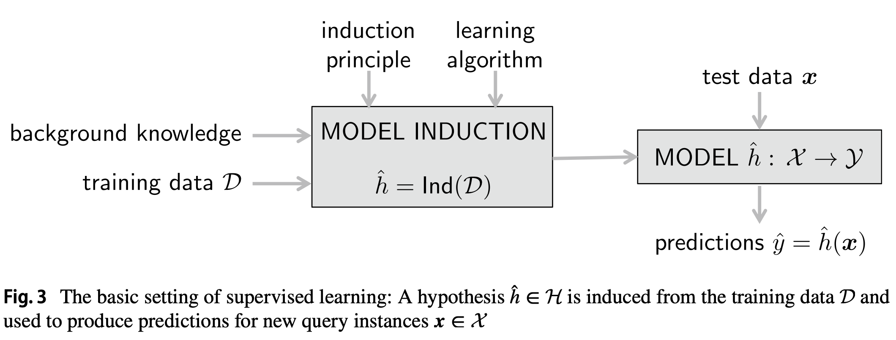
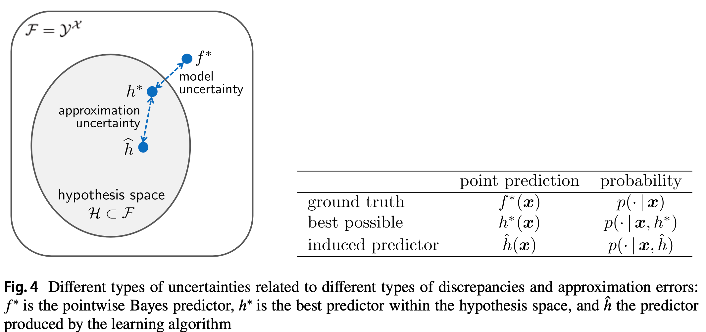
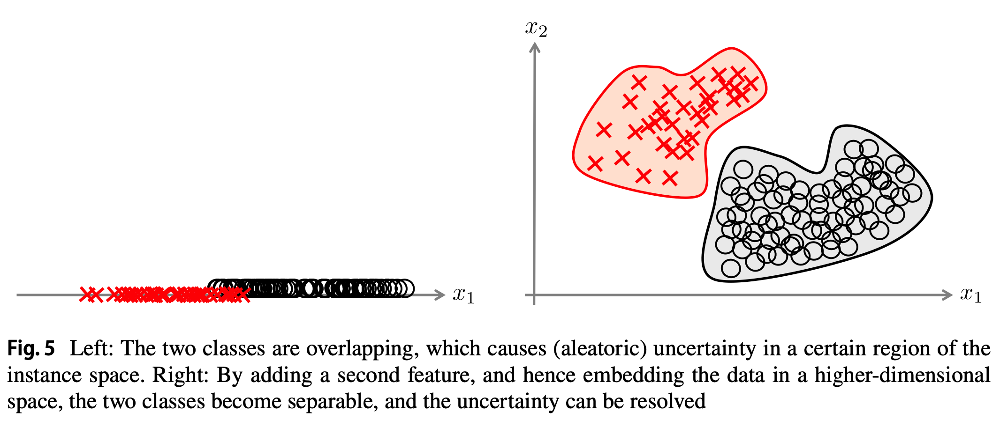
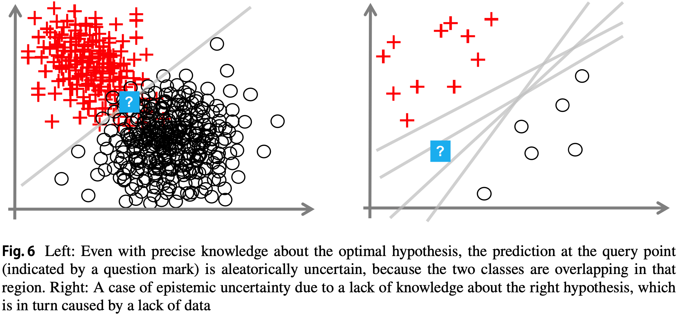

# Aleatoric and Epistemic uncertainty in ML: an introduction to concepts and methods

## Introduction

- Aleatoric (aka statistical) uncertainty refers to the notion of randomness, the variability in the outcome of an experiment which is due to inherently random effects.
	- E.g.: coin flipping. The data-generating process in this type of experiment has *a stochastic component that cannot be reduced by an additional source of information*.
	- refers to the *irreducible* part of the total uncertainty
- Epistemic (aka systematic) uncertainty refers to uncertainty caused by a lack of knowledge (about the best model).
	- uncertainty caused by ignorance can in principle be reduced on the basis of additional information.
	- E.g.: `kichwa` mean in the Swahili language, head or tail, the possible answers are the same as in coin flipping.
	- The *reducible* part of the total uncertainty

### Notations

| Notation                      | Meaning                                                                |
| ----------------------------- | ---------------------------------------------------------------------- |
| $P, p$                        | Probability measure, density or mass function                          |
| $\mathcal{X}, x, x_i$         | Instance space, instance                                               |
| $\mathcal{Y}, y, y_i$         | Output space, outcome                                                  |
| $\mathcal{H}, h$              | Hypothesis space, hypothesis                                           |
| $\mathcal{V=V(H,D)}$          | Version space                                                          |
| $\pi(y)$                      | Possibility/plausibility of outcome $y$                                |
| $h(x)$                        | Outcome $y\in\mathcal{Y}$ for instance $x$ predicted by hypothesis $h$ |
| $p_h(y\|x)=p(y\|x, h)$        | Probability of outcome $y$ given $x$, predicted by $h$                 |
| $l$                           | Loss function                                                          |
| $h^*, \hat{h}$                | Risk-minimizing hypothesis, empirical risk minimizer                   |
| $f^*$                         | Pointwise Bayes Predictor                                              |
| $E(X)$                        | Expected value of random variable $X$                                  |
| $V(X)$                        | Variance of random variable $X$                                        |
| $\llbracket \cdot \rrbracket$ | Indicator function                                                     |

## Sources of uncertainty in Supervised Learning

### Supervised Learning and Predictive Uncertainty

A learner is given access to a set of training data:

$$
\mathcal{D}:=\{(x_1, y_1), \dots, (x_N, y_N)\} \subset \mathcal{X \times Y}
$$

where $\mathcal{X}$ is an instance space and $\mathcal{Y}$ the set of outcomes that can be associated with an instance. 

Typically, the training examples $(x_i, y_i)$ are assumed to be independent and identically distribution according to some unknown probability measure $P$ on $\mathcal{X\times Y}$.

Given a *hypothesis space* $\mathcal{H}, h:\mathcal{X\times Y}$ mapping instances $x$ to outcomes $y$, and a loss function $\mathcal{l:Y\times Y \rightarrow }\mathbb{R}$, the goal of the learner is to induce a hypothesis $h^*\in\mathcal{H}$ with low risk:

$$
R(h):=\int_{\mathcal{X\times Y}} l(h(x),y)dP(x,y)
$$

Given the training data $\mathcal{D}$, the learner needs to guess a good hypothesis $h$. This choice is commonly guided by the empirical risk:

$$
R_{emp}(h):=\frac{1}{N}\sum^N_{i=1} l(h(x_i), y_i)
$$

Since $R_{emp}(h)$ is only an estimation of the true risk $R(h)$, the hypothesis:

$$
\hat{h}: \underset{h \in \mathcal{H}}{\arg\min}R_{emp}(h)
$$

favoured by the learner will normally not coincide with the true risk minimiser:

$$
h^*=\underset{h \in \mathcal{H}}{\arg\min}R_{emp}(h)
$$

There remains. uncertainty regarding $h^*$ as well as the approximation quality of $\hat{h}$ and its true risk $R(\hat{h})$.

One is often interested in *predictive uncertainty*, the uncertainty related to the prediction $\hat{y}_q$ for a concrete query instance $x_q \in \mathcal{X}$.

Estimating and quantify uncertainty in a transductive way in the sense of tailoring it for individual instances, is arguable important and practical a more relevant than a kind of coverage accuracy or confidence.

The learning task could also be formalised as a problem of predictive inference as follows: Given a set of data points $(X_1, Y_1), \dots, (X_N, Y_N)$ and a query point $X_{N+1}$, what is the associated outcome $Y_{N+1}$?

A prediction could be given in the form of a point of prediction $\hat{Y}_{N+1}\in \mathcal{Y}$ but also in the form of predictive set $\hat{C}(X_{N+1})$ that is likely to cover a true outcome.

A statistical guarantee for *marginal coverage*, averages over both $X_{N+1}$ and $Y_{N+1}$, the probability $P$ refers to a joint measure on $\mathcal{X\times Y}$:

$$
P(Y_{N+1} \in \hat{C}(X_{N+1})) \geq 1 - \delta,\ \mathrm{a\ small\ threshold\ \ \delta >0}
$$

and *conditional coverage*, $X_{N+1}$ is fixed and the average in taken over $Y_{N+1}$ only:

$$
P\left(Y_{N+1} \in \hat{C}(X_{N+1})|X_{N+1} =x\right) \geq 1 - \delta, \forall x \in \mathcal{X}
$$

Induction is a more difficult problem than transduction.

### Sources of uncertainty

As the prediction $\hat{y}_q$ constitutes the end of a process that consists of different learning and approximation steps, all errors and uncertainties related to these steps may also contribute to the uncertainty about $\hat{y}_q$：

- Since the dependency between $\mathcal{X}$ and $\mathcal{Y}$ is typically non-deterministic, the description of a new prediction problem in the form of an instance $x_q$ gives rise to a conditional probability distribution on $\mathcal{Y}$:
	$$
	p(y|x_q) = \frac{p(x_q, y)}{p(x_q)}
	$$
	- Even given full information in the form of the measure $P$ and its density $p$, uncertainty about the actual outcome $y$ remains. This is of an *aleatoric* nature.
	- In Bayesian inference, the distribution itself might be delivered as a prediction.
	- When being forced to commit to point estimates, the best predictions are prescribed by the pointwise Bayes predictor $f^*$:
	  $$
	  f^*(x):=\underset{\hat{y} \in \mathcal{Y}}{\arg\min}\int_\mathcal{Y}l(y, \hat{y})dP(y|x)
	  $$
- The Bayes predictor $h^*$ does not necessarily coincide with the pointwise Bayes predictor.
	- This discrepancy between $h^*$ and $f^*$ is connected to the uncertainty regarding the right type of model to be fit, and hence the choice of the hypothesis space $\mathcal{H}$, which is "background knowledge" in Fig. 3.
	- This uncertainty is model uncertainty. One cannot guarantee that $h^*(x)=f^*(x)$. Or, in case the hypothesis $h^*$ delivers probabilistic predictions $p(y|x, h^*)$ instead of point prediction $p(\cdot|x,h^*)=p(\cdot|x)$
- The hypothesis $\hat{h}$ produced by the learning algorithm, is only an estimate of $h^*$, and the quality of this estimate strongly depends on the quality and the amount of training data.
	- The discrepancy between $\hat{h}$ and $h^*$ is the uncertainty about how well the former approximates the latter, as *approximation uncertainty*.

### Reducible vs. Irreducible Uncertainty

One way to characterise uncertainty as aleatoric or epistemic is to ask whether or not the uncertainty can be reduced through additional information: Aleatoric uncertainty refers to the irreducible part of the uncertainty, which is due to the non-deterministic nature of the sought input/output dependency, that is, to the stochastic dependency between instances $x$ and outcomes $y$, as expressed by the conditional probability.

What does “reducible” actually mean? An obvious source of additional information is the training data $\mathcal{D}$: The learner’s uncertainty can be reduced by observing more data, while the setting of the learning problem — the instance space $\mathcal{X}$, output space $\mathcal{Y}$, hypothesis space $\mathcal{H}$, joint probability $P$ on $\mathcal{X \times Y}$ — remains fixed.

A learner can decide to extend the description of instances by additional features, which essentially means replacing the current instance space $\mathcal{X}$ by another space $\mathcal{X}'$. This change of the setting may have an influence on uncertainty. In the figure above, in a low-dimensional space, two class distributions are overlapping ,which causes *aleatoric* uncertainty in a certain region of the instance space. By embedding the data in a higher-dimensional space, the two classes become separable, and the uncertainty can be resolved. More generally, embedding data in a higher-dimensional space will ***reduce aleatoric and increase epistemic uncertainty***, because fitting a model will become more difficult and require more data.

Aleatoric and epistemic uncertainty should not be seen as absolute notions, they are context-dependent in the sense of depending on the setting $(\mathcal{X, Y, H}, P)$. 

Changing the context will also change the uncertainty: *aleatoric may turn into epistemic uncertainty and vice versa*.

### Approximation and model uncertainty

Assuming the setting $(\mathcal{X, Y, H}, P)$ to be fixed, the learner's lack of knowledge will essentially depend on the amount of data it has seen so far: The larger the number $N=|\mathcal{D}|$ of observations, the less ignorant the learner will be when having to make a new prediction. In the limit, when $N\rightarrow \infty$, a consistent learner will be able to identify $h^*$, i.e., it will get rid of its approximation uncertainty.

What is assumed here is a correctly specified hypothesis space $\mathcal{H}$, such that $f^*\in \mathcal{H}$, i.e., model uncertainty is simply ignored. This uncertainty is very difficult to capture. A kind of meta-analysis would be required: Instead of expressing uncertainty about the ground truth hypothesis $h$ within a hypothesis space $\mathcal{H}$, one has to express uncertainty about which $\mathcal{H}$ among a set $\mathbb{H}$ of candidate hypothesis spaces might be the right one. Simply assuming a correctly specified hypothesis space $\mathcal{H}$ actually means neglecting he risk of model misspecification. In fact, the learning itself as well as all sorts of inference from the data are normally done under the assumption that the model is valid.

## Modelling approximation uncertainty: set-based versus distributional representations

Bayesian inference can be seen as the main representative of probabilistic methods and provides a coherent framework for statistical reasoning that is well-established.

Version space learning can be seen as a "logical" counterpart of Bayesian inference, in which hypotheses and predictions are not assessed numerically in term of probabilities, but only qualified as being *possible or impossible*.

By construction, version space learning is free of aleatoric uncertainty, i.e., all uncertainty is epistemic.

### Version space learning

In the idealised setting of version space learning, we assume a deterministic dependency $f^*: \mathcal{X\rightarrow Y}$, i.e., the distribution degenerates to:

$$
p(y|x_q) = \begin{cases}
1 & \mathrm{if} \ y=f^*(x_q) \\
0 & \mathrm{if} \ y \neq f^*(x_q) 
\end{cases}
$$

Moreover, the training data is free of noise.Correspondingly, we also assume that classifiers produce deterministic predictions $h(x)\in \{0, 1\}$. Finally, we assume that $f^*\in \mathcal{H}$, and therefore $h^*=f^*$ (which means there is no model uncertainty).

Under these assumptions, a hypothesis $h\in \mathcal{H}$ can be eliminated as a candidate as soon as it makes at least one mistake on the training data: in that case, the risk of $h$ is necessarily higher than the risk of $h^*$ (which is 0). The idea of the candidate elimination algorithm is to maintain the version space $\mathcal{V \subseteq H}$ that consists of the set of all hypotheses consistent with the data seen so far:

$$
\mathcal{V=V(H, D)}:=\{h \in \mathcal{H}|h(x_i)=y_i\ \mathrm{for}\ i=1,\dots, N\}
$$

Obviously the version space is shrinking with an increasing amount of training data, i.e., $\mathcal{V(H, D')\subseteq V(H,D)}$ for $\mathcal{D\subseteq D'}$.

If a prediction $\hat{y_q}$ for a query instance $x_q$ is sought, this query is submitted to all members $h \in \mathcal{V}$ of the version space. Obviously, a unique prediction can only be made if all members agree on the outcome of $x_q$. Otherwise, several outcomes $y \in \mathcal{Y}$ may still appear possible.

We can express the degree of possibility or plausibility of an outcome $y \in \mathcal{Y}$ as follows ($\llbracket \cdot \rrbracket$ denotes the indicator function):

$$
\pi(y):=\underset{h \in \mathcal{H}}{\max}\min (\llbracket h \in \mathcal{V} \rrbracket, \llbracket h(x_q)=y \rrbracket)
$$

Thus, $\pi(y)=1$ if there exists a candidate hypothesis $h\in mathcal{V}$