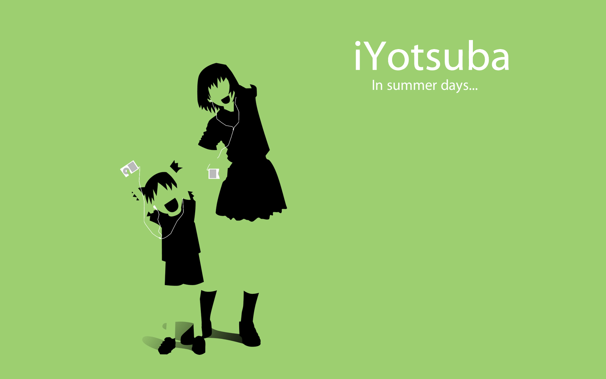

<!-- _coverpage.md -->

# Rs <small>Wiki</small>

> Rs Knowledge Base System

 

	👀 访问量： 次

	| 🚴‍♂️ 访客数： 人

 

[CV](https://github.com/YuyangXueEd/Wiki/raw/master/docs/_media/Yuyang_XUE_CV.pdf)
[Get Started](README.md)

<!-- 背景图片 -->

